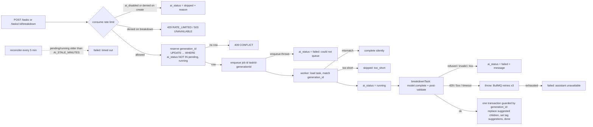

# Architecture

Kaizen Tasks API is one Node 24 process: an Express 5 HTTP API plus, behind `WORKER_ENABLED`, a
BullMQ worker and a reconciler. Postgres holds all durable state; Redis holds refresh tokens,
hourly rate-limit counters, and the queue. Nothing that must survive a Redis flush lives in Redis.

## Shape

| Concern              | Where                                                                  | Notes                                                                                                               |
| -------------------- | ---------------------------------------------------------------------- | ------------------------------------------------------------------------------------------------------------------- |
| Startup              | `src/server.ts`                                                        | Config, asset checks, migrations, Redis, seed, worker, listen; in that order, exit non-zero on any failure          |
| HTTP app             | `src/app.ts`                                                           | `createApp(deps)` so tests build the same app over the test database with a fake queue and a fake model             |
| Validation           | `src/routes/validate.ts`                                               | zod schemas from `src/schemas/`, parsed values in `res.locals.validated`; `req.query` is never assigned (Express 5) |
| Envelopes and errors | `src/lib/envelope.ts`, `src/lib/errors.ts`, `src/lib/error-handler.ts` | One success shape, one error shape, one `statusFor(code)`                                                           |
| Auth                 | `src/lib/auth.ts`, `src/services/auth.ts`                              | HS256 access token (15 min), Redis-backed refresh token in an httpOnly cookie (ADR 0002)                            |
| Data                 | `src/db/schema.ts`, `src/repositories/*`                               | Drizzle over postgres.js; one `tasks` table with `parent_id` (ADR 0001); additive migrations (ADR 0004)             |
| Business rules       | `src/services/*`                                                       | Ownership checks (misses are `NOT_FOUND`), depth rule, position reorder, suggestion transitions, rate limit         |
| AI pipeline          | `src/jobs/*`, `src/agent/*`                                            | Queue, processor, worker (ADR 0003), reconciler, model seam, prompt                                                 |
| Contract             | `src/schemas/*`, `openapi.json`, `docs/API.md`                         | Generated by `npm run openapi`; the web app builds its client from `openapi.json`                                   |

Layering: routes call services, services call repositories and the queue, repositories call
Drizzle. Handlers never touch Drizzle; services never import Express types. The full table is in
`CLAUDE.md`.

## Request path

`helmet` → JSON body (64 kB limit) → cookie parser → request id (`x-request-id` in, header and
envelope out) → pino-http (one line per request with method, url, status, response time,
request id, user id) → `/api/v1` routers → 404 handler → error handler.

## AI breakdown pipeline

Every write on the worker side carries `WHERE generation_id = <job's>`, so a superseded job can
never overwrite a newer generation. The concurrency guard is the conditional update, not the
queue. `replaceSuggestedChildren` (`src/repositories/tasks.ts`) locks the task row (`FOR UPDATE`)
and runs the delete/insert/final-update inside a nested savepoint, so if the closing guarded
update ever found the generation stale, the whole savepoint — deletes and inserts included — rolls
back instead of leaving orphaned children behind.

Rate limits: `ratelimit:breakdown:<userId>:<YYYYMMDDHH>` (default 20 per hour) and
`ratelimit:breakdown:global:<YYYYMMDDHH>` (default 300 per hour, the session budget). Each counter
is incremented atomically (`MULTI INCR` + `EXPIRE NX` in one transaction, `src/lib/rate-limit.ts`)
so a key is never left without a TTL. A denied consume decrements what it incremented.
`AI_ENABLED=false` is the operator kill switch: creates still succeed with `ai_skip_reason =
ai_disabled`; the explicit breakdown action returns `UNAVAILABLE`.

The model seam is `BreakdownModel.complete(input) -> { kind: ok | refused | invalid }`. The
Anthropic adapter uses `messages.parse` with a zod output format, `maxRetries: 0`, a 45-second
timeout, and a 16,000-token output ceiling (`MAX_OUTPUT_TOKENS`). A structured-output parse
failure from the SDK's own zod parser is classified `invalid` — final, not retried — rather than
treated as a transport error. The fake adapter returns fixtures and can refuse, garble, or fail
retryably. The system prompt is `src/agent/prompts/breakdown.system.md`, copied into `dist/` by
the build and asserted at startup.

## Deploy topology

Railway project `kaizen-tasks`, environments `staging` (tracks `develop`) and `production`
(tracks `main`). Each environment has services `api` (this repo, private hostname
`api.railway.internal`, `PORT=3000`, no public domain), `web` (static site behind Caddy, proxies
`/api/*` to the API), `Postgres`, and `Redis`. The `api` service is declared in
`.railway/railway.ts` (including `source.checkSuites: true`, which is wait-for-CI) and applied with
`railway config apply` per environment.

Flow: merge to `develop` → GitHub Actions `ci` (typecheck, lint, tests against service
containers, docs check, build, dist-asset check) → Railway deploys staging after `ci` passes →
health check `/api/v1/health` → traffic switches. A pull request `develop` → `main` runs `promote`,
which waits until staging serves the candidate SHA and runs the shared smoke package. Rollback is
Railway's redeploy of the previous deployment, safe because migrations are additive (ADR 0004).

## Operations

- Health: `GET /api/v1/health` returns `{ status, commit, version, env, checks: { db, redis }, features: { featureRequests } }`,
  503 with `UNAVAILABLE` when a check fails. `featureRequests` is true exactly when
  `POST /api/v1/feature-requests` is mounted (`GITHUB_TOKEN` and `GITHUB_REPO` both set). `version` is the
  running build's package.json version, printed by the web app's footer.
- Demo reset: `POST /api/v1/admin/seed-reset` with `x-admin-token` recreates `demo@kaizen.local`
  and its fixtures with stable ids; `npm run db:seed -- --reset` does the same locally.
- Kill switch and budget: `AI_ENABLED`, `AI_RATE_LIMIT_PER_HOUR`, `AI_GLOBAL_LIMIT_PER_HOUR` are
  Railway variables; changing them restarts the service without a deploy.
- Stuck generations: the reconciler fails anything pending or running for longer than
  `AI_STALE_MINUTES` with "Timed out, try again"; the user sees a retry control, never an
  indefinite spinner.
