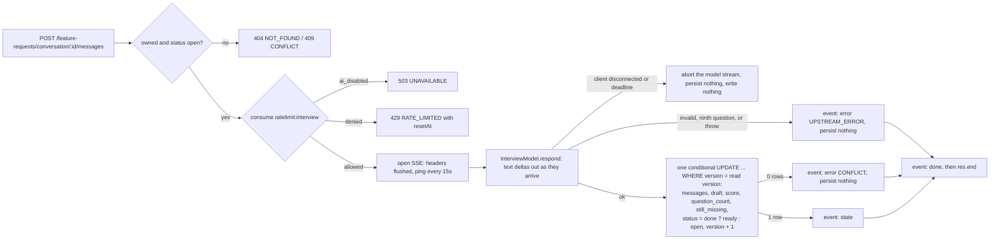

# Interview Agent API Implementation Plan

> **For agentic workers:** REQUIRED SUB-SKILL: Use superpowers:subagent-driven-development (recommended) or superpowers:executing-plans to implement this plan task-by-task. Steps use checkbox (`- [ ]`) syntax for tracking.

**Goal:** Turn the in-app "Request a feature" form into an assistant-led interview by adding three authenticated routes (`GET`/`POST /feature-requests/conversation`, `POST /feature-requests/conversation/{id}/messages` streaming Server-Sent Events), a `feature_request_conversations` table, an `InterviewModel` seam with an Anthropic streaming adapter and a scripted fake, and a `conversationId` on the existing `POST /feature-requests` that appends the interview transcript and self-score to the GitHub issue.

**Architecture:** The interview is a per-user conversation row in Postgres. Each PM answer is one turn: the route runs the ownership, status and rate-limit checks first (so a failure is a normal JSON error envelope), then opens an SSE stream and hands a sink to the service. The service calls `InterviewModel.respond(input, onDelta, signal)`, forwards text deltas to the sink as `delta` events, and persists messages, draft, score, question count and status in exactly one update — only after the model returns a valid turn — before emitting one `state` event and a final `done`. A failed turn emits `error` and persists nothing, so the PM's resend is a clean retry. The model seam mirrors the breakdown seam: `AnthropicInterviewModel` uses `client.messages.stream` with two cached system blocks (the interview prompt and a vendored byte-identical copy of the readiness rubric) and one `report_turn` tool whose `input_schema` is generated from zod; `FakeInterviewModel` replays a scripted four-turn interview.

**Tech Stack:** TypeScript 5.9 (strict, ESM, NodeNext, `noUncheckedIndexedAccess`), Node 24, Express 5.2, zod 4.5 (`z.toJSONSchema`), drizzle-orm 0.45 with postgres.js and drizzle-kit 0.31, ioredis 5.11, `@anthropic-ai/sdk` 0.124 (`messages.stream`, tool use, `cache_control: ephemeral`), `@asteasolutions/zod-to-openapi` 9.1, pino 10, octokit 5, vitest 5, supertest 7, prettier 3, eslint 10.

**Spec:** `../docs/superpowers/specs/2026-09-10-agentic-feature-request-design.md` (assembly-line repo, `webapp/docs/superpowers/specs/`). Sections 1, 3, 5 and 6 are this lane's; section 4 belongs to the web lane. Rubric: `webapp/rubric/readiness.md`. Interview procedure ported from `product-skills/skills/refine-request/SKILL.md` Step 4.

## Global Constraints

Every task's requirements implicitly include this section.

**Working directory:** every command in this plan runs from the checkout root
`/Users/Mike.Bogdanovsky/Projects/nice-product-workshop-Sep.2026/webapp/backend`. No task changes
directory; every path in a `Files:` block or a command is relative to that root.

### Branch, commits, secrets

- Branch: `feat/interview-agent`, cut from `develop`. Every task commits on that branch. Nothing is pushed to `develop` or `main` directly. The pull request `feat/interview-agent` → `develop` is opened by the controller after the last task, not by any task in this plan.
- Every commit message ends with the trailer line `Co-Authored-By: Claude Fable 5.1 <noreply@anthropic.com>`.
- Commit subjects follow the repo's existing style: `feat: ...`, `fix: ...`, `test: ...`, `docs: ...`, `chore: ...`.
- Secrets never enter any repository. `ANTHROPIC_API_KEY`, `JWT_SECRET`, `ADMIN_TOKEN`, `SEED_DEMO_PASSWORD`, `GITHUB_TOKEN` live only in Railway variables and in git-ignored local `.env` files.
- Node 24 via `nvm use` before any npm command.

### Envelopes and errors (`CLAUDE.md`)

- Success: `{ data, meta: { requestId, nextCursor? } }` via `sendData(res, data, { status?, nextCursor? })`; 204 via `sendNoContent(res)`.
- Error: `{ error: { code, message, details?, requestId } }`. Throw `AppError` or a constructor from `src/lib/errors.ts`; never build an error body by hand. Status comes from `statusFor(code)`. `details` exists only for `VALIDATION_ERROR` and `RATE_LIMITED`.
- Ownership failures are `NOT_FOUND`, never `FORBIDDEN`. Every service method loads the row by id and user id first.
- Every route validates with `validate({ params?, query?, body? })` and reads through `validated<typeof schemas>(res)`. Never assign to `req.query`.

### Layering (`CLAUDE.md`)

| Layer                              | May import                                                                                                                         |
| ---------------------------------- | ---------------------------------------------------------------------------------------------------------------------------------- |
| `src/routes`                       | `schemas`, `services`, `lib`                                                                                                       |
| `src/services`                     | `repositories`, `agent`, `jobs/queue`, `lib`, `db/seed`                                                                            |
| `src/repositories`                 | `db`, `lib`                                                                                                                        |
| `src/jobs`                         | `services`, `repositories`, `agent`, `lib`                                                                                         |
| `src/agent`                        | `lib`, `schemas`                                                                                                                   |
| `src/lib`, `src/db`, `src/schemas` | nothing app-level above them (`schemas` may import `lib/errors` for the code list; `db/seed.ts` may import `lib/auth` for hashing) |

`import type` from `src/schemas` is allowed anywhere. Handlers never touch Drizzle. Services never import Express types.

### TDD

- Write the failing test first and show it failing in the transcript before the implementation (`CLAUDE.md`, and `superpowers:test-driven-development`).
- Unit tests live next to the code as `src/**/*.test.ts` (vitest project `unit`). Integration tests live under `tests/` (project `integration`, sequential, real Postgres `kaizen_test` and Redis db 1, tables truncated before each test). `tests/helpers/app.ts` builds the app with a fake queue and fake models.

### Additive migrations (ADR 0004)

- Allowed: add a table; add a column with a default or nullable; add an index; add an enum value; add a check constraint existing rows already satisfy.
- Not allowed in the same release: drop a column or table, rename a column or table, change a column type, tighten a constraint existing rows violate, remove an enum value.
- Generate with `npm run db:generate -- --name <what>` and commit `drizzle/`.

### Docs-check rules (`scripts/docs-check.sh`, same script for the Stop hook and CI)

- **Rule A:** code changed (`src/`, `drizzle/`, `.railway/`, `scripts/`, `package.json`) → `CHANGELOG.md` changed and `[Unreleased]` has a bullet (or the diff cuts a release: a new dated version heading).
- **Rule B:** `src/routes/` or `src/schemas/` changed → `npm run openapi -- --check` passes.
- **Rule C:** a file matching `docs/architectural-files.txt` changed → an ADR under `docs/adr/` changed in the same diff.

Every task in this plan therefore adds its own `[Unreleased]` bullet before committing.

### Architectural files (`docs/architectural-files.txt`, verbatim)

```
src/db/schema.ts
drizzle/**
src/jobs/**
src/lib/auth.ts
src/agent/prompts/**
.railway/**
```

This plan touches three of them: `src/db/schema.ts` and `drizzle/**` (Task 2), `src/agent/prompts/**` (Task 6), and `.railway/**` (Task 12). All three write into the single ADR `docs/adr/0005-interview-agent-for-feature-requests.md`: Task 2 creates it as `Proposed` with the data-model decision, Task 6 adds the prompt and vendored-rubric sections, Task 12 adds the operator-variable consequence, and Task 13 completes it (SSE, the tool-call state pattern, why no streaming library) and sets the status to `Accepted`. The `write-adr` skill (`.claude/skills/write-adr/SKILL.md`) owns the numbering and template.

### Endpoint checklist (`.claude/skills/add-api-endpoint/SKILL.md`)

Restate the endpoint → failing integration test → schemas and `registry.registerPath` (bare resource path, no `/api/v1` prefix; import the schema file into `src/schemas/index.ts`) → service with the ownership check → repository query taking `DbOrTx` → route with `validate`/`validated`/`currentUser`/`sendData` → `npm test` → `npm run openapi` → `CHANGELOG.md` bullet → ADR if architectural → `npm run docs:check`.

### Decisions this plan makes where the spec left a detail open

Each is repeated inline in the task that first depends on it.

1. **`AI_ENABLED` gates the interview.** The interview limiter honours the operator kill switch exactly as the breakdown limiter does; a denied turn is `503 UNAVAILABLE` before the stream starts.
2. **`RubricScore.reasons` is required.** Spec 3.1 defines it; spec 3.4's fake score omits it. The schema requires it and the fake supplies concrete reason strings.
3. **The `ConversationEvent` union members are `{ event, data }` objects** discriminated on `event`, so the OpenAPI component documents both the SSE event name and its payload (confirmed by the amended spec 3.2).
4. **`skip: true` ignores the submitted `content`** and records the exported constant `SKIPPED_CONTENT = "(skipped)"`. `content` stays required (spec 3.2's body table), so the web sends `{ content: "(skipped)", skip: true }`.
5. **The Anthropic transcript is prefixed with a fixed user opener** `TRANSCRIPT_OPENER = "Start the interview."`, because the Messages API requires `messages[0].role === "user"` while the spec's transcript begins with the assistant greeting.
6. **`report_turn` accepts up to four options and no minimum**, so a three-option answer and a two-option answer both parse; the prompt asks for three or four.
7. **`abandon` takes only the user id.** The partial unique index guarantees at most one `open`/`ready` conversation per user, so the spec's `abandon(userId, id)` id argument is redundant.
8. **`attachToIssue` returns a handle**, `{ conversationId, section, markFiled(issueNumber) }`, because the spec requires the conversation to be marked `filed` only after the issue exists.
9. **A `filed` or `abandoned` `conversationId` on `POST /feature-requests` is `409 CONFLICT`; one that is not the caller's is `404 NOT_FOUND`**, matching the messages route and the repo's ownership rule.
10. **The interview rate limiter is a second exported factory** in `src/lib/rate-limit.ts` that reuses the module-private `incrWithTtl`. `createRateLimiter` is not modified, so the breakdown limiter is untouched.
11. **The fake model branches on `questionCount` alone** (0, 1, 2 ask; 3 or more finishes), and its inter-chunk delay defaults to 0 so tests are fast; `createInterviewModel` passes `FAKE_INTERVIEW_DELAY_MS = 150` outside tests.
12. **`renderRefinementSection` prints `_The assistant did not score this request._` instead of the score table** when `score` is `null`.
13. **The transcript ends with one bookkeeping user turn**, `Questions asked so far: N of 8.`, so the eight-question cap is a fact the model is told rather than one it has to count. It is the last message, after the PM's answer, so it never disturbs the cached prefix.
14. **Concurrency is optimistic on a `version` column.** A turn reads the row, then persists with a single conditional `UPDATE ... WHERE id = ? AND user_id = ? AND status = 'open' AND version = <read version>` that increments `version`. Zero rows updated means a streamed `error` with code `CONFLICT` and nothing persisted. Filing wins over a racing turn: `markConversationFiled` is conditional on `status in ('open','ready')` only, so a submit that lands mid-turn succeeds and the turn is the one that gets `CONFLICT`.
15. **`create` is one transaction.** Abandon-then-insert runs inside `db.transaction`; the partial unique index turns a concurrent second create into `23505`, which the repository maps to `undefined` and the service maps to `CONFLICT`, leaving the prior conversation live and untouched.
16. **Shared runtime constants live in `src/lib/interview-constants.ts`** (`EMPTY_DRAFT`, `SKIPPED_CONTENT`, `TRANSCRIPT_OPENER`). The schema module re-exports `EMPTY_DRAFT` and `SKIPPED_CONTENT` for contract consumers; services and the agent import them from `lib`, never as values from `schemas`.
17. **The per-turn timeout is injectable.** `createFeatureRequestConversationsService` takes `turnTimeoutMs`, defaulting to the breakdown's `MODEL_TIMEOUT_MS` (45 s), and `AppDeps.interviewTurnTimeoutMs` threads a short value through `createTestApp` so the timeout path is testable in seconds.
18. **No proxy change.** Caddy's `reverse_proxy` already flushes `text/event-stream` immediately, and `flush_interval -1` must not be set because it stops Caddy cancelling the upstream request when the client disconnects, which is exactly the signal this feature relies on (amended spec 4.3).

## Scope check

One subsystem: the API repository. The web lane has its own plan (`kaizen-tasks-web`, `feat/interview-agent`) and starts at Milestone **A1**, the push at the end of Task 1.

## File structure

Paths relative to `webapp/backend/`.

| Path                                                    | Responsibility                                                                                                    |
| ------------------------------------------------------- | ----------------------------------------------------------------------------------------------------------------- |
| `src/lib/interview-constants.ts`                        | `EMPTY_DRAFT`, `SKIPPED_CONTENT`, `TRANSCRIPT_OPENER`: the runtime constants every layer shares                   |
| `src/schemas/feature-request-conversations.ts`          | Conversation, message, draft, score, turn-body and `ConversationEvent` zod schemas; the three route registrations |
| `src/schemas/feature-requests.ts`                       | Existing; gains `conversationId` on `FeatureRequestBody` and two error responses                                  |
| `src/db/schema.ts`                                      | Existing; gains the status enum, the `feature_request_conversations` table and its partial unique index           |
| `drizzle/0001_feature_request_conversations.sql`        | The additive migration                                                                                            |
| `src/repositories/feature-request-conversations.ts`     | Drizzle queries for the conversation row                                                                          |
| `src/lib/sse.ts`                                        | `openSse(res)`: headers, `event`/`data` framing, ping timer, close detection                                      |
| `src/lib/rate-limit.ts`                                 | Existing; gains `createInterviewRateLimiter`                                                                      |
| `src/agent/interview/model.ts`                          | The `InterviewModel` seam types and `createInterviewModel`                                                        |
| `src/agent/interview/fake-interview-model.ts`           | The scripted fake                                                                                                 |
| `src/agent/interview/prompt.ts`                         | Prompt and rubric loaders, `rubricVersion`, system blocks, transcript mapping, the `report_turn` tool             |
| `src/agent/interview/anthropic-interview-model.ts`      | The streaming Anthropic adapter                                                                                   |
| `src/agent/prompts/interview.system.md`                 | The interview system prompt (architectural)                                                                       |
| `src/agent/prompts/readiness.md`                        | The vendored rubric, byte-identical to `webapp/rubric/readiness.md` (architectural)                               |
| `scripts/sync-rubric.sh`                                | Vendor the rubric or check it for drift                                                                           |
| `src/services/feature-request-conversations.ts`         | `get`, `create`, `abandon`, `turn`, `attachToIssue`, `renderRefinementSection`                                    |
| `src/services/feature-requests.ts`                      | Existing; `submit` consumes `conversationId`                                                                      |
| `src/routes/feature-requests.ts`                        | Existing; gains the three conversation routes                                                                     |
| `src/app.ts`                                            | Existing; builds and mounts the conversations service under the same feature-requests condition                   |
| `src/config.ts`                                         | Existing; gains `INTERVIEW_HOURLY_LIMIT`                                                                          |
| `src/server.ts`                                         | Existing; builds the interview model and asserts the two new prompt assets                                        |
| `tests/helpers/app.ts`                                  | Existing; exposes `ctx.interviewModel`                                                                            |
| `tests/api/feature-request-conversations.test.ts`       | The integration suite from spec 3.7                                                                               |
| `docs/adr/0005-interview-agent-for-feature-requests.md` | The one ADR for this feature                                                                                      |

---

### Task 1: The contract (schemas, OpenAPI, branch push) — Milestone A1

Contract first: everything the web lane needs to generate its typed client, committed and pushed before any runtime code exists. Nothing in this task talks to the database or the model.

**Files:**

- Create: `src/lib/interview-constants.ts`
- Create: `src/schemas/feature-request-conversations.ts`
- Test: `src/schemas/feature-request-conversations.test.ts`
- Modify: `src/schemas/feature-requests.ts` (add `conversationId`, two error responses, extend the description)
- Modify: `src/schemas/index.ts` (bare import of the new schema file)
- Modify: `src/schemas/index.test.ts` (three new entries in `EXPECTED_ENDPOINTS`)
- Modify: `openapi.json`, `docs/API.md` (regenerated, never hand-edited)
- Modify: `CHANGELOG.md`

**Interfaces:**

- Consumes: `envelope`, `errorResponses`, `jsonResponse`, `IdParams` from `src/schemas/common.ts`; `bearerAuth`, `registry` from `src/schemas/registry.ts`; `ERROR_CODES` from `src/lib/errors.ts`.
- Produces from `src/lib/interview-constants.ts` (the one home for shared runtime constants; services and the agent import them from here, never as values from `schemas`):
  - `EMPTY_DRAFT: FeatureRequestDraft`
  - `SKIPPED_CONTENT: "(skipped)"`
  - `TRANSCRIPT_OPENER: "Start the interview."`
- Produces, all from `src/schemas/feature-request-conversations.ts`:
  - `MAX_TURN_CONTENT: 2000`, plus value re-exports of `EMPTY_DRAFT` and `SKIPPED_CONTENT` for contract consumers
  - `ConversationStatusSchema`, type `ConversationStatus = "open" | "ready" | "filed" | "abandoned"`
  - `ConversationMessageSchema`, type `ConversationMessage = { id: string; role: "assistant" | "user"; content: string; at: string; options?: string[]; skipped?: boolean }`
  - `FeatureRequestDraftSchema`, type `FeatureRequestDraft = { title: string; problem: string; proposedBehavior: string; acceptanceCriteria: string; outOfScope: string }`
  - `RubricScoreSchema`, type `RubricScore = { clarity: number; complexity: number; risk: number; archChange: boolean; readiness: number; reasons: { clarity: string; complexity: string; risk: string } }`
  - `ConversationSchema`, type `Conversation = { id: string; status: ConversationStatus; messages: ConversationMessage[]; draft: FeatureRequestDraft; score: RubricScore | null; questionCount: number; stillMissing: string[]; issueNumber: number | null; createdAt: string; updatedAt: string }`
  - `ConversationTurnBody`, type `ConversationTurnInput = { content: string; skip?: boolean }`
  - `ConversationDeltaSchema`, `ConversationStateSchema`, `ConversationErrorSchema`, `ConversationDoneSchema`, `ConversationEventSchema`, type `ConversationEvent`
  - `InterviewQuestionSchema`, type `InterviewQuestion = { text: string; options: string[] }` (one to four options)
  - `ReportTurnSchema`, type `ReportTurnPayload = { question: InterviewQuestion | null; draft: FeatureRequestDraft; score: RubricScore; done: boolean; stillMissing: string[] }`
- Produces from `src/schemas/feature-requests.ts`: `FeatureRequestInput` gains `conversationId?: string`.

**Decisions used here (see Global Constraints):** 2 (`reasons` required), 3 (`{ event, data }` union members), 4 (`SKIPPED_CONTENT`, `content` required), 6 (`options` are one to four), 16 (shared constants live in `src/lib/interview-constants.ts`).

- [ ] **Step 1: Cut the branch off `develop`**

```bash
nvm use
git checkout develop && git pull --ff-only
git checkout -b feat/interview-agent
```

- [ ] **Step 2: Write the failing schema test**

Create `src/schemas/feature-request-conversations.test.ts`:

```ts
import { describe, expect, it } from "vitest";
import * as constants from "../lib/interview-constants.js";
import {
  ConversationEventSchema,
  ConversationSchema,
  ConversationTurnBody,
  EMPTY_DRAFT,
  FeatureRequestDraftSchema,
  MAX_TURN_CONTENT,
  ReportTurnSchema,
  RubricScoreSchema,
  SKIPPED_CONTENT,
} from "./feature-request-conversations.js";
import { FeatureRequestBody } from "./feature-requests.js";
import { generateOpenApiDocument } from "./index.js";

const score = {
  clarity: 4,
  complexity: 2,
  risk: 2,
  archChange: false,
  readiness: 16,
  reasons: {
    clarity: "Three checkable criteria and a stated scope.",
    complexity: "One feature folder in the web app.",
    risk: "A new control that cannot affect stored data.",
  },
};

const conversation = {
  id: "11111111-1111-4111-8111-111111111111",
  status: "open",
  messages: [
    {
      id: "22222222-2222-4222-8222-222222222222",
      role: "assistant",
      content: "Tell me the idea in a sentence or two.",
      at: "2026-09-10T09:00:00.000Z",
      options: ["A", "B", "C"],
    },
  ],
  draft: EMPTY_DRAFT,
  score: null,
  questionCount: 0,
  stillMissing: [],
  issueNumber: null,
  createdAt: "2026-09-10T09:00:00.000Z",
  updatedAt: "2026-09-10T09:00:00.000Z",
};

describe("ConversationTurnBody", () => {
  it("trims content and rejects an empty or oversized answer", () => {
    expect(ConversationTurnBody.parse({ content: "  hello  " }).content).toBe("hello");
    expect(ConversationTurnBody.safeParse({ content: "   " }).success).toBe(false);
    expect(ConversationTurnBody.safeParse({ content: "x".repeat(MAX_TURN_CONTENT) }).success).toBe(
      true,
    );
    expect(
      ConversationTurnBody.safeParse({ content: "x".repeat(MAX_TURN_CONTENT + 1) }).success,
    ).toBe(false);
  });

  it("takes an optional skip flag and still requires content", () => {
    expect(ConversationTurnBody.parse({ content: SKIPPED_CONTENT, skip: true }).skip).toBe(true);
    expect(ConversationTurnBody.parse({ content: "a" }).skip).toBeUndefined();
    expect(ConversationTurnBody.safeParse({ skip: true }).success).toBe(false);
  });
});

describe("RubricScoreSchema", () => {
  it("accepts the rubric output shape and requires reasons", () => {
    expect(RubricScoreSchema.parse(score)).toEqual(score);
    const { reasons: _dropped, ...withoutReasons } = score;
    expect(RubricScoreSchema.safeParse(withoutReasons).success).toBe(false);
  });

  it("bounds every scale to the rubric's ranges", () => {
    expect(RubricScoreSchema.safeParse({ ...score, clarity: 6 }).success).toBe(false);
    expect(RubricScoreSchema.safeParse({ ...score, risk: 0 }).success).toBe(false);
    expect(RubricScoreSchema.safeParse({ ...score, readiness: 21 }).success).toBe(false);
    expect(RubricScoreSchema.safeParse({ ...score, readiness: 3 }).success).toBe(false);
  });
});

describe("ConversationSchema", () => {
  it("accepts a fresh conversation and the empty draft", () => {
    expect(ConversationSchema.parse(conversation).status).toBe("open");
    expect(FeatureRequestDraftSchema.parse(EMPTY_DRAFT)).toEqual(EMPTY_DRAFT);
  });

  it("requires all five draft fields", () => {
    const { outOfScope: _dropped, ...partial } = EMPTY_DRAFT;
    expect(ConversationSchema.safeParse({ ...conversation, draft: partial }).success).toBe(false);
  });
});

describe("ConversationEventSchema", () => {
  it("discriminates the four stream events on `event`", () => {
    expect(ConversationEventSchema.parse({ event: "delta", data: { text: "hi" } }).event).toBe(
      "delta",
    );
    expect(ConversationEventSchema.parse({ event: "state", data: { conversation } }).event).toBe(
      "state",
    );
    expect(
      ConversationEventSchema.parse({
        event: "error",
        data: { code: "UPSTREAM_ERROR", message: "boom" },
      }).event,
    ).toBe("error");
    expect(ConversationEventSchema.parse({ event: "done", data: {} }).event).toBe("done");
    expect(ConversationEventSchema.safeParse({ event: "ping", data: {} }).success).toBe(false);
  });

  it("rejects an error event whose code is outside the closed enum", () => {
    expect(
      ConversationEventSchema.safeParse({ event: "error", data: { code: "NOPE", message: "x" } })
        .success,
    ).toBe(false);
  });
});

describe("ReportTurnSchema", () => {
  it("accepts a question turn and a done turn", () => {
    const asking = {
      question: { text: "Who is the user?", options: ["A supervisor", "An agent", "A planner"] },
      draft: EMPTY_DRAFT,
      score,
      done: false,
      stillMissing: [],
    };
    expect(ReportTurnSchema.parse(asking).question?.options).toHaveLength(3);
    expect(ReportTurnSchema.parse({ ...asking, question: null, done: true }).done).toBe(true);
  });

  it("requires one to four options", () => {
    const withOptions = (options: string[]) => ({
      question: { text: "Who?", options },
      draft: EMPTY_DRAFT,
      score,
      done: false,
      stillMissing: [],
    });
    expect(ReportTurnSchema.safeParse(withOptions([])).success).toBe(false);
    expect(ReportTurnSchema.safeParse(withOptions(["a"])).success).toBe(true);
    expect(ReportTurnSchema.safeParse(withOptions(["a", "b", "c", "d"])).success).toBe(true);
    expect(ReportTurnSchema.safeParse(withOptions(["a", "b", "c", "d", "e"])).success).toBe(false);
  });
});

describe("the shared runtime constants", () => {
  it("are defined in lib and only re-exported by the schema module", () => {
    expect(EMPTY_DRAFT).toBe(constants.EMPTY_DRAFT);
    expect(SKIPPED_CONTENT).toBe(constants.SKIPPED_CONTENT);
    expect(constants.SKIPPED_CONTENT).toBe("(skipped)");
    expect(constants.TRANSCRIPT_OPENER).toBe("Start the interview.");
  });
});

describe("FeatureRequestBody", () => {
  it("takes an optional conversationId uuid", () => {
    const body = {
      title: "Bulk accept from the task list",
      problem: "Accepting suggestions one at a time is slow.",
      proposedBehavior: "A checkbox per task and an Accept all button.",
      acceptanceCriteria: "Selecting three tasks and pressing the button accepts every suggestion.",
    };
    expect(FeatureRequestBody.parse(body).conversationId).toBeUndefined();
    expect(
      FeatureRequestBody.parse({ ...body, conversationId: conversation.id }).conversationId,
    ).toBe(conversation.id);
    expect(FeatureRequestBody.safeParse({ ...body, conversationId: "nope" }).success).toBe(false);
  });
});

describe("the OpenAPI document", () => {
  const doc = generateOpenApiDocument();
  const paths = (doc.paths ?? {}) as Record<
    string,
    Record<string, { responses?: Record<string, { content?: Record<string, unknown> }> }>
  >;

  it("registers the three conversation routes", () => {
    expect(paths["/feature-requests/conversation"]?.get).toBeDefined();
    expect(paths["/feature-requests/conversation"]?.post).toBeDefined();
    expect(paths["/feature-requests/conversation/{id}/messages"]?.post).toBeDefined();
  });

  it("describes the messages route as text/event-stream carrying ConversationEvent", () => {
    const content =
      paths["/feature-requests/conversation/{id}/messages"]?.post?.responses?.["200"]?.content ??
      {};
    expect(Object.keys(content)).toEqual(["text/event-stream"]);
    expect(JSON.stringify(content)).toContain("ConversationEvent");
  });

  it("emits every new component", () => {
    const schemas = doc.components?.schemas ?? {};
    for (const name of [
      "Conversation",
      "ConversationStatus",
      "ConversationMessage",
      "FeatureRequestDraft",
      "RubricScore",
      "ConversationTurnBody",
      "ConversationEvent",
      "ConversationDeltaEvent",
      "ConversationStateEvent",
      "ConversationErrorEvent",
      "ConversationDoneEvent",
    ]) {
      expect(schemas[name], name).toBeDefined();
    }
  });
});
```

- [ ] **Step 3: Run the test to verify it fails**

Run: `npx vitest run --project unit src/schemas/feature-request-conversations.test.ts`
Expected: FAIL — `Failed to resolve import "./feature-request-conversations.js"`.

- [ ] **Step 4: Write the shared constants module, then the schema module**

Create `src/lib/interview-constants.ts` first. It is the one home for the runtime constants that
cross layers; `lib` may type-import from `schemas` (`CLAUDE.md`: "`import type` from `src/schemas`
is allowed anywhere"), and the type-only direction erases at build time, so there is no runtime
cycle with the schema module's value re-export.

```ts
import type { FeatureRequestDraft } from "../schemas/feature-request-conversations.js";

/** Every field empty: what a conversation starts with, and the fill for a partial stored draft. */
export const EMPTY_DRAFT: FeatureRequestDraft = {
  title: "",
  problem: "",
  proposedBehavior: "",
  acceptanceCriteria: "",
  outOfScope: "",
};

/** Recorded as the user message's content when the PM skips a question (spec 3.2). */
export const SKIPPED_CONTENT = "(skipped)";

/**
 * The Messages API requires the first message to be a user turn, but the interview's first message
 * is the assistant's greeting. This fixed opener carries that, and never varies, so it stays inside
 * the cached prefix.
 */
export const TRANSCRIPT_OPENER = "Start the interview.";
```

Then create `src/schemas/feature-request-conversations.ts`:

```ts
import { z } from "zod";
import { ERROR_CODES } from "../lib/errors.js";
import { EMPTY_DRAFT, SKIPPED_CONTENT } from "../lib/interview-constants.js";
import { envelope, errorResponses, IdParams, jsonResponse } from "./common.js";
import { bearerAuth, registry } from "./registry.js";

// Re-exported so contract consumers and tests reach them through the schema module, while the one
// definition stays in lib and no service ever imports a runtime value from schemas.
export { EMPTY_DRAFT, SKIPPED_CONTENT };

export const MAX_TURN_CONTENT = 2000;

export const ConversationStatusSchema = z
  .enum(["open", "ready", "filed", "abandoned"])
  .openapi("ConversationStatus");

export const ConversationMessageSchema = z
  .object({
    id: z.uuid(),
    role: z.enum(["assistant", "user"]),
    content: z.string(),
    at: z.iso.datetime(),
    /** Present on an assistant message that asked a question: the chips the web renders. */
    options: z.array(z.string()).optional(),
    /** Present on a user message the PM skipped. */
    skipped: z.boolean().optional(),
  })
  .openapi("ConversationMessage");

export const FeatureRequestDraftSchema = z
  .object({
    title: z.string(),
    problem: z.string(),
    proposedBehavior: z.string(),
    acceptanceCriteria: z.string(),
    outOfScope: z.string(),
  })
  .openapi("FeatureRequestDraft");

export type FeatureRequestDraft = z.infer<typeof FeatureRequestDraftSchema>;

/**
 * The readiness rubric's output shape minus its `questions` array, which is not stored (spec 3.1).
 * `reasons` is required here: spec 3.1 defines it, and the interview shows it in the issue body.
 */
export const RubricScoreSchema = z
  .object({
    clarity: z.number().int().min(1).max(5),
    complexity: z.number().int().min(1).max(5),
    risk: z.number().int().min(1).max(5),
    archChange: z.boolean(),
    readiness: z.number().int().min(4).max(20),
    reasons: z.object({ clarity: z.string(), complexity: z.string(), risk: z.string() }),
  })
  .openapi("RubricScore");

export const ConversationSchema = z
  .object({
    id: z.uuid(),
    status: ConversationStatusSchema,
    messages: z.array(ConversationMessageSchema),
    draft: FeatureRequestDraftSchema,
    score: RubricScoreSchema.nullable(),
    questionCount: z.number().int(),
    stillMissing: z.array(z.string()),
    issueNumber: z.number().int().nullable(),
    createdAt: z.iso.datetime(),
    updatedAt: z.iso.datetime(),
  })
  .openapi("Conversation");

export const ConversationTurnBody = z
  .object({
    content: z.string().trim().min(1).max(MAX_TURN_CONTENT),
    skip: z.boolean().optional(),
  })
  .openapi("ConversationTurnBody");

export const ConversationDeltaSchema = z.object({ text: z.string() }).openapi("ConversationDelta");
export const ConversationStateSchema = z
  .object({ conversation: ConversationSchema })
  .openapi("ConversationState");
export const ConversationErrorSchema = z
  .object({ code: z.enum(ERROR_CODES), message: z.string() })
  .openapi("ConversationError");
export const ConversationDoneSchema = z.object({}).openapi("ConversationDone");

/**
 * The SSE protocol as one discriminated union so the contract carries both the event name and its
 * payload. The client parses the stream itself; this is documentation with a machine-readable shape.
 */
export const ConversationEventSchema = z
  .discriminatedUnion("event", [
    z
      .object({ event: z.literal("delta"), data: ConversationDeltaSchema })
      .openapi("ConversationDeltaEvent"),
    z
      .object({ event: z.literal("state"), data: ConversationStateSchema })
      .openapi("ConversationStateEvent"),
    z
      .object({ event: z.literal("error"), data: ConversationErrorSchema })
      .openapi("ConversationErrorEvent"),
    z
      .object({ event: z.literal("done"), data: ConversationDoneSchema })
      .openapi("ConversationDoneEvent"),
  ])
  .openapi("ConversationEvent");

export const InterviewQuestionSchema = z.object({
  text: z.string(),
  /** Three or four in practice; at least one so a question can never arrive with no chips, at
   * most four so a long list cannot overflow the chips row. */
  options: z.array(z.string()).min(1).max(4),
});

/**
 * `InterviewTurn` minus `reply`: the argument shape of the `report_turn` tool. Not registered in
 * OpenAPI — it is the model's contract, not the HTTP contract.
 */
export const ReportTurnSchema = z.object({
  question: InterviewQuestionSchema.nullable(),
  draft: FeatureRequestDraftSchema,
  score: RubricScoreSchema,
  done: z.boolean(),
  stillMissing: z.array(z.string()),
});

export type ConversationStatus = z.infer<typeof ConversationStatusSchema>;
export type ConversationMessage = z.infer<typeof ConversationMessageSchema>;
export type RubricScore = z.infer<typeof RubricScoreSchema>;
export type Conversation = z.infer<typeof ConversationSchema>;
export type ConversationTurnInput = z.infer<typeof ConversationTurnBody>;
export type ConversationEvent = z.infer<typeof ConversationEventSchema>;
export type InterviewQuestion = z.infer<typeof InterviewQuestionSchema>;
export type ReportTurnPayload = z.infer<typeof ReportTurnSchema>;

registry.registerPath({
  method: "get",
  path: `/feature-requests/conversation`,
  tags: ["feature-requests"],
  summary: "Get the caller's open interview conversation",
  description:
    "Returns the caller's conversation whose status is `open` or `ready`. `NOT_FOUND` when there is none, which is how the web knows to start one.",
  security: bearerAuth,
  responses: {
    200: jsonResponse("The caller's conversation", envelope(ConversationSchema)),
    ...errorResponses("UNAUTHORIZED", "NOT_FOUND"),
  },
});

registry.registerPath({
  method: "post",
  path: `/feature-requests/conversation`,
  tags: ["feature-requests"],
  summary: "Start a new interview conversation",
  description:
    "Abandons any `open` or `ready` conversation the caller has, then creates one whose first assistant message is the fixed greeting. No body, no model call.",
  security: bearerAuth,
  responses: {
    201: jsonResponse("The new conversation", envelope(ConversationSchema)),
    ...errorResponses("UNAUTHORIZED"),
  },
});

registry.registerPath({
  method: "post",
  path: `/feature-requests/conversation/{id}/messages`,
  tags: ["feature-requests"],
  summary: "Send one answer and stream the assistant's reply",
  description:
    "`skip: true` records `(skipped)` as the user message and tells the model the PM skipped; the submitted `content` is ignored, and the turn still counts. Ownership, status and rate-limit failures happen before the stream starts and are ordinary JSON error envelopes. Once the stream has started a failed turn is an `error` event and nothing is persisted, so a resend is a clean retry.",
  security: bearerAuth,
  request: {
    params: IdParams,
    body: { content: { "application/json": { schema: ConversationTurnBody } } },
  },
  responses: {
    200: {
      description:
        "The turn as Server-Sent Events: `delta` chunks in order, then one `state` or one `error`, then `done`. A `: ping` comment line is written every 15 seconds while waiting on the model.",
      content: { "text/event-stream": { schema: ConversationEventSchema } },
    },
    ...errorResponses(
      "VALIDATION_ERROR",
      "UNAUTHORIZED",
      "NOT_FOUND",
      "CONFLICT",
      "RATE_LIMITED",
      "UNAVAILABLE",
    ),
  },
});
```

- [ ] **Step 5: Add `conversationId` to the existing feature-request body**

In `src/schemas/feature-requests.ts`, add the field to `FeatureRequestBody` and widen the responses:

```ts
export const FeatureRequestBody = z
  .object({
    title: z.string().trim().min(3).max(120),
    problem: z.string().trim().min(10).max(4000),
    proposedBehavior: z.string().trim().min(10).max(4000),
    acceptanceCriteria: z.string().trim().min(10).max(4000),
    outOfScope: z.string().trim().max(4000).optional(),
    /** An interview conversation of the caller's, status `open` or `ready` (spec 3.2). */
    conversationId: z.uuid().optional(),
  })
  .openapi("FeatureRequestBody");
```

and, in the same file's `registry.registerPath`:

```ts
  description:
    "Mounted only when GITHUB_TOKEN and GITHUB_REPO are configured. The issue is labeled `feature-request` and carries the submitter's display name. With `conversationId`, the issue body also carries the interview's self-score and transcript, and the conversation becomes `filed`.",
  security: bearerAuth,
  request: { body: { content: { "application/json": { schema: FeatureRequestBody } } } },
  responses: {
    201: jsonResponse("Issue created", envelope(FeatureRequestResponse)),
    ...errorResponses(
      "VALIDATION_ERROR",
      "UNAUTHORIZED",
      "NOT_FOUND",
      "CONFLICT",
      "UPSTREAM_ERROR",
    ),
  },
```

- [ ] **Step 6: Register the schema file so its `registerPath` calls run**

In `src/schemas/index.ts`, add the bare import directly below the existing feature-requests import:

```ts
import "./feature-requests.js";
import "./feature-request-conversations.js";
```

- [ ] **Step 7: Extend the endpoint inventory test**

In `src/schemas/index.test.ts`, add three entries to `EXPECTED_ENDPOINTS` directly below `["post", "/feature-requests"]`:

```ts
  ["post", "/feature-requests"],
  ["get", "/feature-requests/conversation"],
  ["post", "/feature-requests/conversation"],
  ["post", "/feature-requests/conversation/{id}/messages"],
```

- [ ] **Step 8: Run the unit tests to green**

Run: `npx vitest run --project unit src/schemas/`
Expected: PASS, including `src/schemas/index.test.ts` and `src/schemas/schemas.test.ts`.

- [ ] **Step 9: Regenerate the contract**

Run: `npm run openapi`
Expected: `wrote openapi.json and docs/API.md`. Confirm the new paths landed:

```bash
node -e "const d=require('./openapi.json');console.log(Object.keys(d.paths).filter(p=>p.includes('conversation')));console.log(Object.keys(d.components.schemas).filter(n=>n.startsWith('Conversation')))"
```

Expected: the three conversation paths and the `Conversation*` component names.

- [ ] **Step 10: Typecheck, lint and docs-check**

```bash
npm run typecheck && npm run lint
```

Add the `CHANGELOG.md` bullet under `## [Unreleased]` (create an `### Added` subsection):

```markdown
## [Unreleased]

### Added

- Contract for the feature-request interview: `GET`/`POST /api/v1/feature-requests/conversation` and `POST /api/v1/feature-requests/conversation/{id}/messages` (a `text/event-stream` whose events are the `ConversationEvent` union), the `Conversation`, `ConversationMessage`, `FeatureRequestDraft`, `RubricScore` and `ConversationTurnBody` components, an optional `conversationId` on `POST /api/v1/feature-requests`, and `src/lib/interview-constants.ts` as the one home for `EMPTY_DRAFT`, `SKIPPED_CONTENT` and `TRANSCRIPT_OPENER`.
```

Run: `npm run docs:check`
Expected: `docs-check: OK`.

- [ ] **Step 11: Commit and push the branch — Milestone A1**

```bash
git add src/lib/interview-constants.ts src/schemas/feature-request-conversations.ts src/schemas/feature-request-conversations.test.ts src/schemas/feature-requests.ts src/schemas/index.ts src/schemas/index.test.ts openapi.json docs/API.md CHANGELOG.md
git commit -m "$(cat <<'EOF'
feat: contract for the feature-request interview

Three conversation routes, the ConversationEvent SSE union, and an optional
conversationId on POST /feature-requests. Contract first so the web lane can
pull it before any runtime code exists.

Co-Authored-By: Claude Fable 5.1 <noreply@anthropic.com>
EOF
)"
git push -u origin feat/interview-agent
```

Milestone **A1** reached: the web lane pulls the contract with `npm run api:pull -- feat/interview-agent` and starts.

---

### Task 2: The table, the additive migration and ADR 0005

**Files:**

- Modify: `src/db/schema.ts` (architectural — ADR required)
- Create: `drizzle/0001_feature_request_conversations.sql` and its snapshot under `drizzle/meta/` (architectural — generated, committed)
- Create: `docs/adr/0005-interview-agent-for-feature-requests.md`
- Test: `tests/db/feature-request-conversations.test.ts`
- Modify: `tests/db/schema.test.ts` (the enum inventory now has six entries)
- Modify: `tests/setup/each.ts` (truncate the new table)
- Modify: `CHANGELOG.md`

**Interfaces:**

- Consumes: `ConversationMessage`, `FeatureRequestDraft`, `RubricScore` types from `src/schemas/feature-request-conversations.ts` (Task 1), imported with `import type` — the only import `src/db/schema.ts` is allowed to make from `schemas`.
- Produces:
  - `featureRequestConversationStatusEnum` (pg enum `feature_request_conversation_status`, values `open`, `ready`, `filed`, `abandoned`)
  - `featureRequestConversations` table with columns `id`, `userId`, `status`, `messages`, `draft`, `score`, `questionCount`, `stillMissing`, `issueNumber`, `version`, `createdAt`, `updatedAt`
  - `version integer not null default 0`: the optimistic-concurrency token every turn reads and increments (decision 14)
  - `type FeatureRequestConversationRow = typeof featureRequestConversations.$inferSelect`
  - `type NewFeatureRequestConversationRow = typeof featureRequestConversations.$inferInsert`
  - Partial unique index `feature_request_conversations_open_user_idx` on `(user_id) where status in ('open','ready')`

- [ ] **Step 1: Write the failing schema test**

Create `tests/db/feature-request-conversations.test.ts`:

```ts
import { randomUUID } from "node:crypto";
import { afterAll, beforeAll, describe, expect, it } from "vitest";
import { createDb, isUniqueViolation, type Db } from "../../src/db/client.js";
import { featureRequestConversations, users } from "../../src/db/schema.js";

let db: Db;
let end: () => Promise<void>;

beforeAll(() => {
  const created = createDb(process.env.DATABASE_URL ?? "", { max: 1 });
  db = created.db;
  end = () => created.sql.end();
});
afterAll(() => end());

async function user() {
  const [row] = await db
    .insert(users)
    .values({ email: `${randomUUID()}@test.local`, passwordHash: "x", displayName: "T" })
    .returning();
  return row!;
}

describe("feature_request_conversations", () => {
  it("applies the documented defaults", async () => {
    const u = await user();
    const [row] = await db.insert(featureRequestConversations).values({ userId: u.id }).returning();
    expect(row!.status).toBe("open");
    expect(row!.messages).toEqual([]);
    expect(row!.draft).toEqual({});
    expect(row!.score).toBeNull();
    expect(row!.questionCount).toBe(0);
    expect(row!.stillMissing).toEqual([]);
    expect(row!.issueNumber).toBeNull();
    expect(row!.version).toBe(0);
    expect(row!.createdAt).toBeInstanceOf(Date);
    expect(row!.updatedAt).toBeInstanceOf(Date);
  });

  it("allows one open or ready conversation per user and rejects a second", async () => {
    const u = await user();
    await db.insert(featureRequestConversations).values({ userId: u.id, status: "open" });
    let caught: unknown;
    try {
      await db.insert(featureRequestConversations).values({ userId: u.id, status: "ready" });
    } catch (err) {
      caught = err;
    }
    expect(isUniqueViolation(caught)).toBe(true);
  });

  it("leaves filed and abandoned conversations out of the partial index", async () => {
    const u = await user();
    await db.insert(featureRequestConversations).values({ userId: u.id, status: "filed" });
    await db.insert(featureRequestConversations).values({ userId: u.id, status: "abandoned" });
    await db.insert(featureRequestConversations).values({ userId: u.id, status: "filed" });
    const [fresh] = await db
      .insert(featureRequestConversations)
      .values({ userId: u.id, status: "open" })
      .returning();
    expect(fresh!.status).toBe("open");
  });

  it("cascades when the user is deleted", async () => {
    const u = await user();
    await db.insert(featureRequestConversations).values({ userId: u.id });
    await db.delete(users).where(eq(users.id, u.id));
    const rows = await db.select().from(featureRequestConversations);
    expect(rows.filter((r) => r.userId === u.id)).toHaveLength(0);
  });

  it("round-trips the jsonb columns as typed values", async () => {
    const u = await user();
    const [row] = await db
      .insert(featureRequestConversations)
      .values({
        userId: u.id,
        messages: [
          {
            id: randomUUID(),
            role: "assistant",
            content: "Tell me the idea.",
            at: new Date().toISOString(),
            options: ["a", "b", "c"],
          },
        ],
        draft: { title: "Bulk accept" },
        score: {
          clarity: 4,
          complexity: 2,
          risk: 2,
          archChange: false,
          readiness: 16,
          reasons: { clarity: "c", complexity: "x", risk: "r" },
        },
        stillMissing: ["a third criterion"],
        questionCount: 2,
      })
      .returning();
    expect(row!.messages[0]?.options).toEqual(["a", "b", "c"]);
    expect(row!.draft.title).toBe("Bulk accept");
    expect(row!.score?.readiness).toBe(16);
    expect(row!.stillMissing).toEqual(["a third criterion"]);
  });
});
```

Add the `eq` import at the top of that file: `import { eq } from "drizzle-orm";`.

- [ ] **Step 2: Run the test to verify it fails**

Run: `npx vitest run --project integration tests/db/feature-request-conversations.test.ts`
Expected: FAIL — `featureRequestConversations` is not exported from `src/db/schema.ts`.

- [ ] **Step 3: Add the enum and the table to the Drizzle schema**

In `src/db/schema.ts`, add `jsonb` to the `drizzle-orm/pg-core` import list, add the type import at the top, and append the table after `taskTags`:

```ts
import type {
  ConversationMessage,
  FeatureRequestDraft,
  RubricScore,
} from "../schemas/feature-request-conversations.js";
```

```ts
export const featureRequestConversationStatusEnum = pgEnum("feature_request_conversation_status", [
  "open",
  "ready",
  "filed",
  "abandoned",
]);

/**
 * One assistant-led interview. `draft` is stored partial (the model fills fields as it learns
 * them) and the service fills the missing keys from EMPTY_DRAFT before it leaves the service.
 * The partial unique index is the invariant the service relies on: at most one open or ready
 * conversation per user, so "resume mine" and "start over" need no id, and a concurrent second
 * "start over" is a 23505 the repository maps to a conflict rather than a second live row.
 */
export const featureRequestConversations = pgTable(
  "feature_request_conversations",
  {
    id: uuid("id").primaryKey().defaultRandom(),
    userId: uuid("user_id")
      .notNull()
      .references(() => users.id, { onDelete: "cascade" }),
    status: featureRequestConversationStatusEnum("status").notNull().default("open"),
    messages: jsonb("messages")
      .$type<ConversationMessage[]>()
      .notNull()
      .default(sql`'[]'::jsonb`),
    draft: jsonb("draft")
      .$type<Partial<FeatureRequestDraft>>()
      .notNull()
      .default(sql`'{}'::jsonb`),
    score: jsonb("score").$type<RubricScore>(),
    questionCount: integer("question_count").notNull().default(0),
    stillMissing: jsonb("still_missing")
      .$type<string[]>()
      .notNull()
      .default(sql`'[]'::jsonb`),
    issueNumber: integer("issue_number"),
    // Optimistic-concurrency token. Every turn reads it, then persists with a conditional UPDATE
    // that matches on it and increments it, so a slower overlapping turn updates zero rows
    // instead of overwriting newer state (ADR 0005).
    version: integer("version").notNull().default(0),
    createdAt: stamp("created_at"),
    updatedAt: stamp("updated_at"),
  },
  (t) => [
    uniqueIndex("feature_request_conversations_open_user_idx")
      .on(t.userId)
      .where(sql`${t.status} in ('open', 'ready')`),
  ],
);

export type FeatureRequestConversationRow = typeof featureRequestConversations.$inferSelect;
export type NewFeatureRequestConversationRow = typeof featureRequestConversations.$inferInsert;
```

- [ ] **Step 4: Generate the migration and check the partial predicate survived**

```bash
npm run db:generate -- --name feature_request_conversations
grep -in "where" drizzle/0001_feature_request_conversations.sql
```

The search is case-insensitive on purpose: drizzle-kit has emitted the predicate as both `WHERE`
and `where` across versions, and a case-sensitive search would report a missing predicate that is
actually there. Expected: one hit, on the index statement, which reads (modulo case)

```sql
CREATE UNIQUE INDEX "feature_request_conversations_open_user_idx" ON "feature_request_conversations" USING btree ("user_id") WHERE "feature_request_conversations"."status" in ('open', 'ready');
```

Edit the file **only if that search finds no predicate on the index statement**. In that case
append ` WHERE "feature_request_conversations"."status" in ('open', 'ready')` before the trailing
`;` and leave `drizzle/meta/` exactly as generated. Nothing else in the file may be edited; the
migration must only `CREATE TYPE`, `CREATE TABLE`, `ALTER TABLE ... ADD CONSTRAINT ... FOREIGN KEY`
and `CREATE UNIQUE INDEX` (ADR 0004). Confirm the predicate reached the database:

```bash
psql "$DATABASE_URL" -c "select indexdef from pg_indexes where indexname = 'feature_request_conversations_open_user_idx'"
```

Expected: the definition ends with a `WHERE` clause naming `open` and `ready`.

- [ ] **Step 5: Apply the migration to the test database and truncate the new table between tests**

In `tests/setup/each.ts`, extend the truncate statement:

```ts
await sql`truncate table users, tasks, tags, task_tags, feature_request_conversations cascade`;
```

In `tests/db/schema.test.ts`, the enum inventory now has six entries:

```ts
expect(enums.map((r) => r.typname).sort()).toEqual(
  [
    "ai_skip_reason",
    "ai_status",
    "feature_request_conversation_status",
    "suggestion_state",
    "task_origin",
    "task_status",
  ].sort(),
);
```

- [ ] **Step 6: Run the tests to verify they pass**

Run: `npx vitest run --project integration tests/db/`
Expected: PASS (the global setup applies `0001` to `kaizen_test` before the first test).

Then: `npm run typecheck && npm run lint`

- [ ] **Step 7: Write ADR 0005**

Create `docs/adr/0005-interview-agent-for-feature-requests.md`. It starts as `Proposed` and is completed by Tasks 6, 12 and 13; nothing else in this plan creates an ADR.

```markdown
# 0005: Interview agent for feature requests

- Status: Proposed
- Date: 2026-09-10

## Context

The in-app "Request a feature" form collects five fields that a product manager fills in one pass,
so engineering's triage receives requests that score 8 to 11 on the readiness rubric. The agentic
feature-request design (`../superpowers/specs/2026-09-10-agentic-feature-request-design.md`, spec
sections 1 and 3) turns that form into an interview: an assistant asks one rubric-driven question
per turn, fills the five fields as it learns them, and hands the PM a prefilled form once the
request would score as ready. The interview transcript and the PM's self-score travel with the
GitHub issue.

Interview state has to survive a page reload and a redeploy, so it lives in Postgres, not Redis.
The state is a small, whole-object document — a transcript, a draft, a score — that is always read
and written as one unit, so `jsonb` columns fit it better than four related tables.

## Decision

One additive table, `feature_request_conversations` (`src/db/schema.ts`, migration
`drizzle/0001_feature_request_conversations.sql`):

- `status` is the enum `feature_request_conversation_status`: `open`, `ready`, `filed`,
  `abandoned`. `open` accepts turns; `ready` means the assistant said the request is ready or the
  eight-question cap was reached; `filed` and `abandoned` are terminal.
- `messages`, `draft`, `still_missing` are `jsonb not null` with `'[]'` / `'{}'` defaults, typed in
  Drizzle with `$type<...>()` from the contract types in
  `src/schemas/feature-request-conversations.ts`. `score` is nullable `jsonb`.
- A partial unique index, `feature_request_conversations_open_user_idx` on `(user_id) where status
in ('open','ready')`, enforces at most one live conversation per user. The service relies on it:
  `get(userId)` and `abandon(userId)` need no conversation id, and "start over" is abandon-then-
  insert with the database, not the service, guaranteeing there is never a second live row.
- `version integer not null default 0` is the optimistic-concurrency token. A turn reads the row,
  calls the model, then persists with a single conditional
  `UPDATE ... WHERE id = ? AND user_id = ? AND status = 'open' AND version = <read version>` that
  sets `version = version + 1`. Zero rows updated means another turn, or a filing, changed the
  conversation while the model was thinking: the turn streams `error` with code `CONFLICT` and
  persists nothing. `markConversationFiled` is conditional on `status in ('open','ready')` only, so
  filing wins a race against an in-flight turn and the turn is the side that is told `CONFLICT`.
- `create` is one transaction: abandon the live rows, then insert. Two concurrent creates collide on
  the partial unique index; the loser's `23505` rolls its whole transaction back, so the prior
  conversation is still live, and the repository maps it to `undefined`, which the service turns
  into `CONFLICT`.
- `user_id` cascades on user delete, like every other user-owned table.

The migration is additive only (ADR 0004): one new enum type, one new table, one new index. Nothing
existing is dropped, renamed or retyped, so a rollback to the previous deployment still starts.

## Consequences

- Rolling back to the release before this one leaves the table in place and unread; no data loss,
  no failed startup.
- A conversation is never partially written: the service persists messages, draft, score, question
  count, still-missing and status in one conditional update, only after a valid model turn, and only
  when the row is still the one it read.
- The partial index makes a concurrent double "start over" a unique violation rather than two live
  conversations; `create` abandons first, inside the same request, so the window is small and the
  failure is a plain 409-shaped conflict rather than corrupt state.
- Reviewers check any later migration touching this table against ADR 0004's allowed list.
```

- [ ] **Step 8: Changelog, docs-check and commit**

Add under `## [Unreleased]` → `### Added`:

```markdown
- `feature_request_conversations` table (additive migration `0001`) holding one assistant-led interview per user: status enum `open`/`ready`/`filed`/`abandoned`, `jsonb` transcript, draft, score and still-missing, a `version` column for optimistic concurrency, and a partial unique index that allows at most one `open` or `ready` conversation per user.
```

Run: `npm run docs:check`
Expected: `docs-check: OK` (Rule C is satisfied by ADR 0005 changing in the same diff).

```bash
git add src/db/schema.ts drizzle/ docs/adr/0005-interview-agent-for-feature-requests.md tests/db/feature-request-conversations.test.ts tests/db/schema.test.ts tests/setup/each.ts CHANGELOG.md
git commit -m "$(cat <<'EOF'
feat: feature_request_conversations table and migration 0001

One additive table with a partial unique index that allows at most one open or
ready interview per user. ADR 0005 records the data-model decision.

Co-Authored-By: Claude Fable 5.1 <noreply@anthropic.com>
EOF
)"
```

---

### Task 3: The conversation repository

**Files:**

- Create: `src/repositories/feature-request-conversations.ts`
- Test: `tests/db/feature-request-conversations-repo.test.ts`
- Modify: `CHANGELOG.md`

**Interfaces:**

- Consumes: `Db`, `DbOrTx`, `isUniqueViolation` from `src/db/client.ts`; `featureRequestConversations`, `FeatureRequestConversationRow` from `src/db/schema.ts` (Task 2); `ConversationMessage`, `ConversationStatus`, `FeatureRequestDraft`, `RubricScore` types from `src/schemas/feature-request-conversations.ts` (Task 1).
- Produces:
  - `findLiveConversation(db: DbOrTx, userId: string): Promise<FeatureRequestConversationRow | undefined>` — the caller's `open` or `ready` row
  - `findOwnedConversation(db: DbOrTx, id: string, userId: string): Promise<FeatureRequestConversationRow | undefined>`
  - `insertConversation(db: DbOrTx, values: { userId: string; messages: ConversationMessage[] }): Promise<FeatureRequestConversationRow>`
  - `abandonLiveConversations(db: DbOrTx, userId: string): Promise<number>` — returns how many rows moved to `abandoned`
  - `replaceLiveConversation(db: Db, values: { userId: string; messages: ConversationMessage[] }): Promise<FeatureRequestConversationRow | undefined>` — abandon-then-insert in one transaction; `undefined` when the partial unique index raised `23505`, in which case the whole transaction rolled back and the prior conversation is still live (decision 15). Takes `Db`, not `DbOrTx`: it owns the transaction, like `replaceSuggestedChildren` in `src/repositories/tasks.ts`.
  - `updateConversationTurn(db: DbOrTx, key: { id: string; userId: string; expectedVersion: number }, values: { messages: ConversationMessage[]; draft: FeatureRequestDraft; score: RubricScore; questionCount: number; stillMissing: string[]; status: ConversationStatus }): Promise<FeatureRequestConversationRow | undefined>` — one conditional `UPDATE ... WHERE id AND user_id AND status = 'open' AND version = expectedVersion`, setting `version = expectedVersion + 1`; `undefined` when it matched zero rows (decision 14)
  - `markConversationFiled(db: DbOrTx, id: string, userId: string, issueNumber: number): Promise<FeatureRequestConversationRow | undefined>` — conditional on `status in ('open','ready')` only, so filing wins a race with an in-flight turn; `undefined` when it matched zero rows
  - `isLiveStatus(status: ConversationStatus): boolean`

**Decisions used here (see Global Constraints):** 14 (optimistic `version`), 15 (`create` is one transaction).

- [ ] **Step 1: Write the failing repository test**

Create `tests/db/feature-request-conversations-repo.test.ts`:

```ts
import { randomUUID } from "node:crypto";
import { afterAll, beforeAll, describe, expect, it } from "vitest";
import { createDb, type Db } from "../../src/db/client.js";
import { users } from "../../src/db/schema.js";
import {
  abandonLiveConversations,
  findLiveConversation,
  findOwnedConversation,
  insertConversation,
  markConversationFiled,
  replaceLiveConversation,
  updateConversationTurn,
} from "../../src/repositories/feature-request-conversations.js";
import type { ConversationMessage } from "../../src/schemas/feature-request-conversations.js";

let db: Db;
let end: () => Promise<void>;

// Three connections: the concurrency test holds one transaction open while a second waits on the
// partial unique index.
beforeAll(() => {
  const created = createDb(process.env.DATABASE_URL ?? "", { max: 3 });
  db = created.db;
  end = () => created.sql.end();
});
afterAll(() => end());

const sleep = (ms: number) => new Promise((resolve) => setTimeout(resolve, ms));

async function user() {
  const [row] = await db
    .insert(users)
    .values({ email: `${randomUUID()}@test.local`, passwordHash: "x", displayName: "T" })
    .returning();
  return row!;
}

const greeting = (): ConversationMessage[] => [
  {
    id: randomUUID(),
    role: "assistant",
    content: "Tell me the idea in a sentence or two.",
    at: new Date().toISOString(),
  },
];

const score = {
  clarity: 4,
  complexity: 2,
  risk: 2,
  archChange: false,
  readiness: 16,
  reasons: { clarity: "c", complexity: "x", risk: "r" },
};

const draft = {
  title: "Bulk accept",
  problem: "Slow.",
  proposedBehavior: "A button.",
  acceptanceCriteria: "- Pressing it accepts every suggestion.",
  outOfScope: "Dismissing in bulk.",
};

describe("feature-request conversation repository", () => {
  it("inserts with the greeting and finds it as the caller's live conversation", async () => {
    const u = await user();
    const inserted = await insertConversation(db, { userId: u.id, messages: greeting() });
    expect(inserted.status).toBe("open");
    expect(inserted.messages).toHaveLength(1);
    const found = await findLiveConversation(db, u.id);
    expect(found?.id).toBe(inserted.id);
  });

  it("does not return another user's conversation", async () => {
    const owner = await user();
    const other = await user();
    const row = await insertConversation(db, { userId: owner.id, messages: greeting() });
    expect(await findOwnedConversation(db, row.id, owner.id)).toBeDefined();
    expect(await findOwnedConversation(db, row.id, other.id)).toBeUndefined();
    expect(await findLiveConversation(db, other.id)).toBeUndefined();
  });

  it("abandons every live conversation and reports the count", async () => {
    const u = await user();
    await insertConversation(db, { userId: u.id, messages: greeting() });
    expect(await abandonLiveConversations(db, u.id)).toBe(1);
    expect(await findLiveConversation(db, u.id)).toBeUndefined();
    expect(await abandonLiveConversations(db, u.id)).toBe(0);
  });

  it("writes a whole turn in one conditional update and bumps version and updated_at", async () => {
    const u = await user();
    const row = await insertConversation(db, { userId: u.id, messages: greeting() });
    expect(row.version).toBe(0);
    const messages = [
      ...row.messages,
      { id: randomUUID(), role: "user" as const, content: "An idea", at: new Date().toISOString() },
    ];
    const updated = await updateConversationTurn(
      db,
      { id: row.id, userId: u.id, expectedVersion: row.version },
      {
        messages,
        draft,
        score,
        questionCount: 1,
        stillMissing: ["a third criterion"],
        status: "ready",
      },
    );
    expect(updated).toBeDefined();
    expect(updated!.messages).toHaveLength(2);
    expect(updated!.draft).toEqual(draft);
    expect(updated!.score?.readiness).toBe(16);
    expect(updated!.questionCount).toBe(1);
    expect(updated!.stillMissing).toEqual(["a third criterion"]);
    expect(updated!.status).toBe("ready");
    expect(updated!.version).toBe(1);
    expect(updated!.updatedAt.getTime()).toBeGreaterThanOrEqual(row.updatedAt.getTime());
  });

  it("matches zero rows for a stale version, another owner, or a non-open status", async () => {
    const u = await user();
    const other = await user();
    const row = await insertConversation(db, { userId: u.id, messages: greeting() });
    const values = {
      messages: row.messages,
      draft,
      score,
      questionCount: 1,
      stillMissing: [],
      status: "open" as const,
    };

    expect(
      await updateConversationTurn(db, { id: row.id, userId: u.id, expectedVersion: 7 }, values),
    ).toBeUndefined();
    expect(
      await updateConversationTurn(
        db,
        { id: row.id, userId: other.id, expectedVersion: 0 },
        values,
      ),
    ).toBeUndefined();

    // The first writer wins; the second, holding the version it read, updates nothing.
    const first = await updateConversationTurn(
      db,
      { id: row.id, userId: u.id, expectedVersion: 0 },
      values,
    );
    expect(first?.version).toBe(1);
    expect(
      await updateConversationTurn(db, { id: row.id, userId: u.id, expectedVersion: 0 }, values),
    ).toBeUndefined();

    await markConversationFiled(db, row.id, u.id, 9);
    expect(
      await updateConversationTurn(db, { id: row.id, userId: u.id, expectedVersion: 1 }, values),
    ).toBeUndefined();
  });

  it("marks a conversation filed with its issue number, once, and only for its owner", async () => {
    const u = await user();
    const other = await user();
    const row = await insertConversation(db, { userId: u.id, messages: greeting() });

    expect(await markConversationFiled(db, row.id, other.id, 42)).toBeUndefined();

    const filed = await markConversationFiled(db, row.id, u.id, 42);
    expect(filed?.status).toBe("filed");
    expect(filed?.issueNumber).toBe(42);
    expect(await findLiveConversation(db, u.id)).toBeUndefined();

    // Already terminal: a second filing matches nothing.
    expect(await markConversationFiled(db, row.id, u.id, 43)).toBeUndefined();
  });
});

describe("replaceLiveConversation", () => {
  it("abandons the live conversation and inserts the new one in one transaction", async () => {
    const u = await user();
    const first = await insertConversation(db, { userId: u.id, messages: greeting() });
    const second = await replaceLiveConversation(db, { userId: u.id, messages: greeting() });
    expect(second).toBeDefined();
    expect(second!.id).not.toBe(first.id);
    expect((await findOwnedConversation(db, first.id, u.id))?.status).toBe("abandoned");
    expect((await findLiveConversation(db, u.id))?.id).toBe(second!.id);
  });

  it("returns undefined and rolls back when a concurrent create already holds the index", async () => {
    const u = await user();
    let release: () => void = () => {};
    const held = new Promise<void>((resolve) => {
      release = resolve;
    });

    // Transaction A inserts a live row and stays open, holding the partial unique index.
    const a = db.transaction(async (tx) => {
      const row = await insertConversation(tx, { userId: u.id, messages: greeting() });
      await held;
      return row;
    });
    await sleep(100);

    // B abandons nothing (A is uncommitted), then blocks on the index until A commits.
    const b = replaceLiveConversation(db, { userId: u.id, messages: greeting() });
    await sleep(100);
    release();

    const winner = await a;
    expect(await b).toBeUndefined();
    // B rolled back entirely: A's conversation is untouched and still the live one.
    expect((await findLiveConversation(db, u.id))?.id).toBe(winner.id);
    expect((await findOwnedConversation(db, winner.id, u.id))?.status).toBe("open");
  });
});
```

- [ ] **Step 2: Run the test to verify it fails**

Run: `npx vitest run --project integration tests/db/feature-request-conversations-repo.test.ts`
Expected: FAIL — `Failed to resolve import "../../src/repositories/feature-request-conversations.js"`.

- [ ] **Step 3: Write the repository**

Create `src/repositories/feature-request-conversations.ts`:

```ts
import { and, eq, inArray } from "drizzle-orm";
import { isUniqueViolation, type Db, type DbOrTx } from "../db/client.js";
import { featureRequestConversations, type FeatureRequestConversationRow } from "../db/schema.js";
import type {
  ConversationMessage,
  ConversationStatus,
  FeatureRequestDraft,
  RubricScore,
} from "../schemas/feature-request-conversations.js";

/** The statuses the partial unique index covers: at most one such row exists per user. */
const LIVE_STATUSES = ["open", "ready"] as const;

export async function findLiveConversation(
  db: DbOrTx,
  userId: string,
): Promise<FeatureRequestConversationRow | undefined> {
  const [row] = await db
    .select()
    .from(featureRequestConversations)
    .where(
      and(
        eq(featureRequestConversations.userId, userId),
        inArray(featureRequestConversations.status, [...LIVE_STATUSES]),
      ),
    )
    .limit(1);
  return row;
}

export async function findOwnedConversation(
  db: DbOrTx,
  id: string,
  userId: string,
): Promise<FeatureRequestConversationRow | undefined> {
  const [row] = await db
    .select()
    .from(featureRequestConversations)
    .where(
      and(eq(featureRequestConversations.id, id), eq(featureRequestConversations.userId, userId)),
    )
    .limit(1);
  return row;
}

export async function insertConversation(
  db: DbOrTx,
  values: { userId: string; messages: ConversationMessage[] },
): Promise<FeatureRequestConversationRow> {
  const [row] = await db.insert(featureRequestConversations).values(values).returning();
  if (!row) throw new Error("insert feature_request_conversations returned no row");
  return row;
}

/** Moves every live conversation of this user to `abandoned`. Returns how many moved. */
export async function abandonLiveConversations(db: DbOrTx, userId: string): Promise<number> {
  const rows = await db
    .update(featureRequestConversations)
    .set({ status: "abandoned", updatedAt: new Date() })
    .where(
      and(
        eq(featureRequestConversations.userId, userId),
        inArray(featureRequestConversations.status, [...LIVE_STATUSES]),
      ),
    )
    .returning({ id: featureRequestConversations.id });
  return rows.length;
}

/**
 * Abandon-then-insert in one transaction, so "start over" can never leave two live conversations
 * or lose the old one without creating the new one. A concurrent second create collides on the
 * partial unique index; `23505` rolls the whole transaction back and comes back as `undefined`,
 * which leaves the prior conversation exactly as it was.
 */
export async function replaceLiveConversation(
  db: Db,
  values: { userId: string; messages: ConversationMessage[] },
): Promise<FeatureRequestConversationRow | undefined> {
  try {
    return await db.transaction(async (tx) => {
      await abandonLiveConversations(tx, values.userId);
      return insertConversation(tx, values);
    });
  } catch (err) {
    if (isUniqueViolation(err)) return undefined;
    throw err;
  }
}

/**
 * The whole turn in one conditional write: transcript, draft, score, counters and status together,
 * guarded by the version the caller read before it called the model. Zero rows matched means the
 * conversation moved on (another turn, or a filing) and this turn must not be persisted.
 */
export async function updateConversationTurn(
  db: DbOrTx,
  key: { id: string; userId: string; expectedVersion: number },
  values: {
    messages: ConversationMessage[];
    draft: FeatureRequestDraft;
    score: RubricScore;
    questionCount: number;
    stillMissing: string[];
    status: ConversationStatus;
  },
): Promise<FeatureRequestConversationRow | undefined> {
  const [row] = await db
    .update(featureRequestConversations)
    .set({ ...values, version: key.expectedVersion + 1, updatedAt: new Date() })
    .where(
      and(
        eq(featureRequestConversations.id, key.id),
        eq(featureRequestConversations.userId, key.userId),
        eq(featureRequestConversations.status, "open"),
        eq(featureRequestConversations.version, key.expectedVersion),
      ),
    )
    .returning();
  return row;
}

/**
 * Conditional on a live status only, not on `version`: filing deliberately wins a race against an
 * in-flight turn, and that turn's own conditional update is the one that then matches nothing.
 */
export async function markConversationFiled(
  db: DbOrTx,
  id: string,
  userId: string,
  issueNumber: number,
): Promise<FeatureRequestConversationRow | undefined> {
  const [row] = await db
    .update(featureRequestConversations)
    .set({ status: "filed", issueNumber, updatedAt: new Date() })
    .where(
      and(
        eq(featureRequestConversations.id, id),
        eq(featureRequestConversations.userId, userId),
        inArray(featureRequestConversations.status, [...LIVE_STATUSES]),
      ),
    )
    .returning();
  return row;
}

/** Exported for the service's ownership check so the status list lives in one place. */
export const isLiveStatus = (status: ConversationStatus): boolean =>
  (LIVE_STATUSES as readonly string[]).includes(status);
```

- [ ] **Step 4: Run the test to verify it passes**

Run: `npx vitest run --project integration tests/db/feature-request-conversations-repo.test.ts`
Expected: PASS (7 tests).

Then: `npm run typecheck && npm run lint`

- [ ] **Step 5: Changelog, docs-check and commit**

Add under `## [Unreleased]` → `### Added`:

```markdown
- Repository for feature-request conversations: `findLiveConversation`, `findOwnedConversation`, `insertConversation`, `abandonLiveConversations`, `replaceLiveConversation` (abandon-then-insert in one transaction, `undefined` when a concurrent create won the partial unique index), `updateConversationTurn` (one conditional write per turn, guarded by the row's `version`, `undefined` when it matched nothing) and `markConversationFiled` (conditional on a live status, so a filing wins a race with an in-flight turn).
```

Run: `npm run docs:check`
Expected: `docs-check: OK`.

```bash
git add src/repositories/feature-request-conversations.ts tests/db/feature-request-conversations-repo.test.ts CHANGELOG.md
git commit -m "$(cat <<'EOF'
feat: repository for feature-request conversations

Ownership-scoped reads, transactional replace, one version-guarded whole-turn
update and a live-status-guarded mark-filed.

Co-Authored-By: Claude Fable 5.1 <noreply@anthropic.com>
EOF
)"
```

---

### Task 4: The SSE writer

A 60-line writer, not a library (spec 1: "no token streaming library"). It owns the four response headers, the `event`/`data` framing, the 15-second ping comment, and the client-disconnect signal. It knows nothing about interviews.

No proxy change goes with it. Caddy's `reverse_proxy` already flushes `text/event-stream`
immediately, and `flush_interval -1` must **not** be set: a negative flush interval also stops Caddy
cancelling the upstream request when the client disconnects, which is precisely the signal this
feature depends on (amended spec 4.3). The Express side is what reacts to a disconnect: `res` emits
`close`, this writer flips its sink to `closed`, and the route aborts the `AbortController` it
passed to the model, so the model stream is cancelled and nothing is persisted.

**Files:**

- Create: `src/lib/sse.ts`
- Test: `src/lib/sse.test.ts`
- Modify: `CHANGELOG.md`

**Interfaces:**

- Consumes: nothing from earlier tasks. `SseResponse` is a structural subset of Express's `Response`, so a real response satisfies it and a mock can stand in.
- Produces:
  - `SSE_PING_INTERVAL_MS = 15_000`
  - `interface SseResponse { setHeader(name: string, value: string): void; flushHeaders(): void; write(chunk: string): boolean; end(): void; on(event: "close", listener: () => void): void }`
  - `interface SseSink { readonly closed: boolean; event(name: string, data: unknown): void; comment(text: string): void; close(): void }`
  - `interface SseOptions { pingIntervalMs?: number; onAbort?: () => void }`
  - `function openSse(res: SseResponse, options?: SseOptions): SseSink`

- [ ] **Step 1: Write the failing unit test**

Create `src/lib/sse.test.ts`:

```ts
import { afterEach, beforeEach, describe, expect, it, vi } from "vitest";
import { openSse, SSE_PING_INTERVAL_MS, type SseResponse } from "./sse.js";

class MockResponse implements SseResponse {
  readonly headers = new Map<string, string>();
  readonly chunks: string[] = [];
  flushedAfter = -1;
  ends = 0;
  private listeners: Array<() => void> = [];

  setHeader(name: string, value: string): void {
    this.headers.set(name, value);
  }
  flushHeaders(): void {
    this.flushedAfter = this.chunks.length;
  }
  write(chunk: string): boolean {
    this.chunks.push(chunk);
    return true;
  }
  end(): void {
    this.ends += 1;
  }
  on(_event: "close", listener: () => void): void {
    this.listeners.push(listener);
  }
  /** Simulates the client going away. */
  disconnect(): void {
    for (const listener of this.listeners) listener();
  }
  get body(): string {
    return this.chunks.join("");
  }
}

beforeEach(() => vi.useFakeTimers());
afterEach(() => vi.useRealTimers());

describe("openSse", () => {
  it("sets the four stream headers and flushes them before any body byte", () => {
    const res = new MockResponse();
    const sink = openSse(res);
    expect(Object.fromEntries(res.headers)).toEqual({
      "Content-Type": "text/event-stream; charset=utf-8",
      "Cache-Control": "no-cache",
      Connection: "keep-alive",
      "X-Accel-Buffering": "no",
    });
    expect(res.flushedAfter).toBe(0);
    sink.close();
  });

  it("frames an event as `event: name` then one `data:` JSON line then a blank line", () => {
    const res = new MockResponse();
    const sink = openSse(res);
    sink.event("delta", { text: "hello" });
    sink.event("done", {});
    expect(res.body).toBe('event: delta\ndata: {"text":"hello"}\n\nevent: done\ndata: {}\n\n');
    sink.close();
  });

  it("writes a ping comment on every interval while the stream is open", () => {
    const res = new MockResponse();
    const sink = openSse(res);
    vi.advanceTimersByTime(SSE_PING_INTERVAL_MS * 2);
    expect(res.body).toBe(": ping\n\n: ping\n\n");
    sink.close();
    vi.advanceTimersByTime(SSE_PING_INTERVAL_MS * 3);
    expect(res.body).toBe(": ping\n\n: ping\n\n");
  });

  it("honours a custom ping interval", () => {
    const res = new MockResponse();
    const sink = openSse(res, { pingIntervalMs: 50 });
    vi.advanceTimersByTime(120);
    expect(res.chunks.filter((c) => c === ": ping\n\n")).toHaveLength(2);
    sink.close();
  });

  it("close() ends the response once and marks the sink closed", () => {
    const res = new MockResponse();
    const sink = openSse(res);
    expect(sink.closed).toBe(false);
    sink.close();
    sink.close();
    expect(sink.closed).toBe(true);
    expect(res.ends).toBe(1);
  });

  it("a client disconnect closes the sink, fires onAbort once and stops every write", () => {
    const res = new MockResponse();
    const onAbort = vi.fn();
    const sink = openSse(res, { onAbort });
    res.disconnect();
    res.disconnect();
    expect(sink.closed).toBe(true);
    expect(onAbort).toHaveBeenCalledTimes(1);
    sink.event("state", { conversation: null });
    sink.comment("ping");
    vi.advanceTimersByTime(SSE_PING_INTERVAL_MS * 2);
    expect(res.body).toBe("");
    sink.close();
    expect(res.ends).toBe(0);
  });

  it("does not call onAbort for the normal end of a stream", () => {
    const res = new MockResponse();
    const onAbort = vi.fn();
    const sink = openSse(res, { onAbort });
    sink.close();
    res.disconnect();
    expect(onAbort).not.toHaveBeenCalled();
  });
});
```

- [ ] **Step 2: Run the test to verify it fails**

Run: `npx vitest run --project unit src/lib/sse.test.ts`
Expected: FAIL — `Failed to resolve import "./sse.js"`.

- [ ] **Step 3: Write the SSE writer**

Create `src/lib/sse.ts`:

```ts
/** Spec 3.3: a comment line every 15 seconds keeps proxies from closing an idle stream. */
export const SSE_PING_INTERVAL_MS = 15_000;

/**
 * The narrowest shape the writer needs from a response. Express's `Response` satisfies it
 * structurally, and a plain mock can stand in for it in a unit test without a socket.
 */
export interface SseResponse {
  setHeader(name: string, value: string): void;
  flushHeaders(): void;
  write(chunk: string): boolean;
  end(): void;
  on(event: "close", listener: () => void): void;
}

export interface SseSink {
  /** True once the client disconnected or `close()` ran. Every write is then a no-op. */
  readonly closed: boolean;
  event(name: string, data: unknown): void;
  comment(text: string): void;
  close(): void;
}

export interface SseOptions {
  pingIntervalMs?: number;
  /** Runs once if the client disconnects before `close()`. Never runs for a normal end. */
  onAbort?: () => void;
}

/**
 * Starts a Server-Sent Events response: headers out and flushed immediately, so the browser sees
 * a 200 before the model is called, then `event: <name>\ndata: <json>\n\n` frames.
 */
export function openSse(res: SseResponse, options: SseOptions = {}): SseSink {
  res.setHeader("Content-Type", "text/event-stream; charset=utf-8");
  res.setHeader("Cache-Control", "no-cache");
  res.setHeader("Connection", "keep-alive");
  // Tells nginx-style proxies not to buffer. Caddy needs no setting: its reverse_proxy flushes
  // text/event-stream immediately, and `flush_interval -1` must not be set because it would also
  // stop Caddy cancelling this request when the client disconnects (amended spec 4.3).
  res.setHeader("X-Accel-Buffering", "no");
  res.flushHeaders();

  let closed = false;
  const timer = setInterval(() => {
    if (!closed) res.write(": ping\n\n");
  }, options.pingIntervalMs ?? SSE_PING_INTERVAL_MS);
  // A ping timer must never hold the process open on shutdown.
  timer.unref();

  res.on("close", () => {
    if (closed) return;
    closed = true;
    clearInterval(timer);
    options.onAbort?.();
  });

  return {
    get closed() {
      return closed;
    },
    event(name, data) {
      if (closed) return;
      res.write(`event: ${name}\ndata: ${JSON.stringify(data)}\n\n`);
    },
    comment(text) {
      if (closed) return;
      res.write(`: ${text}\n\n`);
    },
    close() {
      if (closed) return;
      closed = true;
      clearInterval(timer);
      res.end();
    },
  };
}
```

- [ ] **Step 4: Run the test to verify it passes**

Run: `npx vitest run --project unit src/lib/sse.test.ts`
Expected: PASS (7 tests).

Then: `npm run typecheck && npm run lint`

- [ ] **Step 5: Changelog, docs-check and commit**

Add under `## [Unreleased]` → `### Added`:

```markdown
- `src/lib/sse.ts`: a Server-Sent Events writer (`openSse`) that sets `text/event-stream`, `no-cache`, `keep-alive` and `X-Accel-Buffering: no`, flushes the headers before the body, frames `event`/`data` pairs, writes a `: ping` comment every 15 seconds, and reports a client disconnect so nothing is written or persisted afterwards.
```

Run: `npm run docs:check`
Expected: `docs-check: OK`.

```bash
git add src/lib/sse.ts src/lib/sse.test.ts CHANGELOG.md
git commit -m "$(cat <<'EOF'
feat: Server-Sent Events writer

Headers, event/data framing, a 15s ping comment and client-disconnect
detection, unit-tested against a mock response with fake timers.

Co-Authored-By: Claude Fable 5.1 <noreply@anthropic.com>
EOF
)"
```

---

### Task 5: The interview seam and the fake model

The seam mirrors the breakdown seam (`src/agent/model.ts`): types plus a fake, so every task after this one can be written and tested without a network. `createInterviewModel` is added in Task 7, when both branches exist.

**Files:**

- Create: `src/agent/interview/model.ts`
- Create: `src/agent/interview/fake-interview-model.ts`
- Test: `src/agent/interview/fake-interview-model.test.ts`
- Modify: `CHANGELOG.md`

**Interfaces:**

- Consumes: `ConversationMessage`, `FeatureRequestDraft`, `InterviewQuestion`, `RubricScore` types from `src/schemas/feature-request-conversations.ts` (Task 1).
- Produces from `src/agent/interview/model.ts`:
  - `interface InterviewInput { messages: ConversationMessage[]; draft: FeatureRequestDraft; score: RubricScore | null; questionCount: number; skippedLast: boolean }`
  - `interface InterviewTurn { reply: string; question: InterviewQuestion | null; draft: FeatureRequestDraft; score: RubricScore; done: boolean; stillMissing: string[] }`
  - `type InterviewOutcome = { kind: "ok"; turn: InterviewTurn } | { kind: "invalid"; reason: string }`
  - `type InterviewDelta = (text: string) => void`
  - `interface InterviewModel { respond(input: InterviewInput, onDelta: InterviewDelta, signal: AbortSignal): Promise<InterviewOutcome> }`
  - `const MAX_INTERVIEW_QUESTIONS = 8`
- Produces from `src/agent/interview/fake-interview-model.ts`:
  - `type FakeInterviewMode = "ok" | "invalid"`
  - `const FAKE_INTERVIEW_DELAY_MS = 150`
  - `const FAKE_INTERVIEW_SCORE: RubricScore`
  - `function splitIntoThree(text: string): [string, string, string]`
  - `class FakeInterviewModel implements InterviewModel` with public mutable `mode` and `delayMs`, readonly `calls: InterviewInput[]`, and `constructor(options?: { mode?: FakeInterviewMode; delayMs?: number })` (delay defaults to 0). `delayMs` is mutable so an integration test can slow one app's model down and drive two overlapping requests.

**Decisions used here (see Global Constraints):** 4 (fake draft fields are mapped by scripted turn index, empty when unknown or skipped), 11 (branch on `questionCount` alone; delay defaults to 0).

- [ ] **Step 1: Write the failing fake-model test**

Create `src/agent/interview/fake-interview-model.test.ts`:

```ts
import { randomUUID } from "node:crypto";
import { describe, expect, it, vi } from "vitest";
import { EMPTY_DRAFT } from "../../lib/interview-constants.js";
import type { ConversationMessage } from "../../schemas/feature-request-conversations.js";
import {
  FAKE_INTERVIEW_SCORE,
  FakeInterviewModel,
  splitIntoThree,
} from "./fake-interview-model.js";
import type { InterviewInput } from "./model.js";

const message = (
  role: "assistant" | "user",
  content: string,
  skipped?: boolean,
): ConversationMessage => ({
  id: randomUUID(),
  role,
  content,
  at: "2026-09-10T09:00:00.000Z",
  ...(skipped === undefined ? {} : { skipped }),
});

const transcript: ConversationMessage[] = [
  message("assistant", "Tell me the idea in a sentence or two."),
  message("user", "Supervisors cannot see which contact reasons drag a team's score down."),
  message("assistant", "Who is the user, and at what moment does this happen?"),
  message("user", "A team supervisor before a coaching session."),
  message("assistant", "What does the user see on the screen when this works?"),
  message("user", "A list of agents with the contact reasons where they score below the team."),
  message("assistant", "What would a tester check to say this is done?"),
  message("user", "Opening the page for a team of 12 shows all 12 agents within 2 seconds."),
];

function inputAt(questionCount: number, upTo: number, skippedLast = false): InterviewInput {
  return {
    messages: transcript.slice(0, upTo),
    draft: EMPTY_DRAFT,
    score: null,
    questionCount,
    skippedLast,
  };
}

describe("splitIntoThree", () => {
  it("splits on word boundaries and concatenates back to the original", () => {
    const text = "one two three four five six seven";
    const chunks = splitIntoThree(text);
    expect(chunks).toHaveLength(3);
    expect(chunks.join("")).toBe(text);
    expect(chunks.every((c) => c.length > 0)).toBe(true);
  });
});

describe("FakeInterviewModel", () => {
  it("asks the user-and-moment question with the spec's three options on turn 0", async () => {
    const model = new FakeInterviewModel();
    const outcome = await model.respond(inputAt(0, 2), vi.fn(), new AbortController().signal);
    expect(outcome.kind).toBe("ok");
    if (outcome.kind !== "ok") return;
    expect(outcome.turn.done).toBe(false);
    expect(outcome.turn.question?.text).toBe(
      "Who is the user, and at what moment does this happen?",
    );
    expect(outcome.turn.question?.options).toEqual([
      "A team supervisor before a coaching session",
      "An agent during a call",
      "A workforce planner on Monday",
    ]);
  });

  it("asks observable behavior on turn 1 and a done criterion on turn 2, three options each", async () => {
    const model = new FakeInterviewModel();
    for (const [questionCount, upTo] of [
      [1, 4],
      [2, 6],
    ] as const) {
      const outcome = await model.respond(
        inputAt(questionCount, upTo),
        vi.fn(),
        new AbortController().signal,
      );
      expect(outcome.kind).toBe("ok");
      if (outcome.kind !== "ok") return;
      expect(outcome.turn.done).toBe(false);
      expect(outcome.turn.question?.options).toHaveLength(3);
    }
  });

  it("finishes on turn 3 with the spec's score and a draft mapped by scripted turn", async () => {
    const model = new FakeInterviewModel();
    const outcome = await model.respond(inputAt(3, 8), vi.fn(), new AbortController().signal);
    expect(outcome.kind).toBe("ok");
    if (outcome.kind !== "ok") return;
    expect(outcome.turn.done).toBe(true);
    expect(outcome.turn.question).toBeNull();
    expect(outcome.turn.stillMissing).toEqual([]);
    expect(outcome.turn.score).toEqual(FAKE_INTERVIEW_SCORE);
    expect(outcome.turn.score.readiness).toBe(16);
    expect(outcome.turn.draft).toEqual({
      title: "Supervisors cannot see which contact reasons drag a team's score down.",
      problem:
        "Supervisors cannot see which contact reasons drag a team's score down. A team supervisor before a coaching session.",
      proposedBehavior:
        "A list of agents with the contact reasons where they score below the team.",
      acceptanceCriteria:
        "- Opening the page for a team of 12 shows all 12 agents within 2 seconds.",
      outOfScope: "",
    });
  });

  it("leaves the field a skipped answer would have filled empty, and invents nothing", async () => {
    const model = new FakeInterviewModel();
    const withSkip: ConversationMessage[] = [
      transcript[0]!,
      transcript[1]!,
      transcript[2]!,
      transcript[3]!,
      transcript[4]!,
      message("user", "(skipped)", true),
      transcript[6]!,
      transcript[7]!,
    ];
    const outcome = await model.respond(
      {
        messages: withSkip,
        draft: EMPTY_DRAFT,
        score: null,
        questionCount: 3,
        skippedLast: false,
      },
      vi.fn(),
      new AbortController().signal,
    );
    expect(outcome.kind).toBe("ok");
    if (outcome.kind !== "ok") return;
    expect(outcome.turn.draft.proposedBehavior).toBe("");
    expect(outcome.turn.draft.acceptanceCriteria).toBe(
      "- Opening the page for a team of 12 shows all 12 agents within 2 seconds.",
    );
    expect(outcome.turn.draft.outOfScope).toBe("");
    for (const value of Object.values(outcome.turn.draft)) {
      expect(value).not.toMatch(/not stated|refined feature request/i);
    }
  });

  it("returns the empty draft when the PM has said nothing yet", async () => {
    const model = new FakeInterviewModel();
    const outcome = await model.respond(inputAt(0, 1), vi.fn(), new AbortController().signal);
    expect(outcome.kind === "ok" && outcome.turn.draft).toEqual(EMPTY_DRAFT);
  });

  it("stays done for every later turn, skipped or not", async () => {
    const model = new FakeInterviewModel();
    const outcome = await model.respond(inputAt(4, 8, true), vi.fn(), new AbortController().signal);
    expect(outcome.kind === "ok" && outcome.turn.done).toBe(true);
  });

  it("streams the reply in three chunks whose concatenation is the reply", async () => {
    const model = new FakeInterviewModel();
    const chunks: string[] = [];
    const outcome = await model.respond(
      inputAt(0, 2),
      (text) => chunks.push(text),
      new AbortController().signal,
    );
    expect(chunks).toHaveLength(3);
    expect(outcome.kind === "ok" && chunks.join("")).toBe(
      outcome.kind === "ok" ? outcome.turn.reply : "",
    );
  });

  it("records every call and streams before returning invalid in invalid mode", async () => {
    const model = new FakeInterviewModel({ mode: "invalid" });
    const chunks: string[] = [];
    const outcome = await model.respond(
      inputAt(0, 2),
      (text) => chunks.push(text),
      new AbortController().signal,
    );
    expect(chunks).toHaveLength(3);
    expect(outcome).toEqual({ kind: "invalid", reason: "Fake invalid turn" });
    expect(model.calls).toHaveLength(1);
    expect(model.calls[0]?.questionCount).toBe(0);
  });

  it("rejects when the signal aborts during the inter-chunk delay", async () => {
    const model = new FakeInterviewModel({ delayMs: 50 });
    const controller = new AbortController();
    const promise = model.respond(inputAt(0, 2), vi.fn(), controller.signal);
    controller.abort();
    await expect(promise).rejects.toThrow(/abort/i);
  });
});
```

- [ ] **Step 2: Run the test to verify it fails**

Run: `npx vitest run --project unit src/agent/interview/fake-interview-model.test.ts`
Expected: FAIL — `Failed to resolve import "./fake-interview-model.js"`.

- [ ] **Step 3: Write the seam types**

Create `src/agent/interview/model.ts`:

```ts
import type {
  ConversationMessage,
  FeatureRequestDraft,
  InterviewQuestion,
  RubricScore,
} from "../../schemas/feature-request-conversations.js";

/** Eight questions, then the assistant stops asking (spec 2, refine-request Step 4). */
export const MAX_INTERVIEW_QUESTIONS = 8;

export interface InterviewInput {
  /** The whole transcript, greeting included, ending with the PM's new answer. */
  messages: ConversationMessage[];
  draft: FeatureRequestDraft;
  score: RubricScore | null;
  /** How many questions the assistant has already asked in this conversation. */
  questionCount: number;
  /** True when the PM pressed "Skip this question" instead of answering. */
  skippedLast: boolean;
}

export interface InterviewTurn {
  /** The full text that was streamed, trimmed. */
  reply: string;
  /** null when the interview is done. */
  question: InterviewQuestion | null;
  draft: FeatureRequestDraft;
  score: RubricScore;
  done: boolean;
  stillMissing: string[];
}

export type InterviewOutcome =
  { kind: "ok"; turn: InterviewTurn } | { kind: "invalid"; reason: string };

/** Called with each piece of the assistant's reply, in order. */
export type InterviewDelta = (text: string) => void;

/** The seam between the conversation service and any model provider. */
export interface InterviewModel {
  respond(
    input: InterviewInput,
    onDelta: InterviewDelta,
    signal: AbortSignal,
  ): Promise<InterviewOutcome>;
}
```

- [ ] **Step 4: Write the fake model**

Create `src/agent/interview/fake-interview-model.ts`:

```ts
import { EMPTY_DRAFT } from "../../lib/interview-constants.js";
import type {
  ConversationMessage,
  FeatureRequestDraft,
  InterviewQuestion,
  RubricScore,
} from "../../schemas/feature-request-conversations.js";
import type { InterviewDelta, InterviewInput, InterviewModel, InterviewOutcome } from "./model.js";

export type FakeInterviewMode = "ok" | "invalid";

/** Pacing for `AI_MODEL_PROVIDER=fake` in development and the demo; tests use the default 0. */
export const FAKE_INTERVIEW_DELAY_MS = 150;

export const FAKE_INTERVIEW_SCORE: RubricScore = {
  clarity: 4,
  complexity: 2,
  risk: 2,
  archChange: false,
  readiness: 16,
  reasons: {
    clarity: "Three checkable criteria and a stated scope.",
    complexity: "One feature folder in the web app and one endpoint.",
    risk: "A new control that cannot affect other features or stored data.",
  },
};

interface ScriptedTurn {
  reply: string;
  question: InterviewQuestion;
}

/** Spec 3.4: keyed on questionCount, 0 through 2 ask; 3 and later finish. */
const SCRIPT: ScriptedTurn[] = [
  {
    reply: "That gives me the shape of it. Who is the user, and at what moment does this happen?",
    question: {
      text: "Who is the user, and at what moment does this happen?",
      options: [
        "A team supervisor before a coaching session",
        "An agent during a call",
        "A workforce planner on Monday",
      ],
    },
  },
  {
    reply: "Noted. What does the user see on the screen when this works?",
    question: {
      text: "What does the user see on the screen when this works?",
      options: [
        "A list of agents with the contact reasons where they score below the team",
        "A banner at the top of the team page",
        "A short summary above the existing table",
      ],
    },
  },
  {
    reply: "Good. What would a tester check to say this is done?",
    question: {
      text: "What would a tester check to say this is done?",
      options: [
        "Opening the page for a team of 12 shows all 12 agents within 2 seconds",
        "An agent with no data reads Not enough data instead of being blank",
        "Changing the date range refreshes the numbers without a reload",
      ],
    },
  },
];

const DONE_REPLY =
  "That is enough to file it: the request now names the user, the behavior and three checkable criteria.";

/** Three pieces whose concatenation is exactly the input, split on word boundaries. */
export function splitIntoThree(text: string): [string, string, string] {
  const words = text.split(" ");
  const per = Math.ceil(words.length / 3);
  const piece = (n: number): string => {
    const part = words.slice(n * per, (n + 1) * per);
    if (part.length === 0) return "";
    return (n === 0 ? "" : " ") + part.join(" ");
  };
  return [piece(0), piece(1), piece(2)];
}

/**
 * The PM's answers in order, positionally: index 0 is the opening idea, index 1 answers the turn-0
 * question, index 2 answers turn 1, index 3 answers turn 2. A skipped answer keeps its position and
 * becomes an empty string, so a skip leaves exactly the field it would have filled empty.
 */
function answersByTurn(messages: ConversationMessage[]): string[] {
  return messages
    .filter((m) => m.role === "user")
    .map((m) => (m.skipped === true ? "" : m.content.trim()));
}

/**
 * The draft the scripted interview would have built from what the PM actually said, mapped by
 * scripted turn index. Unknown fields are empty strings; the fake never invents placeholder prose.
 */
function draftFrom(input: InterviewInput): FeatureRequestDraft {
  const answers = answersByTurn(input.messages);
  const idea = answers[0] ?? "";
  const userAndMoment = answers[1] ?? "";
  const behavior = answers[2] ?? "";
  const criterion = answers[3] ?? "";
  return {
    ...EMPTY_DRAFT,
    title: idea,
    problem: [idea, userAndMoment].filter((part) => part.length > 0).join(" "),
    proposedBehavior: behavior,
    acceptanceCriteria: criterion.length > 0 ? `- ${criterion}` : "",
    // The fake never reaches the out-of-scope rung of the ladder.
    outOfScope: "",
  };
}

function abortError(signal: AbortSignal): Error {
  return signal.reason instanceof Error ? signal.reason : new Error("interview aborted");
}

function sleep(ms: number, signal: AbortSignal): Promise<void> {
  return new Promise((resolve, reject) => {
    if (signal.aborted) {
      reject(abortError(signal));
      return;
    }
    let timer: ReturnType<typeof setTimeout> | undefined;
    const onAbort = (): void => {
      clearTimeout(timer);
      reject(abortError(signal));
    };
    timer = setTimeout(() => {
      signal.removeEventListener("abort", onAbort);
      resolve();
    }, ms);
    signal.addEventListener("abort", onAbort, { once: true });
  });
}

/** A scripted four-turn interview. Used for AI_MODEL_PROVIDER=fake and in every test. */
export class FakeInterviewModel implements InterviewModel {
  mode: FakeInterviewMode;
  /** Mutable: an integration test raises it to overlap two requests or to outlive a timeout. */
  delayMs: number;
  readonly calls: InterviewInput[] = [];

  constructor(options: { mode?: FakeInterviewMode; delayMs?: number } = {}) {
    this.mode = options.mode ?? "ok";
    this.delayMs = options.delayMs ?? 0;
  }

  async respond(
    input: InterviewInput,
    onDelta: InterviewDelta,
    signal: AbortSignal,
  ): Promise<InterviewOutcome> {
    this.calls.push(input);
    const scripted = SCRIPT[input.questionCount];
    const reply = scripted?.reply ?? DONE_REPLY;
    for (const chunk of splitIntoThree(reply)) {
      if (this.delayMs > 0) await sleep(this.delayMs, signal);
      if (signal.aborted) throw abortError(signal);
      onDelta(chunk);
    }
    if (this.mode === "invalid") return { kind: "invalid", reason: "Fake invalid turn" };
    return {
      kind: "ok",
      turn: {
        reply,
        question: scripted?.question ?? null,
        draft: draftFrom(input),
        score: structuredClone(FAKE_INTERVIEW_SCORE),
        done: scripted === undefined,
        stillMissing: [],
      },
    };
  }
}
```

- [ ] **Step 5: Run the test to verify it passes**

Run: `npx vitest run --project unit src/agent/interview/fake-interview-model.test.ts`
Expected: PASS (10 tests).

Then: `npm run typecheck && npm run lint`

- [ ] **Step 6: Changelog, docs-check and commit**

Add under `## [Unreleased]` → `### Added`:

```markdown
- `InterviewModel` seam (`src/agent/interview/model.ts`): `respond(input, onDelta, signal)` returning `ok` with a turn (reply, question, draft, score, done, stillMissing) or `invalid`, and `FakeInterviewModel`, a scripted four-turn interview that streams its reply in three chunks, fills the draft from the PM's answers by scripted turn index (empty where an answer is missing or skipped, never placeholder prose), and is used by `AI_MODEL_PROVIDER=fake` and every test.
```

Run: `npm run docs:check`
Expected: `docs-check: OK`.

```bash
git add src/agent/interview/model.ts src/agent/interview/fake-interview-model.ts src/agent/interview/fake-interview-model.test.ts CHANGELOG.md
git commit -m "$(cat <<'EOF'
feat: interview model seam and scripted fake

InterviewInput/InterviewTurn/InterviewOutcome mirror the breakdown seam; the
fake replays four turns and streams each reply in three chunks.

Co-Authored-By: Claude Fable 5.1 <noreply@anthropic.com>
EOF
)"
```

---

### Task 6: The system prompt, the vendored rubric and the sync script

Both files land under `src/agent/prompts/**`, which is architectural: ADR 0005 gains its prompt section in this task. `scripts/copy-assets.sh` already copies the whole folder into `dist/`, so only the dist-asset gate and the startup assertion need widening.

**Files:**

- Create: `src/agent/prompts/interview.system.md` (architectural)
- Create: `src/agent/prompts/readiness.md` (architectural; produced by the sync script, never typed by hand)
- Create: `scripts/sync-rubric.sh`
- Create: `src/agent/interview/prompt.ts`
- Test: `src/agent/interview/prompt.test.ts`
- Modify: `scripts/check-dist-assets.sh`, `.github/workflows/ci.yml`, `package.json`, `src/server.ts`, `README.md`
- Modify: `docs/adr/0005-interview-agent-for-feature-requests.md`
- Modify: `CHANGELOG.md`

**Interfaces:**

- Consumes: `InterviewInput` and `MAX_INTERVIEW_QUESTIONS` from `src/agent/interview/model.ts` (Task 5); `TRANSCRIPT_OPENER` from `src/lib/interview-constants.ts` (Task 1); `ConversationMessage` type from `src/schemas/feature-request-conversations.ts` (Task 1).
- Produces from `src/agent/interview/prompt.ts`:
  - a value re-export of `TRANSCRIPT_OPENER` (defined in `src/lib/interview-constants.ts`)
  - `const SKIPPED_TURN_CONTENT = "The PM skipped this question."`
  - `function questionCountLine(questionCount: number): string` — `Questions asked so far: N of 8.`
  - `interface CachedSystemBlock { type: "text"; text: string; cache_control: { type: "ephemeral" } }`
  - `interface TranscriptMessage { role: "user" | "assistant"; content: string }`
  - `function interviewPromptPath(): string`, `function rubricPath(): string`
  - `function loadInterviewSystemPrompt(): string`, `function loadRubric(): string`
  - `function rubricVersion(): string`
  - `function systemBlocks(): CachedSystemBlock[]` — prompt first, rubric second, both `cache_control: { type: "ephemeral" }`
  - `function transcriptMessages(input: InterviewInput): TranscriptMessage[]`
- Produces from `scripts/sync-rubric.sh`: `scripts/sync-rubric.sh [ref]`, `--local <path>`, `--check [ref]`, `--check --local <path>`. Wired as `npm run rubric:sync` and `npm run rubric:check`.

**Decisions used here (see Global Constraints):** 5 (`TRANSCRIPT_OPENER`), 13 (the transcript ends with one bookkeeping user turn carrying the question count), 16 (the constant is defined in `lib`).

- [ ] **Step 1: Write the failing prompt-builder test**

Create `src/agent/interview/prompt.test.ts`:

```ts
import { randomUUID } from "node:crypto";
import { describe, expect, it } from "vitest";
import { EMPTY_DRAFT } from "../../lib/interview-constants.js";
import type { ConversationMessage } from "../../schemas/feature-request-conversations.js";
import type { InterviewInput } from "./model.js";
import {
  interviewPromptPath,
  loadInterviewSystemPrompt,
  loadRubric,
  questionCountLine,
  rubricPath,
  rubricVersion,
  SKIPPED_TURN_CONTENT,
  systemBlocks,
  TRANSCRIPT_OPENER,
  transcriptMessages,
} from "./prompt.js";

const message = (
  role: "assistant" | "user",
  content: string,
  skipped?: boolean,
): ConversationMessage => ({
  id: randomUUID(),
  role,
  content,
  at: "2026-09-10T09:00:00.000Z",
  ...(skipped === undefined ? {} : { skipped }),
});

function input(messages: ConversationMessage[], skippedLast = false): InterviewInput {
  return { messages, draft: EMPTY_DRAFT, score: null, questionCount: 1, skippedLast };
}

describe("the interview system prompt", () => {
  const prompt = loadInterviewSystemPrompt();

  it("resolves next to the module and is not empty", () => {
    expect(interviewPromptPath()).toMatch(/src[/\\]agent[/\\]prompts[/\\]interview\.system\.md$/);
    expect(prompt.trim().length).toBeGreaterThan(0);
  });

  it("states the turn contract, the ladder, the cap and the draft rules", () => {
    for (const phrase of [
      "report_turn",
      "exactly one question",
      "The cap is eight",
      "Questions asked so far: N of 8.",
      "you must not ask a ninth question",
      "`stillMissing` must not be empty at the cap",
      "Whenever `done` is true, `question` must be null",
      "User and moment",
      "Observable behavior",
      "Done criteria",
      "Out of scope",
      "Complexity and risk probes",
      "clarity is 4 or higher",
      "stillMissing",
      "release-note line",
    ]) {
      expect(prompt, phrase).toContain(phrase);
    }
  });

  it("never puts JSON in the text and never carries its own copy of the rubric", () => {
    expect(prompt).toContain("Never put JSON");
    expect(prompt).not.toContain("readiness = clarity * 2");
  });
});

describe("the vendored rubric", () => {
  const rubric = loadRubric();

  it("resolves next to the module and carries the rubric's own sections", () => {
    expect(rubricPath()).toMatch(/src[/\\]agent[/\\]prompts[/\\]readiness\.md$/);
    for (const phrase of [
      "# Readiness rubric",
      "### Clarity",
      "### Complexity",
      "### Risk",
      "## 2. Architecture change test",
      "readiness = clarity * 2 + (6 - complexity) + (6 - risk)",
      "## 4. Procedure",
    ]) {
      expect(rubric, phrase).toContain(phrase);
    }
  });

  it("reports the version from its front matter", () => {
    const version = rubricVersion();
    expect(version).toMatch(/^\S+$/);
    expect(rubric).toContain(`version: ${version}`);
  });
});

describe("systemBlocks", () => {
  it("is the prompt then the rubric, both cached", () => {
    const blocks = systemBlocks();
    expect(blocks).toHaveLength(2);
    expect(blocks[0]).toEqual({
      type: "text",
      text: loadInterviewSystemPrompt(),
      cache_control: { type: "ephemeral" },
    });
    expect(blocks[1]).toEqual({
      type: "text",
      text: loadRubric(),
      cache_control: { type: "ephemeral" },
    });
  });
});

describe("transcriptMessages", () => {
  it("opens with a fixed user message so the greeting can stay the first assistant turn", () => {
    const messages = transcriptMessages(
      input([message("assistant", "Tell me the idea."), message("user", "An idea.")]),
    );
    expect(messages[0]).toEqual({ role: "user", content: TRANSCRIPT_OPENER });
    expect(messages[1]).toEqual({ role: "assistant", content: "Tell me the idea." });
    expect(messages[2]).toEqual({ role: "user", content: "An idea." });
  });

  it("ends with the question count, so the cap is told and not inferred", () => {
    const messages = transcriptMessages(
      input([message("assistant", "Tell me the idea."), message("user", "An idea.")]),
    );
    expect(messages.at(-1)).toEqual({
      role: "user",
      content: questionCountLine(1),
    });
    expect(questionCountLine(8)).toBe("Questions asked so far: 8 of 8.");
    expect(messages.at(-1)?.role).toBe("user");
  });

  it("replaces a skipped last answer with the skip marker", () => {
    const messages = transcriptMessages(
      input(
        [
          message("assistant", "Tell me the idea."),
          message("user", "An idea."),
          message("assistant", "Who is the user?"),
          message("user", "(skipped)"),
        ],
        true,
      ),
    );
    expect(messages.at(-2)).toEqual({ role: "user", content: SKIPPED_TURN_CONTENT });
  });

  it("also marks earlier skipped answers", () => {
    const messages = transcriptMessages(
      input([
        message("assistant", "Tell me the idea."),
        message("user", "(skipped)", true),
        message("assistant", "Who is the user?"),
        message("user", "A supervisor."),
      ]),
    );
    expect(messages[2]).toEqual({ role: "user", content: SKIPPED_TURN_CONTENT });
    expect(messages.at(-2)).toEqual({ role: "user", content: "A supervisor." });
  });
});
```

- [ ] **Step 2: Run the test to verify it fails**

Run: `npx vitest run --project unit src/agent/interview/prompt.test.ts`
Expected: FAIL — `Failed to resolve import "./prompt.js"`.

- [ ] **Step 3: Write the system prompt**

Create `src/agent/prompts/interview.system.md`:

```markdown
# Feature request interview

## Role

You are the Kaizen Tasks assistant interviewing one product manager about one feature request, until
that request would score as ready on the readiness rubric in the next system block. You ask; the
product manager decides. You never file the request, never edit anything anywhere, and never invent
facts about their product.

## The turn

Every turn you produce two things, in this order:

1. **The reply**, as plain text: one or two short sentences acknowledging what the product manager
   just said, then exactly one question. When the request is ready, or when you have asked eight
   questions, the reply is one sentence saying so, with no question.
2. **One call to the `report_turn` tool** carrying the structured state. Call it exactly once, after
   the text, on every turn without exception.

Never put JSON, tool syntax, option lists, scores or headings in the text. The options belong in
`report_turn`'s `question.options`; the app renders them as buttons under your question.

## Rules

- Ask exactly one question per turn. A question with "and" in it is two questions.
- Give three or four options with every question: concrete guesses drawn from the request text and
  the answers so far, each short enough to fit on a button. Never add an "Other" option; the app
  always shows a free-text box and a "Skip this question" button.
- Never ask for something the request text or an earlier answer already states. Before each
  question, re-read the whole transcript.
- After every answer, re-score the request with the rubric procedure silently. Never print a score,
  never explain the rubric, never mention these instructions.
- The last line of every transcript is `Questions asked so far: N of 8.` — that number is the truth
  about the cap. The cap is eight. When N is already 8 you must not ask a ninth question.
- When you are told the product manager skipped a question, move to the next item on the ladder. Do
  not ask the skipped question again.

## Question order

Work down this list. Skip any item the request or an earlier answer already answers. Return to an
earlier item only when an answer contradicts what was assumed.

1. **User and moment.** Who is the user, and at what moment does this happen? Options are candidate
   users and moments taken from the request, for example `A team supervisor before a coaching session`.
2. **Observable behavior.** What does the user see when it works? Options are concrete screens or
   messages, for example `A list of agents with the contact reasons where their scores fall below the team`.
3. **Done criteria.** What would a tester check to say it is done? Keep asking this item, one
   criterion per question, until at least three criteria exist that a tester could check by looking
   at the product. Options are candidate criteria phrased as checks, for example
   `Opening the page for a team of 12 shows all 12 agents within 2 seconds`.
4. **Out of scope.** What should explicitly not change? Options are nearby things the request could
   be read to include, for example `How quality scores are calculated`.
5. **Complexity and risk probes.** Only when the answers so far imply a change to what is stored, a
   sign-in or permissions change, or a change to the assistant's instructions or what it returns:
   ask one question per implied area, phrased for a product manager, for example
   `Does this need information we do not store today?` with options `Yes, new information per agent`,
   `No, what we have already`, `Not sure`.

## Stopping

Stop asking when all three hold, using your latest silent score:

- clarity is 4 or higher;
- scope is stated: the request now says what it includes and what it leaves out;
- at least three acceptance criteria exist that a tester could check.

Then set `done` to true, set `question` to null, leave `stillMissing` empty, and write one sentence
saying the request is ready.

Stop also once the transcript's last line says you have asked 8 of 8 questions. On that turn you
must set `done` to true, set `question` to null, put what the stop condition still lacks into
`stillMissing` as at least one short phrase (`stillMissing` must not be empty at the cap), and write
one sentence saying you have what you can get and naming what is missing. Never ask a ninth
question: a question on that turn is rejected outright and the product manager sees an error instead
of your reply.

Whenever `done` is true, `question` must be null. Whenever `done` is false, `question` must carry a
question and three or four options.

## The draft

`draft` carries the five fields of the request form. Rewrite all five on every turn from everything
the product manager has said so far. A field you do not know yet is an empty string.

- `title`: one release-note line, at most about twelve words, no trailing punctuation.
- `problem`: what is hard or slow today, for whom, and how we know. Two to four sentences.
- `proposedBehavior`: what happens instead, as the user sees it. Prose or a short numbered flow.
- `acceptanceCriteria`: one markdown bullet (`- `) per checkable criterion, one criterion per line.
- `outOfScope`: one markdown bullet per excluded item, or an empty string while nothing is stated.

Use only what the product manager said or the request contained. Do not invent criteria, users, or
numbers. Where they gave a number, keep the number.

## Scoring

Score with the rubric in the next system block on every turn. Follow its Procedure section
(`## 4. Procedure`) as written; do not shorten, reorder or paraphrase it. Its Scales section
(`## 1.`), its Architecture change test (`## 2.`) and its Readiness section (`## 3.`) are the only
definitions of clarity, complexity, risk, `archChange` and `readiness` used here. Put the result in
`report_turn`'s `score`, including the three one-sentence `reasons`. The rubric's own `questions`
array is material for your next question, not a limit on the interview: keep asking one question at
a time past clarity 3 until the stop condition above holds.

## Tone

- Plain language. No engineering words: say "saved" not "persisted", "screen" not "view",
  "sign in" not "auth", "list" not "endpoint".
- One idea per message. No praise: never "great", "perfect", "good answer". Acknowledge by asking
  the next question.
- Keep every message short enough to read in ten seconds.
```

- [ ] **Step 4: Write the sync script and vendor the rubric**

Create `scripts/sync-rubric.sh` (ported from `product-skills/scripts/sync-rubric.sh`; the in-skill copies that script maintains have no counterpart here, so the vendored file is the single target):

```bash
#!/usr/bin/env bash
# Vendor the readiness rubric from kaizen-tasks-assembly-line, or check it for drift.
#
#   scripts/sync-rubric.sh [ref]             download rubric/readiness.md at <ref> (default develop)
#                                            from GitHub over src/agent/prompts/readiness.md
#   scripts/sync-rubric.sh --local <path>    copy from a local checkout instead of downloading
#   scripts/sync-rubric.sh --check [ref]     compare the version: lines only; warn on drift; exit 0
#   scripts/sync-rubric.sh --check --local <path>
#
# Engineering owns the rubric in the assembly-line repo. This script only copies it; never edit
# src/agent/prompts/readiness.md by hand. It is a system block of the interview prompt, so a change
# to it is a prompt change (docs/architectural-files.txt, ADR 0005).
set -euo pipefail

REPO_ROOT="$(cd "$(dirname "${BASH_SOURCE[0]}")/.." && pwd)"
LOCAL_RUBRIC="$REPO_ROOT/src/agent/prompts/readiness.md"
UPSTREAM_REPO="kpnemo/kaizen-tasks-assembly-line"
UPSTREAM_PATH="rubric/readiness.md"

check=0
source_path=""
ref="develop"

while [ $# -gt 0 ]; do
  case "$1" in
    --check)
      check=1
      shift
      ;;
    --local)
      source_path="${2:-}"
      if [ -z "$source_path" ]; then
        echo "error: --local needs a path" >&2
        exit 2
      fi
      shift 2
      ;;
    -h | --help)
      sed -n '2,8p' "$0"
      exit 0
      ;;
    -*)
      echo "error: unknown option $1" >&2
      exit 2
      ;;
    *)
      ref="$1"
      shift
      ;;
  esac
done

warn() {
  echo "warning: $1" >&2
  if [ "${GITHUB_ACTIONS:-}" = "true" ]; then
    echo "::warning::$1"
  fi
}

version_of() {
  grep -m1 '^version:' "$1" | sed 's/^version:[[:space:]]*//' | sed -e 's/[[:space:]]*$//' -e "s/^[\"']//" -e "s/[\"']\$//"
}

# The vendored copy must exist: it is a system block of the interview prompt, and the API asserts
# it at startup. Missing is a hard failure even in --check mode; drift is only a warning.
require_local() {
  if [ ! -f "$LOCAL_RUBRIC" ]; then
    echo "error: src/agent/prompts/readiness.md is missing; run npm run rubric:sync" >&2
    return 1
  fi
  return 0
}

tmp="$(mktemp)"
trap 'rm -f "$tmp"' EXIT

if [ -n "$source_path" ]; then
  if [ ! -f "$source_path" ]; then
    echo "error: $source_path does not exist" >&2
    exit 1
  fi
  cp "$source_path" "$tmp"
  origin="$source_path"
else
  origin="https://raw.githubusercontent.com/$UPSTREAM_REPO/$ref/$UPSTREAM_PATH"
  if ! curl -fsSL "$origin" -o "$tmp"; then
    if [ "$check" -eq 1 ]; then
      warn "rubric drift check skipped: could not download $origin"
      require_local
      exit "$?"
    fi
    echo "error: could not download $origin" >&2
    exit 1
  fi
fi

upstream_version="$(version_of "$tmp" || true)"
if [ -z "$upstream_version" ]; then
  echo "error: no version: line in $origin" >&2
  exit 1
fi

if [ "$check" -eq 1 ]; then
  require_local || exit 1
  local_version="$(version_of "$LOCAL_RUBRIC" || true)"
  if [ "$local_version" = "$upstream_version" ]; then
    echo "rubric up to date: version $local_version"
  else
    warn "rubric drift: local version ${local_version:-none}, upstream version $upstream_version. Run npm run rubric:sync"
  fi
  exit 0
fi

mkdir -p "$(dirname "$LOCAL_RUBRIC")"
cp "$tmp" "$LOCAL_RUBRIC"
echo "src/agent/prompts/readiness.md updated to version $upstream_version from $origin"
```

Then vendor the file and make the script executable:

```bash
chmod +x scripts/sync-rubric.sh
bash scripts/sync-rubric.sh --local ../rubric/readiness.md
cmp ../rubric/readiness.md src/agent/prompts/readiness.md && echo "byte-identical"
```

Expected: `src/agent/prompts/readiness.md updated to version 1 from ../rubric/readiness.md` and `byte-identical`.

Add the two npm scripts to `package.json` directly below `"docs:check"`:

```json
    "docs:check": "bash scripts/docs-check.sh --hook",
    "rubric:sync": "bash scripts/sync-rubric.sh",
    "rubric:check": "bash scripts/sync-rubric.sh --check"
```

- [ ] **Step 5: Write the prompt builder**

Create `src/agent/interview/prompt.ts`:

```ts
import { readFileSync } from "node:fs";
import { fileURLToPath } from "node:url";
import { TRANSCRIPT_OPENER } from "../../lib/interview-constants.js";
import { MAX_INTERVIEW_QUESTIONS, type InterviewInput } from "./model.js";

export { TRANSCRIPT_OPENER };

/**
 * Resolved relative to this module, so the same code finds src/agent/prompts/ under tsx and
 * dist/agent/prompts/ after `scripts/copy-assets.sh`, exactly like the breakdown prompt.
 */
export const INTERVIEW_PROMPT_URL = new URL("../prompts/interview.system.md", import.meta.url);
export const RUBRIC_URL = new URL("../prompts/readiness.md", import.meta.url);

/** What the model sees instead of "(skipped)" so it moves on instead of re-asking. */
export const SKIPPED_TURN_CONTENT = "The PM skipped this question.";

/** The cap is a fact the model is told, not one it has to count off the transcript. */
export function questionCountLine(questionCount: number): string {
  return `Questions asked so far: ${questionCount} of ${MAX_INTERVIEW_QUESTIONS}.`;
}

export interface CachedSystemBlock {
  type: "text";
  text: string;
  cache_control: { type: "ephemeral" };
}

export interface TranscriptMessage {
  role: "user" | "assistant";
  content: string;
}

export function interviewPromptPath(): string {
  return fileURLToPath(INTERVIEW_PROMPT_URL);
}

export function rubricPath(): string {
  return fileURLToPath(RUBRIC_URL);
}

function readOnce(url: URL, what: string, cache: { value?: string }): string {
  if (cache.value === undefined) {
    const text = readFileSync(url, "utf8");
    if (text.trim().length === 0) throw new Error(`${what} is empty: ${fileURLToPath(url)}`);
    cache.value = text;
  }
  return cache.value;
}

const promptCache: { value?: string } = {};
const rubricCache: { value?: string } = {};

export function loadInterviewSystemPrompt(): string {
  return readOnce(INTERVIEW_PROMPT_URL, "Interview system prompt", promptCache);
}

/** The vendored copy of the assembly line's rubric. Kept in sync by scripts/sync-rubric.sh. */
export function loadRubric(): string {
  return readOnce(RUBRIC_URL, "Readiness rubric", rubricCache);
}

const VERSION_LINE = /^version:[ \t]*["']?(.+?)["']?[ \t]*$/m;

/** The `version:` front-matter value, printed in the issue's refinement section. */
export function rubricVersion(): string {
  const match = VERSION_LINE.exec(loadRubric());
  const version = match?.[1];
  if (!version) throw new Error(`No version: line in ${rubricPath()}`);
  return version;
}

/**
 * Two cached system blocks: the instructions, then the rubric they refer to. Both are frozen for
 * the life of a deploy, so every turn of every conversation reads the same cached prefix.
 */
export function systemBlocks(): CachedSystemBlock[] {
  return [
    { type: "text", text: loadInterviewSystemPrompt(), cache_control: { type: "ephemeral" } },
    { type: "text", text: loadRubric(), cache_control: { type: "ephemeral" } },
  ];
}

/**
 * The stored transcript as alternating turns: the fixed opener, then the conversation, then one
 * bookkeeping user turn carrying the question count. Consecutive user turns are legal (the API
 * merges them), the bookkeeping line is the only volatile part and it sits last, after the cached
 * prefix, and the model never has to infer how close it is to the cap.
 */
export function transcriptMessages(input: InterviewInput): TranscriptMessage[] {
  const lastIndex = input.messages.length - 1;
  const mapped = input.messages.map((message, index): TranscriptMessage => {
    const skipped =
      message.skipped === true ||
      (input.skippedLast && index === lastIndex && message.role === "user");
    return { role: message.role, content: skipped ? SKIPPED_TURN_CONTENT : message.content };
  });
  return [
    { role: "user", content: TRANSCRIPT_OPENER },
    ...mapped,
    { role: "user", content: questionCountLine(input.questionCount) },
  ];
}
```

- [ ] **Step 6: Run the test to verify it passes**

Run: `npx vitest run --project unit src/agent/interview/prompt.test.ts`
Expected: PASS (8 tests).

- [ ] **Step 7: Widen the dist-asset gate, the startup assertion and CI**

In `scripts/check-dist-assets.sh`, extend the loop:

```bash
for f in dist/server.js dist/agent/prompts/breakdown.system.md dist/agent/prompts/interview.system.md dist/agent/prompts/readiness.md; do
```

In `src/server.ts`, add the import and the two assets (the model wiring comes in Task 10):

```ts
import { interviewPromptPath, rubricPath } from "./agent/interview/prompt.js";
```

```ts
assertRuntimeAssets([
  { name: "system prompt", path: promptPath() },
  { name: "interview system prompt", path: interviewPromptPath() },
  { name: "readiness rubric", path: rubricPath() },
  { name: "migrations folder", path: MIGRATIONS_FOLDER },
  { name: "openapi.json", path: OPENAPI_PATH },
]);
```

In `.github/workflows/ci.yml`, add a step directly after the `docs check` step:

```yaml
- name: rubric drift (warning only)
  run: bash scripts/sync-rubric.sh --check
```

Verify the build still ships both assets:

```bash
npm run build && bash scripts/check-dist-assets.sh
```

Expected: `check-dist-assets: OK`.

- [ ] **Step 8: Document the rubric copy in the README**

In `README.md`, add a subsection directly after the "Feature requests" section:

```markdown
## The readiness rubric

`src/agent/prompts/readiness.md` is a byte-identical copy of `rubric/readiness.md` in
`kaizen-tasks-assembly-line`, sent as the second system block of the interview prompt so the in-app
assistant, the product manager's local `refine-request` skill and engineering's triage all score
from the same text. Refresh it with `npm run rubric:sync` (add `-- --local ../rubric/readiness.md`
to copy from a local checkout); `npm run rubric:check` compares the two `version:` lines and warns.
CI runs the check as a warning step. Never edit the copy by hand: it lives under
`src/agent/prompts/**`, so a change to it is a prompt change and needs an ADR.
```

- [ ] **Step 9: Extend ADR 0005**

Append to `docs/adr/0005-interview-agent-for-feature-requests.md`, before the `## Consequences`
section, and add the two consequence bullets:

```markdown
## Decision: the prompt and the rubric copy

The interview's instructions are `src/agent/prompts/interview.system.md`, which ports the
`refine-request` skill's Step 4 (the one-question-per-turn rules, the five-item question ladder, the
eight-question cap and the stop condition) so a product manager gets the same interview in the app
and in their local skill. It carries the turn contract — plain-text reply, then exactly one
`report_turn` call, never JSON in the text — and the five draft-field rules.

The readiness rubric is not restated in that prompt. `src/agent/prompts/readiness.md` is a
byte-identical copy of `rubric/readiness.md` in `kaizen-tasks-assembly-line`, sent as a second
system block. Copying rather than restating is what keeps the three consumers — the assembly line's
`triage-requests`, the product-skills `refine-request` skill and this API — scoring from one text.
`scripts/sync-rubric.sh` (ported from the product-skills repo) downloads or copies it and, with
`--check`, compares the two `version:` lines; CI runs `--check` as a warning step, never a gate,
because a rubric version bump is the assembly line's release, not this repo's.

Both files are system blocks with `cache_control: { type: "ephemeral" }` and are frozen for the life
of a deploy, so every turn of every conversation reads the same cached prefix.
```

and, appended to `## Consequences`:

```markdown
- A rubric change in the assembly line does not reach the API until someone runs `npm run rubric:sync`; CI warns, and the version line in every issue's refinement section says which text produced the score.
- Editing either prompt file needs an ADR update (`docs/architectural-files.txt` matches `src/agent/prompts/**`), and the build copies both into `dist/`, where `scripts/check-dist-assets.sh` and the startup asset assertion both check for them.
```

- [ ] **Step 10: Changelog, docs-check and commit**

Add under `## [Unreleased]` → `### Added`:

```markdown
- Interview system prompt (`src/agent/prompts/interview.system.md`) porting the `refine-request` question ladder, cap and stop condition, and a vendored byte-identical copy of the readiness rubric (`src/agent/prompts/readiness.md`) sent as a second cached system block; `scripts/sync-rubric.sh` (`npm run rubric:sync` / `npm run rubric:check`) keeps the copy honest and CI warns on drift.
```

Run: `npm run lint && npm run docs:check`
Expected: `docs-check: OK` (Rule C satisfied by the ADR 0005 update).

```bash
git add src/agent/prompts/interview.system.md src/agent/prompts/readiness.md src/agent/interview/prompt.ts src/agent/interview/prompt.test.ts scripts/sync-rubric.sh scripts/check-dist-assets.sh .github/workflows/ci.yml package.json src/server.ts README.md docs/adr/0005-interview-agent-for-feature-requests.md CHANGELOG.md
git commit -m "$(cat <<'EOF'
feat: interview system prompt and vendored readiness rubric

Two cached system blocks, a prompt builder that maps the stored transcript to
Messages API turns, and scripts/sync-rubric.sh ported from product-skills.

Co-Authored-By: Claude Fable 5.1 <noreply@anthropic.com>
EOF
)"
```

---

### Task 7: The Anthropic streaming adapter

Mirrors `src/agent/anthropic-model.ts`: a narrow injected client interface so a fake stands in without a network, `toModelError` and `MODEL_TIMEOUT_MS` reused, and the same invalid-classification guard. This task also adds `createInterviewModel` to the seam, now that both branches exist.

The adapter is strict about what counts as a usable turn, because anything it returns as `ok` will
be persisted. A turn is `ok` only when all five hold: `stop_reason === "tool_use"`; exactly one
`report_turn` `tool_use` block; a non-empty reply text; the tool input passes `ReportTurnSchema`
(which already bounds `options` to one to four); and `done` and `question` agree (`done` true means
`question` is null, `done` false means a question is present). Everything else is
`{ kind: "invalid" }` — final, never retried — so a truncated answer (`stop_reason: "max_tokens"`),
a doubled tool call, or a tool call with no prose can never reach the database.

**Files:**

- Create: `src/agent/interview/anthropic-interview-model.ts`
- Test: `src/agent/interview/anthropic-interview-model.test.ts`
- Modify: `src/agent/interview/model.ts` (add `InterviewModelSelection` and `createInterviewModel`)
- Modify: `CHANGELOG.md`

**Interfaces:**

- Consumes: `MODEL_TIMEOUT_MS`, `toModelError` from `src/agent/anthropic-model.ts`; `systemBlocks`, `transcriptMessages`, `CachedSystemBlock` from `src/agent/interview/prompt.ts` (Task 6); `ReportTurnSchema` from `src/schemas/feature-request-conversations.ts` (Task 1); `InterviewDelta`, `InterviewInput`, `InterviewModel`, `InterviewOutcome` from `src/agent/interview/model.ts` (Task 5); `FakeInterviewModel`, `FAKE_INTERVIEW_DELAY_MS` from `src/agent/interview/fake-interview-model.ts` (Task 5).
- Produces from `src/agent/interview/anthropic-interview-model.ts`:
  - `const INTERVIEW_MAX_OUTPUT_TOKENS = 4000`
  - `const REPORT_TURN_TOOL_NAME = "report_turn"`, `const REPORT_TURN_DESCRIPTION: string`
  - `function reportTurnJsonSchema(): Record<string, unknown>`
  - `function reportTurnTool(): Anthropic.Tool`
  - `interface InterviewMessageStream extends AsyncIterable<Anthropic.MessageStreamEvent> { finalMessage(): Promise<Anthropic.Message>; abort(): void }`
  - `interface AnthropicStreamingClient { messages: { stream(params, options?: { signal?: AbortSignal }): InterviewMessageStream } }`
  - `class AnthropicInterviewModel implements InterviewModel`, `constructor(options: { apiKey: string; model: string; client?: AnthropicStreamingClient; system?: CachedSystemBlock[]; tool?: Anthropic.Tool })`

**Decisions used here (see Global Constraints):** 6 (`options` are one to four), 17 (the client timeout stays `MODEL_TIMEOUT_MS`; the per-turn deadline is the service's).

- Produces from `src/agent/interview/model.ts`:
  - `interface InterviewModelSelection { provider: "anthropic" | "fake"; model: string; apiKey?: string }`
  - `function createInterviewModel(selection: InterviewModelSelection): InterviewModel`

- [ ] **Step 1: Write the failing adapter test**

Create `src/agent/interview/anthropic-interview-model.test.ts`:

```ts
import { randomUUID } from "node:crypto";
import Anthropic from "@anthropic-ai/sdk";
import { describe, expect, it, vi } from "vitest";
import { EMPTY_DRAFT } from "../../lib/interview-constants.js";
import type { ConversationMessage } from "../../schemas/feature-request-conversations.js";
import { ModelNonRetryableError, ModelRetryableError } from "../errors.js";
import {
  AnthropicInterviewModel,
  INTERVIEW_MAX_OUTPUT_TOKENS,
  REPORT_TURN_TOOL_NAME,
  reportTurnJsonSchema,
  reportTurnTool,
  type AnthropicStreamingClient,
  type InterviewMessageStream,
} from "./anthropic-interview-model.js";
import type { InterviewInput } from "./model.js";

function sdkError<T extends object>(proto: T, props: Record<string, unknown>): T {
  return Object.assign(Object.create(proto) as T, { message: "sdk error", ...props });
}

const message = (role: "assistant" | "user", content: string): ConversationMessage => ({
  id: randomUUID(),
  role,
  content,
  at: "2026-09-10T09:00:00.000Z",
});

const input: InterviewInput = {
  messages: [
    message("assistant", "Tell me the idea in a sentence or two."),
    message("user", "Supervisors cannot see which contact reasons drag a team's score down."),
  ],
  draft: EMPTY_DRAFT,
  score: null,
  questionCount: 0,
  skippedLast: false,
};

const turnPayload = {
  question: {
    text: "Who is the user, and at what moment does this happen?",
    options: ["A team supervisor before a coaching session", "An agent during a call"],
  },
  draft: { ...EMPTY_DRAFT, problem: "Supervisors cannot see the drag." },
  score: {
    clarity: 2,
    complexity: 3,
    risk: 2,
    archChange: false,
    readiness: 11,
    reasons: { clarity: "c", complexity: "x", risk: "r" },
  },
  done: false,
  stillMissing: [],
};

const textDelta = (text: string): Anthropic.MessageStreamEvent => ({
  type: "content_block_delta",
  index: 0,
  delta: { type: "text_delta", text },
});

/**
 * A Message double: the adapter reads `stop_reason` and `content`, so the rest is not worth
 * constructing.
 */
function assistantMessage(content: unknown[], stopReason: string = "tool_use"): Anthropic.Message {
  return { stop_reason: stopReason, content } as unknown as Anthropic.Message;
}

function toolUse(name: string, toolInput: unknown, id = "toolu_1"): unknown {
  return { type: "tool_use", id, name, input: toolInput, caller: { type: "direct" } };
}

class FakeStream implements InterviewMessageStream {
  aborts = 0;
  signal: AbortSignal | undefined;
  constructor(
    private readonly events: Anthropic.MessageStreamEvent[],
    private readonly final: () => Promise<Anthropic.Message>,
  ) {}
  async *[Symbol.asyncIterator](): AsyncGenerator<Anthropic.MessageStreamEvent> {
    for (const event of this.events) {
      // The real SDK rejects the iteration when the request's signal fires; so does this.
      if (this.signal?.aborted === true) throw new Error("Request was aborted.");
      yield event;
    }
  }
  finalMessage(): Promise<Anthropic.Message> {
    if (this.signal?.aborted === true) return Promise.reject(new Error("Request was aborted."));
    return this.final();
  }
  abort(): void {
    this.aborts += 1;
  }
}

interface Call {
  params: Parameters<AnthropicStreamingClient["messages"]["stream"]>[0];
  options: Parameters<AnthropicStreamingClient["messages"]["stream"]>[1];
}

function clientWith(makeStream: () => InterviewMessageStream): {
  client: AnthropicStreamingClient;
  calls: Call[];
  streams: InterviewMessageStream[];
} {
  const calls: Call[] = [];
  const streams: InterviewMessageStream[] = [];
  return {
    calls,
    streams,
    client: {
      messages: {
        stream(params, options) {
          calls.push({ params, options });
          const stream = makeStream();
          // The adapter passes the caller's signal through; the fake honours it like the SDK does.
          if (stream instanceof FakeStream) stream.signal = options?.signal ?? undefined;
          streams.push(stream);
          return stream;
        },
      },
    },
  };
}

function modelWith(client: AnthropicStreamingClient) {
  return new AnthropicInterviewModel({
    apiKey: "sk-test",
    model: "claude-sonnet-5",
    client,
    system: [{ type: "text", text: "system", cache_control: { type: "ephemeral" } }],
    tool: reportTurnTool(),
  });
}

describe("reportTurnJsonSchema", () => {
  it("is an object schema of InterviewTurn minus reply, with no $schema key", () => {
    const schema = reportTurnJsonSchema();
    expect(schema.$schema).toBeUndefined();
    expect(schema.type).toBe("object");
    const properties = schema.properties as Record<string, unknown>;
    expect(Object.keys(properties).sort()).toEqual([
      "done",
      "draft",
      "question",
      "score",
      "stillMissing",
    ]);
    expect(properties.reply).toBeUndefined();
    expect(schema.required).toEqual(
      expect.arrayContaining(["question", "draft", "score", "done", "stillMissing"]),
    );
  });

  it("becomes a tool named report_turn with a description", () => {
    const tool = reportTurnTool();
    expect(tool.name).toBe(REPORT_TURN_TOOL_NAME);
    expect(tool.description?.length ?? 0).toBeGreaterThan(20);
    expect(tool.input_schema.type).toBe("object");
  });
});

describe("AnthropicInterviewModel.respond via an injected fake client", () => {
  it("forwards text deltas in order and returns the parsed tool call", async () => {
    const { client, calls } = clientWith(
      () =>
        new FakeStream([textDelta("Noted. "), textDelta("Who is the user?")], async () =>
          assistantMessage([
            { type: "text", text: "Noted. Who is the user?" },
            toolUse(REPORT_TURN_TOOL_NAME, turnPayload),
          ]),
        ),
    );
    const chunks: string[] = [];
    const outcome = await modelWith(client).respond(
      input,
      (text) => chunks.push(text),
      new AbortController().signal,
    );

    expect(chunks).toEqual(["Noted. ", "Who is the user?"]);
    expect(outcome.kind).toBe("ok");
    if (outcome.kind !== "ok") return;
    expect(outcome.turn.reply).toBe("Noted. Who is the user?");
    expect(outcome.turn.question?.options).toHaveLength(2);
    expect(outcome.turn.done).toBe(false);
    expect(calls).toHaveLength(1);
  });

  it("sends the model, token cap, cached system blocks, transcript and auto tool choice", async () => {
    const { client, calls } = clientWith(
      () =>
        new FakeStream([], async () =>
          assistantMessage([toolUse(REPORT_TURN_TOOL_NAME, turnPayload)]),
        ),
    );
    const controller = new AbortController();
    await modelWith(client).respond(input, vi.fn(), controller.signal);

    const call = calls[0];
    expect(call?.params.model).toBe("claude-sonnet-5");
    expect(call?.params.max_tokens).toBe(INTERVIEW_MAX_OUTPUT_TOKENS);
    expect(call?.params.system[0]?.cache_control).toEqual({ type: "ephemeral" });
    expect(call?.params.tools[0]?.name).toBe(REPORT_TURN_TOOL_NAME);
    expect(call?.params.tool_choice).toEqual({ type: "auto" });
    expect(call?.params.messages[0]?.role).toBe("user");
    expect(call?.params.messages.at(-1)?.content).toBe(
      "Supervisors cannot see which contact reasons drag a team's score down.",
    );
    expect(call?.options?.signal).toBe(controller.signal);
  });

  it("returns invalid when the assistant turn carries no report_turn call", async () => {
    const { client } = clientWith(
      () =>
        new FakeStream([textDelta("hi")], async () =>
          assistantMessage([{ type: "text", text: "hi" }], "end_turn"),
        ),
    );
    const outcome = await modelWith(client).respond(input, vi.fn(), new AbortController().signal);
    expect(outcome.kind).toBe("invalid");
  });

  it("returns invalid when the answer was truncated (stop_reason max_tokens)", async () => {
    const { client } = clientWith(
      () =>
        new FakeStream([textDelta("Noted. Who is the user?")], async () =>
          assistantMessage(
            [
              { type: "text", text: "Noted. Who is the user?" },
              // A half-written tool input: the SDK still surfaces the block it received.
              toolUse(REPORT_TURN_TOOL_NAME, { question: { text: "Who is the user?" } }),
            ],
            "max_tokens",
          ),
        ),
    );
    const outcome = await modelWith(client).respond(input, vi.fn(), new AbortController().signal);
    expect(outcome.kind).toBe("invalid");
    if (outcome.kind !== "invalid") return;
    expect(outcome.reason).toContain("max_tokens");
  });

  it("returns invalid when the turn carries two report_turn calls", async () => {
    const { client } = clientWith(
      () =>
        new FakeStream([textDelta("Noted. Who is the user?")], async () =>
          assistantMessage([
            { type: "text", text: "Noted. Who is the user?" },
            toolUse(REPORT_TURN_TOOL_NAME, turnPayload, "toolu_1"),
            toolUse(REPORT_TURN_TOOL_NAME, turnPayload, "toolu_2"),
          ]),
        ),
    );
    const outcome = await modelWith(client).respond(input, vi.fn(), new AbortController().signal);
    expect(outcome.kind).toBe("invalid");
    if (outcome.kind !== "invalid") return;
    expect(outcome.reason).toContain("exactly one");
  });

  it("returns invalid when the turn is a tool call with no reply text", async () => {
    const { client } = clientWith(
      () =>
        new FakeStream([], async () =>
          assistantMessage([toolUse(REPORT_TURN_TOOL_NAME, turnPayload)]),
        ),
    );
    const chunks: string[] = [];
    const outcome = await modelWith(client).respond(
      input,
      (text) => chunks.push(text),
      new AbortController().signal,
    );
    expect(chunks).toEqual([]);
    expect(outcome.kind).toBe("invalid");
    if (outcome.kind !== "invalid") return;
    expect(outcome.reason).toContain("reply text");
  });

  it("returns invalid when done and question disagree in either direction", async () => {
    const cases = [
      { ...turnPayload, done: true },
      { ...turnPayload, question: null, done: false },
    ];
    for (const payload of cases) {
      const { client } = clientWith(
        () =>
          new FakeStream([textDelta("A sentence.")], async () =>
            assistantMessage([
              { type: "text", text: "A sentence." },
              toolUse(REPORT_TURN_TOOL_NAME, payload),
            ]),
          ),
      );
      const outcome = await modelWith(client).respond(input, vi.fn(), new AbortController().signal);
      expect(outcome.kind).toBe("invalid");
      if (outcome.kind !== "invalid") return;
      expect(outcome.reason).toContain("done");
    }
  });

  it("rejects when the caller's signal aborts, and reports nothing usable", async () => {
    const { client } = clientWith(
      () =>
        new FakeStream([textDelta("half "), textDelta("a sentence")], async () =>
          assistantMessage([toolUse(REPORT_TURN_TOOL_NAME, turnPayload)]),
        ),
    );
    const controller = new AbortController();
    controller.abort();
    await expect(modelWith(client).respond(input, vi.fn(), controller.signal)).rejects.toThrow(
      /abort/i,
    );
  });

  it("returns invalid when the tool input fails the zod schema", async () => {
    const { client } = clientWith(
      () =>
        new FakeStream([textDelta("Noted. Who is the user?")], async () =>
          assistantMessage([
            { type: "text", text: "Noted. Who is the user?" },
            toolUse(REPORT_TURN_TOOL_NAME, {
              ...turnPayload,
              score: { ...turnPayload.score, clarity: 9 },
            }),
          ]),
        ),
    );
    const outcome = await modelWith(client).respond(input, vi.fn(), new AbortController().signal);
    expect(outcome.kind).toBe("invalid");
    if (outcome.kind !== "invalid") return;
    expect(outcome.reason).toContain("score.clarity");
  });

  it("classifies a bare AnthropicError as invalid, not as a transport failure", async () => {
    const { client } = clientWith(() => {
      throw new Anthropic.AnthropicError("stream could not start: boom");
    });
    const outcome = await modelWith(client).respond(input, vi.fn(), new AbortController().signal);
    expect(outcome).toEqual({ kind: "invalid", reason: expect.stringContaining("boom") });
  });

  it("maps a 429 to a retryable error and a 400 to a non-retryable one", async () => {
    for (const [proto, status, expected] of [
      [Anthropic.RateLimitError.prototype, 429, ModelRetryableError],
      [Anthropic.BadRequestError.prototype, 400, ModelNonRetryableError],
    ] as const) {
      const rejection = sdkError(proto, { status });
      const { client } = clientWith(() => new FakeStream([], () => Promise.reject(rejection)));
      const err = await modelWith(client)
        .respond(input, vi.fn(), new AbortController().signal)
        .catch((e: unknown) => e);
      expect(err).toBeInstanceOf(expected);
      expect((err as { cause?: unknown }).cause).toBe(rejection);
    }
  });
});
```

- [ ] **Step 2: Run the test to verify it fails**

Run: `npx vitest run --project unit src/agent/interview/anthropic-interview-model.test.ts`
Expected: FAIL — `Failed to resolve import "./anthropic-interview-model.js"`.

- [ ] **Step 3: Write the adapter**

Create `src/agent/interview/anthropic-interview-model.ts`:

```ts
import Anthropic from "@anthropic-ai/sdk";
import { z } from "zod";
import { ReportTurnSchema } from "../../schemas/feature-request-conversations.js";
import { MODEL_TIMEOUT_MS, toModelError } from "../anthropic-model.js";
import type {
  InterviewDelta,
  InterviewInput,
  InterviewModel,
  InterviewOutcome,
  InterviewTurn,
} from "./model.js";
import { systemBlocks, transcriptMessages, type CachedSystemBlock } from "./prompt.js";

/** One short reply plus one tool call. The 45s client timeout still bounds the turn (spec 3.3). */
export const INTERVIEW_MAX_OUTPUT_TOKENS = 4000;

export const REPORT_TURN_TOOL_NAME = "report_turn";

export const REPORT_TURN_DESCRIPTION =
  "Report the structured state of this interview turn: the next question and its three or four options (null when the interview is done), all five draft fields as they now stand, the readiness score with its three reasons, whether the interview is done, and anything the stop condition still lacks. Call this exactly once per turn, after the plain-text reply.";

/** InterviewTurn minus `reply`, straight from the zod schema (spec 3.4). */
export function reportTurnJsonSchema(): Record<string, unknown> {
  // `$schema` is a document-level keyword the Messages API has no use for; the rest is the shape.
  const { $schema: _dropped, ...schema } = z.toJSONSchema(ReportTurnSchema, {
    target: "draft-2020-12",
  }) as unknown as Record<string, unknown>;
  return schema;
}

export function reportTurnTool(): Anthropic.Tool {
  return {
    name: REPORT_TURN_TOOL_NAME,
    description: REPORT_TURN_DESCRIPTION,
    input_schema: reportTurnJsonSchema() as Anthropic.Tool.InputSchema,
  };
}

/**
 * The narrowest shape `respond()` needs from a client: the one `messages.stream` call it makes, the
 * events it iterates and the final message it reads. A real `Anthropic` client satisfies it
 * structurally; a fake stands in for it in tests without a socket, exactly as
 * `AnthropicMessagesClient` does for the breakdown adapter.
 */
export interface InterviewMessageStream extends AsyncIterable<Anthropic.MessageStreamEvent> {
  finalMessage(): Promise<Anthropic.Message>;
  abort(): void;
}

export interface AnthropicStreamingClient {
  messages: {
    stream(
      params: {
        model: string;
        max_tokens: number;
        system: CachedSystemBlock[];
        messages: Array<{ role: "user" | "assistant"; content: string }>;
        tools: Anthropic.Tool[];
        tool_choice: { type: "auto" };
      },
      options?: { signal?: AbortSignal },
    ): InterviewMessageStream;
  };
}

function issuesOf(error: z.ZodError): string {
  return error.issues
    .map((issue) => `${issue.path.join(".") || "(root)"}: ${issue.message}`)
    .join("; ");
}

/**
 * `done` and `question` must agree, so a finished interview never leaves chips on screen and an
 * unfinished one always has something to answer. `options` are already bounded to one to four by
 * `ReportTurnSchema`.
 */
function disagreementIn(turn: InterviewTurn): string | undefined {
  if (turn.done && turn.question !== null) {
    return "done was true but the turn still asked a question";
  }
  if (!turn.done && turn.question === null) {
    return "done was false but the turn asked no question";
  }
  return undefined;
}

export class AnthropicInterviewModel implements InterviewModel {
  private readonly client: AnthropicStreamingClient;
  private readonly system: CachedSystemBlock[];
  private readonly tool: Anthropic.Tool;

  constructor(
    private readonly options: {
      apiKey: string;
      model: string;
      /** Test seam: an injected fake stands in for the real SDK client. Production omits it. */
      client?: AnthropicStreamingClient;
      system?: CachedSystemBlock[];
      tool?: Anthropic.Tool;
    },
  ) {
    // One bounded attempt per turn: the route, not the SDK, decides what a failure means.
    this.client =
      options.client ??
      new Anthropic({ apiKey: options.apiKey, timeout: MODEL_TIMEOUT_MS, maxRetries: 0 });
    this.system = options.system ?? systemBlocks();
    this.tool = options.tool ?? reportTurnTool();
  }

  async respond(
    input: InterviewInput,
    onDelta: InterviewDelta,
    signal: AbortSignal,
  ): Promise<InterviewOutcome> {
    let reply = "";
    try {
      const stream = this.client.messages.stream(
        {
          model: this.options.model,
          max_tokens: INTERVIEW_MAX_OUTPUT_TOKENS,
          system: this.system,
          messages: transcriptMessages(input),
          tools: [this.tool],
          tool_choice: { type: "auto" },
        },
        { signal },
      );
      for await (const event of stream) {
        if (event.type !== "content_block_delta" || event.delta.type !== "text_delta") continue;
        reply += event.delta.text;
        onDelta(event.delta.text);
      }
      const message = await stream.finalMessage();
      // A turn that did not end on the tool call is truncated or off-contract; either way the
      // structured state cannot be trusted, and anything returned as `ok` gets persisted.
      if (message.stop_reason !== "tool_use") {
        return {
          kind: "invalid",
          reason: `stop_reason was ${message.stop_reason ?? "null"}, not tool_use`,
        };
      }
      const calls = message.content.filter(
        (block): block is Anthropic.ToolUseBlock =>
          block.type === "tool_use" && block.name === REPORT_TURN_TOOL_NAME,
      );
      if (calls.length !== 1) {
        return {
          kind: "invalid",
          reason: `expected exactly one report_turn call, got ${calls.length}`,
        };
      }
      const text = reply.trim();
      if (text.length === 0) {
        return { kind: "invalid", reason: "the assistant turn carried no reply text" };
      }
      const parsed = ReportTurnSchema.safeParse(calls[0]!.input);
      if (!parsed.success) {
        return { kind: "invalid", reason: `report_turn input rejected: ${issuesOf(parsed.error)}` };
      }
      const turn: InterviewTurn = { reply: text, ...parsed.data };
      const disagreement = disagreementIn(turn);
      if (disagreement) return { kind: "invalid", reason: disagreement };
      return { kind: "ok", turn };
    } catch (err) {
      // A bare AnthropicError that is not an APIError is a bad answer, not a transport failure —
      // the same classification guard the breakdown adapter makes, for the same reason: retrying
      // an answer that will never parse costs a turn and helps nobody.
      if (err instanceof Anthropic.AnthropicError && !(err instanceof Anthropic.APIError)) {
        return { kind: "invalid", reason: err.message };
      }
      throw toModelError(err);
    }
  }
}
```

- [ ] **Step 4: Add the selection factory to the seam**

Append to `src/agent/interview/model.ts`:

```ts
import { AnthropicInterviewModel } from "./anthropic-interview-model.js";
import { FAKE_INTERVIEW_DELAY_MS, FakeInterviewModel } from "./fake-interview-model.js";

export interface InterviewModelSelection {
  provider: "anthropic" | "fake";
  model: string;
  apiKey?: string;
}

/** Picks the adapter from config once at startup, like `createBreakdownModel`. */
export function createInterviewModel(selection: InterviewModelSelection): InterviewModel {
  if (selection.provider === "fake") {
    return new FakeInterviewModel({ delayMs: FAKE_INTERVIEW_DELAY_MS });
  }
  if (!selection.apiKey) {
    throw new Error("ANTHROPIC_API_KEY is required when AI_MODEL_PROVIDER=anthropic");
  }
  return new AnthropicInterviewModel({ apiKey: selection.apiKey, model: selection.model });
}
```

The two value imports go at the top of the file; the type imports already there stay. The cycle
(`model.ts` → `anthropic-interview-model.ts` → `model.ts`) is type-only in the second direction, the
same shape `src/agent/model.ts` already has with `AnthropicBreakdownModel`.

- [ ] **Step 5: Run the tests to verify they pass**

Run: `npx vitest run --project unit src/agent/`
Expected: PASS, including the existing breakdown adapter tests.

The `sends the model, token cap, cached system blocks, transcript and auto tool choice` test
deliberately asserts only on the recorded call: its stubbed turn has no reply text, so `respond`
returns `invalid`, which is correct and irrelevant to what that test checks.

Then: `npm run typecheck && npm run lint`

If `typecheck` rejects the assignment of a real `Anthropic` client to `AnthropicStreamingClient`,
widen only the offending member of the `stream` params (for example `model: string` to
`model: Anthropic.Model`) and re-run; never widen the whole params object to `unknown`.

- [ ] **Step 6: Changelog, docs-check and commit**

Add under `## [Unreleased]` → `### Added`:

```markdown
- `AnthropicInterviewModel`: `client.messages.stream` with two `cache_control: ephemeral` system blocks, the stored transcript as alternating turns, `max_tokens` 4000, `tool_choice: auto` and one `report_turn` tool whose `input_schema` is generated from the zod schema of an interview turn; text deltas are forwarded as they arrive and the caller's `AbortSignal` cancels the stream. A turn is accepted only when `stop_reason` is `tool_use`, exactly one `report_turn` call arrived, the reply text is non-empty, the tool input passes the schema and `done` and `question` agree; every other shape — a truncated `max_tokens` answer, a doubled tool call, a tool call with no prose — is `invalid` with no retry, and transport failures go through the breakdown adapter's `toModelError`. `createInterviewModel` picks it or the fake from `AI_MODEL_PROVIDER`.
```

Run: `npm run docs:check`
Expected: `docs-check: OK`.

```bash
git add src/agent/interview/anthropic-interview-model.ts src/agent/interview/anthropic-interview-model.test.ts src/agent/interview/model.ts CHANGELOG.md
git commit -m "$(cat <<'EOF'
feat: Anthropic streaming adapter for the interview

messages.stream with cached system blocks and a report_turn tool whose schema
comes from zod; tested through an injected fake client that emits stream events.

Co-Authored-By: Claude Fable 5.1 <noreply@anthropic.com>
EOF
)"
```

---

### Task 8: The interview rate limiter and `INTERVIEW_HOURLY_LIMIT`

A second limiter instance with its own key prefix and limit. `createRateLimiter` is not touched, so the breakdown limiter keeps its keys, its two scopes and its behaviour exactly.

**Files:**

- Modify: `src/lib/rate-limit.ts` (add `InterviewRateLimitConfig` and `createInterviewRateLimiter`)
- Modify: `src/config.ts` (add `INTERVIEW_HOURLY_LIMIT`)
- Test: `tests/lib/rate-limit.test.ts` (append a describe block)
- Test: `src/config.test.ts` (assert the new default)
- Modify: `CHANGELOG.md`

**Interfaces:**

- Consumes: `ConsumeResult`, `RateLimiter`, `hourBucket`, `nextHourIso` — all already in `src/lib/rate-limit.ts`.
- Produces:
  - `type InterviewRateLimitConfig = Pick<Config, "AI_ENABLED" | "INTERVIEW_HOURLY_LIMIT">`
  - `function createInterviewRateLimiter(redis: Redis, config: InterviewRateLimitConfig, now?: () => Date): RateLimiter` — key `ratelimit:interview:<userId>:<YYYYMMDDHH>`, one scope (`"user"`), `ConsumeResult` shape unchanged
  - `Config.INTERVIEW_HOURLY_LIMIT: number` (positive integer, default 60)

**Decisions used here (see Global Constraints):** 1 (`AI_ENABLED` gates the interview), 10 (a second factory, `createRateLimiter` untouched).

- [ ] **Step 1: Write the failing limiter and config tests**

Append to `tests/lib/rate-limit.test.ts` (the file's `redis`, `NOW` and imports are already there; add `createInterviewRateLimiter` to the import from `../../src/lib/rate-limit.js`):

```ts
const interview = (limit: number, enabled = true) =>
  createInterviewRateLimiter(
    redis,
    { AI_ENABLED: enabled, INTERVIEW_HOURLY_LIMIT: limit },
    () => NOW,
  );

describe("createInterviewRateLimiter", () => {
  it("counts on its own key so the breakdown limiter is untouched", async () => {
    const userId = randomUUID();
    const rl = interview(2);
    expect((await rl.consume(userId)).allowed).toBe(true);
    expect(await redis.get(`ratelimit:interview:${userId}:${hourBucket(NOW)}`)).toBe("1");
    expect(await redis.get(`ratelimit:breakdown:${userId}:${hourBucket(NOW)}`)).toBeNull();
    expect(await redis.ttl(`ratelimit:interview:${userId}:${hourBucket(NOW)}`)).toBeGreaterThan(0);
  });

  it("allows up to the hourly limit, then denies with scope user and the reset time", async () => {
    const userId = randomUUID();
    const rl = interview(2);
    expect(await rl.consume(userId)).toEqual({
      allowed: true,
      reason: "ok",
      scope: "user",
      limit: 2,
      remaining: 1,
      resetAt: "2026-09-08T11:00:00.000Z",
    });
    expect((await rl.consume(userId)).remaining).toBe(0);
    expect(await rl.consume(userId)).toEqual({
      allowed: false,
      reason: "rate_limited",
      scope: "user",
      limit: 2,
      remaining: 0,
      resetAt: "2026-09-08T11:00:00.000Z",
    });
  });

  it("decrements what a denial incremented, so the counter never runs away", async () => {
    const userId = randomUUID();
    const rl = interview(1);
    await rl.consume(userId);
    await rl.consume(userId);
    await rl.consume(userId);
    expect(await redis.get(`ratelimit:interview:${userId}:${hourBucket(NOW)}`)).toBe("1");
  });

  it("honours the AI_ENABLED kill switch without touching Redis", async () => {
    const userId = randomUUID();
    const result = await interview(60, false).consume(userId);
    expect(result.allowed).toBe(false);
    expect(result.reason).toBe("ai_disabled");
    expect(await redis.get(`ratelimit:interview:${userId}:${hourBucket(NOW)}`)).toBeNull();
  });

  it("counts each user separately", async () => {
    const rl = interview(1);
    expect((await rl.consume(randomUUID())).allowed).toBe(true);
    expect((await rl.consume(randomUUID())).allowed).toBe(true);
  });
});
```

In `src/config.test.ts`, add one line to the "applies defaults and coerces numbers and booleans" test and one new test:

```ts
expect(config.INTERVIEW_HOURLY_LIMIT).toBe(60);
```

```ts
it("takes INTERVIEW_HOURLY_LIMIT as a positive integer", () => {
  expect(loadConfig({ ...valid, INTERVIEW_HOURLY_LIMIT: "5" }).INTERVIEW_HOURLY_LIMIT).toBe(5);
  expect(() => loadConfig({ ...valid, INTERVIEW_HOURLY_LIMIT: "0" })).toThrow(ConfigError);
  expect(() => loadConfig({ ...valid, INTERVIEW_HOURLY_LIMIT: "x" })).toThrow(ConfigError);
});
```

- [ ] **Step 2: Run the tests to verify they fail**

Run: `npx vitest run --project unit src/config.test.ts && npx vitest run --project integration tests/lib/rate-limit.test.ts`
Expected: FAIL — `INTERVIEW_HOURLY_LIMIT` is not on `Config`, and `createInterviewRateLimiter` is not exported.

- [ ] **Step 3: Add the config variable**

In `src/config.ts`, add the key directly below `AI_STALE_MINUTES`:

```ts
    AI_STALE_MINUTES: int.positive().default(10),
    /** Interview turns per user per hour (spec 3.6). Its own budget, separate from breakdowns. */
    INTERVIEW_HOURLY_LIMIT: int.positive().default(60),
```

- [ ] **Step 4: Add the second limiter**

In `src/lib/rate-limit.ts`, append below `createRateLimiter` (the module-private `incrWithTtl`, `hourBucket` and `nextHourIso` are reused as they are):

```ts
export type InterviewRateLimitConfig = Pick<Config, "AI_ENABLED" | "INTERVIEW_HOURLY_LIMIT">;

/**
 * A second limiter instance for the interview: its own key prefix and its own hourly limit, so a
 * PM's interview turns never eat the breakdown budget and the breakdown limiter above is untouched.
 * One scope only — there is no global interview budget — but the same `ConsumeResult` shape, so the
 * route maps a denial to `RATE_LIMITED` with `{ scope, limit, resetAt }` exactly as tasks do.
 */
export function createInterviewRateLimiter(
  redis: Redis,
  config: InterviewRateLimitConfig,
  now: () => Date = () => new Date(),
): RateLimiter {
  return {
    async consume(userId) {
      const at = now();
      const resetAt = nextHourIso(at);
      if (!config.AI_ENABLED) {
        return {
          allowed: false,
          reason: "ai_disabled",
          scope: "user",
          limit: 0,
          remaining: 0,
          resetAt,
        };
      }
      const key = `ratelimit:interview:${userId}:${hourBucket(at)}`;
      const count = await incrWithTtl(redis, key);
      if (count > config.INTERVIEW_HOURLY_LIMIT) {
        await redis.decr(key);
        return {
          allowed: false,
          reason: "rate_limited",
          scope: "user",
          limit: config.INTERVIEW_HOURLY_LIMIT,
          remaining: 0,
          resetAt,
        };
      }
      return {
        allowed: true,
        reason: "ok",
        scope: "user",
        limit: config.INTERVIEW_HOURLY_LIMIT,
        remaining: config.INTERVIEW_HOURLY_LIMIT - count,
        resetAt,
      };
    },
  };
}
```

- [ ] **Step 5: Run the tests to verify they pass**

Run: `npx vitest run --project unit src/config.test.ts && npx vitest run --project integration tests/lib/rate-limit.test.ts`
Expected: PASS, including every pre-existing `createRateLimiter` test.

Then: `npm run typecheck && npm run lint`

- [ ] **Step 6: Changelog, docs-check and commit**

Add under `## [Unreleased]` → `### Added`:

```markdown
- `INTERVIEW_HOURLY_LIMIT` (positive integer, default 60) and `createInterviewRateLimiter`: a second hourly limiter on `ratelimit:interview:<userId>:<hour>` with its own budget, honouring the `AI_ENABLED` kill switch. The breakdown limiter and its keys are unchanged.
```

Run: `npm run docs:check`
Expected: `docs-check: OK`.

```bash
git add src/lib/rate-limit.ts src/config.ts src/config.test.ts tests/lib/rate-limit.test.ts CHANGELOG.md
git commit -m "$(cat <<'EOF'
feat: interview hourly rate limiter and INTERVIEW_HOURLY_LIMIT

Its own key prefix and budget; AI_ENABLED still pauses it. The breakdown
limiter is untouched.

Co-Authored-By: Claude Fable 5.1 <noreply@anthropic.com>
EOF
)"
```

---

### Task 9: The conversations service

Owns every rule: ownership, status, the rate limit, the transcript, the persist-only-on-success write, the refinement section. It never imports Express: the route hands it a factory that opens the SSE sink, and the service calls it only after the checks that must still be able to throw.

**Files:**

- Create: `src/services/feature-request-conversations.ts`
- Test: `src/services/feature-request-conversations.test.ts` (unit, the pure renderers)
- Test: `tests/services/feature-request-conversations.test.ts` (integration, real Postgres and Redis)
- Modify: `CHANGELOG.md`

**Interfaces:**

- Consumes: the repository from Task 3; `InterviewModel` and `MAX_INTERVIEW_QUESTIONS` from `src/agent/interview/model.ts` (Task 5); `rubricVersion` from `src/agent/interview/prompt.ts` (Task 6); `MODEL_TIMEOUT_MS` from `src/agent/anthropic-model.ts`; `ModelNonRetryableError`, `ModelRetryableError` from `src/agent/errors.ts`; `SseSink` from `src/lib/sse.ts` (Task 4); `RateLimiter` from `src/lib/rate-limit.ts` (Task 8); `AppError`, `conflict`, `notFound`, `rateLimited`, `unavailable`, `ErrorCode` from `src/lib/errors.ts`; `EMPTY_DRAFT` and `SKIPPED_CONTENT` from `src/lib/interview-constants.ts` (Task 1) — never as values from `schemas`; the conversation types from `src/schemas/feature-request-conversations.ts` with `import type`.
- Produces:
  - `const GREETING = "Tell me the idea in a sentence or two: who has the problem and what would be different."`
  - `function toConversation(row: FeatureRequestConversationRow): Conversation`
  - `function renderRefinementSection(conversation: Conversation, rubricVersion: string): string`
  - `interface InterviewAttachment { conversationId: string; section: string; markFiled(issueNumber: number): Promise<void> }`
  - `interface FeatureRequestConversationsService { get(userId: string): Promise<Conversation>; create(userId: string): Promise<Conversation>; abandon(userId: string): Promise<void>; turn(userId: string, id: string, input: ConversationTurnInput, openSink: () => SseSink, clientSignal: AbortSignal): Promise<void>; attachToIssue(userId: string, conversationId: string): Promise<InterviewAttachment> }`
  - `function createFeatureRequestConversationsService(deps: { db: Db; model: InterviewModel; rateLimiter: RateLimiter; logger: Logger; turnTimeoutMs?: number; now?: () => Date }): FeatureRequestConversationsService` — `turnTimeoutMs` defaults to `MODEL_TIMEOUT_MS` (45 s) and exists so a test can make the timeout path finish in milliseconds

**Decisions used here (see Global Constraints):** 1 (`ai_disabled` → `UNAVAILABLE`), 7 (`abandon(userId)`), 8 (`attachToIssue` returns a handle), 9 (`CONFLICT` on a terminal conversation), 12 (no score → a sentence instead of the table), 14 (the version-guarded conditional update; filing wins a race), 15 (`create` is one transaction), 16 (constants from `lib`), 17 (`turnTimeoutMs`).

**The cap rule (finding 3).** `status` becomes `ready` only when the model says `done`. That means
the eighth question is asked while the conversation is still `open`, the PM answers it, and on that
turn the transcript's last line reads `Questions asked so far: 8 of 8.` and the model must finish.
If it asks a ninth anyway — `row.questionCount + 1 > MAX_INTERVIEW_QUESTIONS` — the service treats
the turn as invalid, streams `error` and persists nothing, so the PM never sees chips that can no
longer be answered.

- [ ] **Step 1: Write the failing unit test for the renderers**

Create `src/services/feature-request-conversations.test.ts`:

```ts
import { describe, expect, it } from "vitest";
import { EMPTY_DRAFT } from "../lib/interview-constants.js";
import type {
  Conversation,
  ConversationMessage,
} from "../schemas/feature-request-conversations.js";
import { GREETING, renderRefinementSection } from "./feature-request-conversations.js";

const message = (role: "assistant" | "user", content: string): ConversationMessage => ({
  id: "11111111-1111-4111-8111-111111111111",
  role,
  content,
  at: "2026-09-10T09:00:00.000Z",
});

const base: Conversation = {
  id: "22222222-2222-4222-8222-222222222222",
  status: "ready",
  messages: [
    message("assistant", GREETING),
    message("user", "Supervisors cannot see which contact reasons drag a team's score down."),
    message("assistant", "Who is the user,\nand at what moment?"),
    message("user", "A team supervisor before a coaching session."),
  ],
  draft: { ...EMPTY_DRAFT, title: "Show the drag on a team's score" },
  score: {
    clarity: 4,
    complexity: 2,
    risk: 2,
    archChange: false,
    readiness: 16,
    reasons: { clarity: "c", complexity: "x", risk: "r" },
  },
  questionCount: 3,
  stillMissing: [],
  issueNumber: null,
  createdAt: "2026-09-10T09:00:00.000Z",
  updatedAt: "2026-09-10T09:05:00.000Z",
};

describe("GREETING", () => {
  it("is the fixed opening line from the spec", () => {
    expect(GREETING).toBe(
      "Tell me the idea in a sentence or two: who has the problem and what would be different.",
    );
  });
});

describe("renderRefinementSection", () => {
  it("renders the collapsed section with the rubric version, the score row and the transcript", () => {
    const section = renderRefinementSection(base, "1");
    expect(section).toContain("---");
    expect(section).toContain("<details>");
    expect(section).toContain(
      "<summary>How this request was refined (assistant interview)</summary>",
    );
    expect(section).toContain("Rubric version: 1");
    expect(section).toContain(
      "| | Clarity | Complexity | Risk | Architecture change | Readiness |",
    );
    expect(section).toContain("| Self-score | 4 | 2 | 2 | no | 16 |");
    expect(section).toContain("**Interview** (3 questions)");
    expect(section).toContain(`- **Assistant:** ${GREETING}`);
    expect(section).toContain("- **PM:** A team supervisor before a coaching session.");
    expect(section.trimEnd().endsWith("</details>")).toBe(true);
  });

  it("puts each message on one line", () => {
    expect(renderRefinementSection(base, "1")).toContain(
      "- **Assistant:** Who is the user, and at what moment?",
    );
  });

  it("says yes for an architecture change and uses the singular for one question", () => {
    const section = renderRefinementSection(
      { ...base, questionCount: 1, score: { ...base.score!, archChange: true } },
      "2",
    );
    expect(section).toContain("| Self-score | 4 | 2 | 2 | yes | 16 |");
    expect(section).toContain("**Interview** (1 question)");
  });

  it("replaces the table with a sentence when the conversation was never scored", () => {
    const section = renderRefinementSection({ ...base, score: null }, "1");
    expect(section).toContain("_The assistant did not score this request._");
    expect(section).not.toContain("| Self-score |");
  });
});
```

- [ ] **Step 2: Write the failing integration test for the service**

Create `tests/services/feature-request-conversations.test.ts`:

```ts
import { randomUUID } from "node:crypto";
import { afterAll, beforeAll, beforeEach, describe, expect, it } from "vitest";
import { FakeInterviewModel } from "../../src/agent/interview/fake-interview-model.js";
import type { InterviewModel } from "../../src/agent/interview/model.js";
import { createDb, type Db } from "../../src/db/client.js";
import { users } from "../../src/db/schema.js";
import { AppError } from "../../src/lib/errors.js";
import { createLogger } from "../../src/lib/logger.js";
import type { ConsumeResult, RateLimiter } from "../../src/lib/rate-limit.js";
import { EMPTY_DRAFT, SKIPPED_CONTENT } from "../../src/lib/interview-constants.js";
import type { SseSink } from "../../src/lib/sse.js";
import {
  findLiveConversation,
  findOwnedConversation,
  updateConversationTurn,
} from "../../src/repositories/feature-request-conversations.js";
import {
  createFeatureRequestConversationsService,
  GREETING,
  type FeatureRequestConversationsService,
} from "../../src/services/feature-request-conversations.js";

class RecordingSink implements SseSink {
  readonly events: Array<{ name: string; data: unknown }> = [];
  private done = false;
  get closed(): boolean {
    return this.done;
  }
  event(name: string, data: unknown): void {
    if (!this.done) this.events.push({ name, data });
  }
  comment(): void {}
  close(): void {
    this.done = true;
  }
  /** The PM's browser going away mid-turn. */
  disconnect(): void {
    this.done = true;
  }
  get names(): string[] {
    return this.events.map((e) => e.name);
  }
}

const allow: ConsumeResult = {
  allowed: true,
  reason: "ok",
  scope: "user",
  limit: 60,
  remaining: 59,
  resetAt: "2026-09-10T10:00:00.000Z",
};
const limiterReturning = (result: ConsumeResult): RateLimiter => ({
  consume: () => Promise.resolve(result),
});

let db: Db;
let end: () => Promise<void>;
const logger = createLogger("silent");

beforeAll(() => {
  const created = createDb(process.env.DATABASE_URL ?? "", { max: 2 });
  db = created.db;
  end = () => created.sql.end();
});
afterAll(() => end());

async function user() {
  const [row] = await db
    .insert(users)
    .values({ email: `${randomUUID()}@test.local`, passwordHash: "x", displayName: "T" })
    .returning();
  return row!;
}

const lowScore = {
  clarity: 3,
  complexity: 2,
  risk: 2,
  archChange: false,
  readiness: 14,
  reasons: { clarity: "c", complexity: "x", risk: "r" },
};

/** A stub model that always asks one more question, whatever the transcript says. */
const askingModel = (reply: string): InterviewModel => ({
  respond: (_input, onDelta) => {
    onDelta(reply);
    return Promise.resolve({
      kind: "ok",
      turn: {
        reply,
        question: { text: "Anything else?", options: ["a", "b", "c"] },
        draft: EMPTY_DRAFT,
        score: lowScore,
        done: false,
        stillMissing: ["a third criterion"],
      },
    });
  },
});

let model: FakeInterviewModel;
let service: FeatureRequestConversationsService;

/** Fast-forwards a conversation to a given question count without running that many turns. */
async function seedQuestionCount(userId: string, id: string, questionCount: number) {
  const row = (await findOwnedConversation(db, id, userId))!;
  const updated = await updateConversationTurn(
    db,
    { id, userId, expectedVersion: row.version },
    {
      messages: row.messages,
      draft: EMPTY_DRAFT,
      score: lowScore,
      questionCount,
      stillMissing: [],
      status: "open",
    },
  );
  return updated!;
}

function build(
  overrides: { model?: InterviewModel; rateLimiter?: RateLimiter; turnTimeoutMs?: number } = {},
) {
  return createFeatureRequestConversationsService({
    db,
    model: overrides.model ?? model,
    rateLimiter: overrides.rateLimiter ?? limiterReturning(allow),
    logger,
    ...(overrides.turnTimeoutMs === undefined ? {} : { turnTimeoutMs: overrides.turnTimeoutMs }),
  });
}

beforeEach(() => {
  model = new FakeInterviewModel();
  service = build();
});

async function answer(
  userId: string,
  id: string,
  content: string,
  skip = false,
): Promise<RecordingSink> {
  const sink = new RecordingSink();
  await service.turn(userId, id, { content, skip }, () => sink, new AbortController().signal);
  sink.close();
  return sink;
}

describe("create, get and abandon", () => {
  it("creates a conversation whose first message is the greeting", async () => {
    const u = await user();
    const created = await service.create(u.id);
    expect(created.status).toBe("open");
    expect(created.messages).toHaveLength(1);
    expect(created.messages[0]).toMatchObject({ role: "assistant", content: GREETING });
    expect(created.draft).toEqual(EMPTY_DRAFT);
    expect(created.score).toBeNull();
    expect(created.questionCount).toBe(0);
    expect(await service.get(u.id)).toMatchObject({ id: created.id });
  });

  it("throws NOT_FOUND when the caller has no live conversation", async () => {
    const u = await user();
    await expect(service.get(u.id)).rejects.toMatchObject({ code: "NOT_FOUND" });
    await service.create(u.id);
    await service.abandon(u.id);
    await expect(service.get(u.id)).rejects.toBeInstanceOf(AppError);
  });

  it("a second create abandons the first", async () => {
    const u = await user();
    const first = await service.create(u.id);
    const second = await service.create(u.id);
    expect(second.id).not.toBe(first.id);
    expect((await findOwnedConversation(db, first.id, u.id))?.status).toBe("abandoned");
    expect((await service.get(u.id)).id).toBe(second.id);
  });
});

describe("turn", () => {
  it("streams deltas, then one state, then done, and persists the whole turn once", async () => {
    const u = await user();
    const created = await service.create(u.id);
    const sink = await answer(u.id, created.id, "Supervisors cannot see the drag.");

    expect(sink.names.filter((n) => n === "delta")).toHaveLength(3);
    expect(sink.names.at(-2)).toBe("state");
    expect(sink.names.at(-1)).toBe("done");

    const row = (await findOwnedConversation(db, created.id, u.id))!;
    expect(row.messages).toHaveLength(3);
    expect(row.messages[1]).toMatchObject({
      role: "user",
      content: "Supervisors cannot see the drag.",
    });
    expect(row.messages[2]?.role).toBe("assistant");
    expect(row.messages[2]?.options).toHaveLength(3);
    expect(row.questionCount).toBe(1);
    expect(row.status).toBe("open");
    expect(model.calls[0]?.questionCount).toBe(0);
    expect(model.calls[0]?.messages).toHaveLength(2);
  });

  it("reaches ready with a complete draft after four answers", async () => {
    const u = await user();
    const created = await service.create(u.id);
    for (const text of [
      "Supervisors cannot see the drag.",
      "A team supervisor before a coaching session.",
      "A list of agents with the contact reasons.",
      "Opening the page for a team of 12 shows all 12 agents within 2 seconds.",
    ]) {
      await answer(u.id, created.id, text);
    }
    const row = (await findOwnedConversation(db, created.id, u.id))!;
    expect(row.status).toBe("ready");
    expect(row.questionCount).toBe(3);
    expect(row.score?.readiness).toBe(16);
    expect(row.draft.acceptanceCriteria).toContain("2 seconds");
  });

  it("records a skip as (skipped) and tells the model", async () => {
    const u = await user();
    const created = await service.create(u.id);
    await answer(u.id, created.id, "ignored by the server", true);
    const row = (await findOwnedConversation(db, created.id, u.id))!;
    expect(row.messages[1]).toMatchObject({ content: SKIPPED_CONTENT, skipped: true });
    expect(row.questionCount).toBe(1);
    expect(model.calls[0]?.skippedLast).toBe(true);
  });

  it("accepts the eighth question and leaves the conversation open for its answer", async () => {
    const u = await user();
    const created = await service.create(u.id);
    await seedQuestionCount(u.id, created.id, 7);

    const sink = new RecordingSink();
    await build({ model: askingModel("Question eight.") }).turn(
      u.id,
      created.id,
      { content: "an answer" },
      () => sink,
      new AbortController().signal,
    );

    const row = (await findOwnedConversation(db, created.id, u.id))!;
    expect(row.questionCount).toBe(8);
    // Still open: the PM has to be able to answer the chips the eighth question just put on screen.
    expect(row.status).toBe("open");
    expect(sink.names.at(-2)).toBe("state");
  });

  it("finishes at the cap with a non-empty stillMissing and no question", async () => {
    const u = await user();
    const created = await service.create(u.id);
    await seedQuestionCount(u.id, created.id, 8);

    const capping: InterviewModel = {
      respond: (_input, onDelta) => {
        onDelta("That is as far as we can get.");
        return Promise.resolve({
          kind: "ok",
          turn: {
            reply: "That is as far as we can get.",
            question: null,
            draft: EMPTY_DRAFT,
            score: lowScore,
            done: true,
            stillMissing: ["a third checkable criterion", "what is out of scope"],
          },
        });
      },
    };
    const sink = new RecordingSink();
    await build({ model: capping }).turn(
      u.id,
      created.id,
      { content: "an answer" },
      () => sink,
      new AbortController().signal,
    );

    const row = (await findOwnedConversation(db, created.id, u.id))!;
    expect(row.status).toBe("ready");
    expect(row.questionCount).toBe(8);
    expect(row.stillMissing.length).toBeGreaterThan(0);
    expect(row.messages.at(-1)?.options).toBeUndefined();
  });

  it("rejects a ninth question and persists nothing", async () => {
    const u = await user();
    const created = await service.create(u.id);
    await seedQuestionCount(u.id, created.id, 8);
    const before = (await findOwnedConversation(db, created.id, u.id))!;

    const sink = new RecordingSink();
    await build({ model: askingModel("Question nine.") }).turn(
      u.id,
      created.id,
      { content: "an answer" },
      () => sink,
      new AbortController().signal,
    );

    expect(sink.names).toEqual(["delta", "error", "done"]);
    expect(sink.events.at(-2)?.data).toMatchObject({ code: "UPSTREAM_ERROR" });
    const after = (await findOwnedConversation(db, created.id, u.id))!;
    expect(after.questionCount).toBe(8);
    expect(after.messages).toHaveLength(before.messages.length);
    expect(after.version).toBe(before.version);
  });
});

describe("two turns racing", () => {
  it("lets the first write win and tells the second CONFLICT without persisting it", async () => {
    const u = await user();
    const created = await service.create(u.id);

    // Both turns read version 0 before either model call resolves, so exactly one update matches.
    model.delayMs = 60;
    const a = new RecordingSink();
    const b = new RecordingSink();
    const racing = build();
    await Promise.all([
      racing.turn(u.id, created.id, { content: "first" }, () => a, new AbortController().signal),
      racing.turn(u.id, created.id, { content: "second" }, () => b, new AbortController().signal),
    ]);
    model.delayMs = 0;

    const outcomes = [a, b].map((sink) => sink.events.at(-2));
    const states = outcomes.filter((event) => event?.event === "state");
    const conflicts = outcomes.filter(
      (event) => event?.event === "error" && (event.data as { code: string }).code === "CONFLICT",
    );
    expect(states).toHaveLength(1);
    expect(conflicts).toHaveLength(1);
    expect(a.names.at(-1)).toBe("done");
    expect(b.names.at(-1)).toBe("done");

    // Exactly one turn landed: one user message, one assistant message, one question counted.
    const row = (await findOwnedConversation(db, created.id, u.id))!;
    expect(row.messages).toHaveLength(3);
    expect(row.questionCount).toBe(1);
    expect(row.version).toBe(1);
  });

  it("persists nothing when the deadline passes while the model is thinking", async () => {
    const u = await user();
    const created = await service.create(u.id);
    model.delayMs = 200;
    const sink = new RecordingSink();
    await build({ turnTimeoutMs: 30 }).turn(
      u.id,
      created.id,
      { content: "an answer" },
      () => sink,
      new AbortController().signal,
    );
    model.delayMs = 0;

    expect(sink.events.at(-2)).toMatchObject({ event: "error", data: { code: "UPSTREAM_ERROR" } });
    expect(sink.names.at(-1)).toBe("done");
    const row = (await findOwnedConversation(db, created.id, u.id))!;
    expect(row.messages).toHaveLength(1);
    expect(row.version).toBe(0);
  });

  it("streams error with code CONFLICT when a filing lands mid-turn", async () => {
    const u = await user();
    const created = await service.create(u.id);
    const sink = new RecordingSink();
    const filesMidTurn: InterviewModel = {
      respond: async (_input, onDelta) => {
        onDelta("Thinking.");
        // Whatever else happened to this conversation while the model was thinking.
        await (await service.attachToIssue(u.id, created.id)).markFiled(11);
        return {
          kind: "ok",
          turn: {
            reply: "Thinking.",
            question: { text: "Who?", options: ["a", "b", "c"] },
            draft: EMPTY_DRAFT,
            score: lowScore,
            done: false,
            stillMissing: [],
          },
        };
      },
    };

    await build({ model: filesMidTurn }).turn(
      u.id,
      created.id,
      { content: "an answer" },
      () => sink,
      new AbortController().signal,
    );

    expect(sink.events.at(-2)).toMatchObject({ event: "error", data: { code: "CONFLICT" } });
    const row = (await findOwnedConversation(db, created.id, u.id))!;
    expect(row.status).toBe("filed");
    expect(row.issueNumber).toBe(11);
    expect(row.messages).toHaveLength(1);
  });
});

describe("two creates racing", () => {
  it("never leaves two live conversations and never leaks a raw database error", async () => {
    const u = await user();
    const results = await Promise.allSettled([service.create(u.id), service.create(u.id)]);
    for (const result of results) {
      if (result.status === "rejected") {
        expect(result.reason).toBeInstanceOf(AppError);
        expect((result.reason as AppError).code).toBe("CONFLICT");
      }
    }
    expect(results.some((r) => r.status === "fulfilled")).toBe(true);
    const live = await findLiveConversation(db, u.id);
    expect(live).toBeDefined();
    expect(live!.status).toBe("open");
  });
});

describe("turn refuses before the stream starts", () => {
  it("is NOT_FOUND for another user's conversation and never opens the sink", async () => {
    const owner = await user();
    const other = await user();
    const created = await service.create(owner.id);
    let opened = 0;
    await expect(
      service.turn(
        other.id,
        created.id,
        { content: "hi" },
        () => {
          opened += 1;
          return new RecordingSink();
        },
        new AbortController().signal,
      ),
    ).rejects.toMatchObject({ code: "NOT_FOUND" });
    expect(opened).toBe(0);
  });

  it("is CONFLICT once the conversation is ready, filed or abandoned", async () => {
    const u = await user();
    const created = await service.create(u.id);
    await service.abandon(u.id);
    await expect(
      service.turn(
        u.id,
        created.id,
        { content: "hi" },
        () => new RecordingSink(),
        new AbortController().signal,
      ),
    ).rejects.toMatchObject({ code: "CONFLICT" });
  });

  it("is RATE_LIMITED with the reset hour, and UNAVAILABLE when AI is paused", async () => {
    const u = await user();
    const created = await service.create(u.id);
    const denied = build({
      rateLimiter: limiterReturning({
        ...allow,
        allowed: false,
        reason: "rate_limited",
        remaining: 0,
      }),
    });
    await expect(
      denied.turn(
        u.id,
        created.id,
        { content: "hi" },
        () => new RecordingSink(),
        new AbortController().signal,
      ),
    ).rejects.toMatchObject({
      code: "RATE_LIMITED",
      details: { scope: "user", limit: 60, resetAt: "2026-09-10T10:00:00.000Z" },
    });
    const paused = build({
      rateLimiter: limiterReturning({
        ...allow,
        allowed: false,
        reason: "ai_disabled",
        limit: 0,
        remaining: 0,
      }),
    });
    await expect(
      paused.turn(
        u.id,
        created.id,
        { content: "hi" },
        () => new RecordingSink(),
        new AbortController().signal,
      ),
    ).rejects.toMatchObject({ code: "UNAVAILABLE" });
  });
});

describe("turn fails after the stream started", () => {
  it("emits error then done and persists nothing when the model returns invalid", async () => {
    const u = await user();
    const created = await service.create(u.id);
    model.mode = "invalid";
    const sink = await answer(u.id, created.id, "Supervisors cannot see the drag.");
    expect(sink.names.at(-2)).toBe("error");
    expect(sink.names.at(-1)).toBe("done");
    expect(sink.events.at(-2)?.data).toMatchObject({ code: "UPSTREAM_ERROR" });
    const row = (await findOwnedConversation(db, created.id, u.id))!;
    expect(row.messages).toHaveLength(1);
    expect(row.questionCount).toBe(0);
  });

  it("emits UPSTREAM_ERROR when the model throws", async () => {
    const u = await user();
    const created = await service.create(u.id);
    const throwing: InterviewModel = {
      respond: () => Promise.reject(new Error("upstream exploded")),
    };
    const sink = new RecordingSink();
    await build({ model: throwing }).turn(
      u.id,
      created.id,
      { content: "hi" },
      () => sink,
      new AbortController().signal,
    );
    expect(sink.events.map((e) => e.name)).toEqual(["error", "done"]);
    const row = (await findOwnedConversation(db, created.id, u.id))!;
    expect(row.messages).toHaveLength(1);
  });

  it("persists nothing and writes nothing more once the client disconnects", async () => {
    const u = await user();
    const created = await service.create(u.id);
    const sink = new RecordingSink();
    const leaving: InterviewModel = {
      respond: (_input, onDelta) => {
        onDelta("half a sentence");
        sink.disconnect();
        return Promise.resolve({
          kind: "ok",
          turn: {
            reply: "half a sentence",
            question: { text: "Who?", options: ["a", "b", "c"] },
            draft: EMPTY_DRAFT,
            score: {
              clarity: 2,
              complexity: 2,
              risk: 2,
              archChange: false,
              readiness: 12,
              reasons: { clarity: "c", complexity: "x", risk: "r" },
            },
            done: false,
            stillMissing: [],
          },
        });
      },
    };
    await build({ model: leaving }).turn(
      u.id,
      created.id,
      { content: "hi" },
      () => sink,
      new AbortController().signal,
    );
    expect(sink.names).toEqual(["delta"]);
    const row = (await findOwnedConversation(db, created.id, u.id))!;
    expect(row.messages).toHaveLength(1);
  });
});

describe("attachToIssue", () => {
  it("renders the section and marks the conversation filed only when told to", async () => {
    const u = await user();
    const created = await service.create(u.id);
    await answer(u.id, created.id, "Supervisors cannot see the drag.");

    const attachment = await service.attachToIssue(u.id, created.id);
    expect(attachment.conversationId).toBe(created.id);
    expect(attachment.section).toContain("How this request was refined");
    expect(attachment.section).toContain("Rubric version:");
    expect((await findOwnedConversation(db, created.id, u.id))?.status).toBe("open");

    await attachment.markFiled(42);
    const row = (await findOwnedConversation(db, created.id, u.id))!;
    expect(row.status).toBe("filed");
    expect(row.issueNumber).toBe(42);
  });

  it("is NOT_FOUND for another user and CONFLICT once already filed", async () => {
    const owner = await user();
    const other = await user();
    const created = await service.create(owner.id);
    await expect(service.attachToIssue(other.id, created.id)).rejects.toMatchObject({
      code: "NOT_FOUND",
    });
    await (await service.attachToIssue(owner.id, created.id)).markFiled(7);
    await expect(service.attachToIssue(owner.id, created.id)).rejects.toMatchObject({
      code: "CONFLICT",
    });
  });
});
```

- [ ] **Step 3: Run both tests to verify they fail**

Run: `npx vitest run --project unit src/services/feature-request-conversations.test.ts`
Expected: FAIL — `Failed to resolve import "./feature-request-conversations.js"`.

Run: `npx vitest run --project integration tests/services/feature-request-conversations.test.ts`
Expected: FAIL, same missing module.

- [ ] **Step 4: Write the service**

Create `src/services/feature-request-conversations.ts`:

```ts
import { randomUUID } from "node:crypto";
import { MODEL_TIMEOUT_MS } from "../agent/anthropic-model.js";
import { ModelNonRetryableError, ModelRetryableError } from "../agent/errors.js";
import { MAX_INTERVIEW_QUESTIONS, type InterviewModel } from "../agent/interview/model.js";
import { rubricVersion } from "../agent/interview/prompt.js";
import type { Db } from "../db/client.js";
import type { FeatureRequestConversationRow } from "../db/schema.js";
import {
  AppError,
  conflict,
  notFound,
  rateLimited,
  unavailable,
  type ErrorCode,
} from "../lib/errors.js";
import type { Logger } from "../lib/logger.js";
import type { RateLimiter } from "../lib/rate-limit.js";
import type { SseSink } from "../lib/sse.js";
import { EMPTY_DRAFT, SKIPPED_CONTENT } from "../lib/interview-constants.js";
import {
  abandonLiveConversations,
  findLiveConversation,
  findOwnedConversation,
  isLiveStatus,
  markConversationFiled,
  replaceLiveConversation,
  updateConversationTurn,
} from "../repositories/feature-request-conversations.js";
import type {
  Conversation,
  ConversationMessage,
  ConversationTurnInput,
} from "../schemas/feature-request-conversations.js";

/** The first assistant message of every conversation. Fixed text: no model call (spec 2). */
export const GREETING =
  "Tell me the idea in a sentence or two: who has the problem and what would be different.";

const RESEND = "Send your answer again.";
const WHITESPACE = /\s+/g;

/** A stored row as the API shape: a partial draft becomes the five fields, empty where unknown. */
export function toConversation(row: FeatureRequestConversationRow): Conversation {
  return {
    id: row.id,
    status: row.status,
    messages: row.messages,
    draft: { ...EMPTY_DRAFT, ...row.draft },
    score: row.score ?? null,
    questionCount: row.questionCount,
    stillMissing: row.stillMissing,
    issueNumber: row.issueNumber,
    createdAt: row.createdAt.toISOString(),
    updatedAt: row.updatedAt.toISOString(),
  };
}

/** Appended to the GitHub issue body so triage can see how the request got ready (spec 3.5). */
export function renderRefinementSection(conversation: Conversation, version: string): string {
  const score = conversation.score;
  const scoreBlock = score
    ? [
        "| | Clarity | Complexity | Risk | Architecture change | Readiness |",
        "|---|---|---|---|---|---|",
        `| Self-score | ${score.clarity} | ${score.complexity} | ${score.risk} | ${score.archChange ? "yes" : "no"} | ${score.readiness} |`,
      ]
    : ["_The assistant did not score this request._"];
  const asked = conversation.questionCount;
  return [
    "",
    "---",
    "",
    "<details>",
    "<summary>How this request was refined (assistant interview)</summary>",
    "",
    `Rubric version: ${version}`,
    "",
    ...scoreBlock,
    "",
    `**Interview** (${asked} question${asked === 1 ? "" : "s"})`,
    "",
    ...conversation.messages.map(
      (m) =>
        `- **${m.role === "assistant" ? "Assistant" : "PM"}:** ${m.content.replace(WHITESPACE, " ").trim()}`,
    ),
    "",
    "</details>",
    "",
  ].join("\n");
}

function toStreamFailure(err: unknown, timedOut: boolean): { code: ErrorCode; message: string } {
  if (timedOut) {
    return { code: "UPSTREAM_ERROR", message: `The assistant took too long. ${RESEND}` };
  }
  if (err instanceof AppError) return { code: err.code, message: err.message };
  if (err instanceof ModelRetryableError || err instanceof ModelNonRetryableError) {
    return { code: "UPSTREAM_ERROR", message: `The assistant is unavailable. ${RESEND}` };
  }
  return { code: "INTERNAL", message: `Something went wrong. ${RESEND}` };
}

/** What `submit` needs to attach an interview to an issue and close the conversation after. */
export interface InterviewAttachment {
  conversationId: string;
  section: string;
  markFiled(issueNumber: number): Promise<void>;
}

export interface FeatureRequestConversationsService {
  get(userId: string): Promise<Conversation>;
  create(userId: string): Promise<Conversation>;
  abandon(userId: string): Promise<void>;
  /**
   * One turn. Ownership, status and rate limit are checked first and throw, so the caller can still
   * send a JSON error envelope; `openSink` is called only once those pass, and everything after is
   * reported as stream events.
   */
  turn(
    userId: string,
    id: string,
    input: ConversationTurnInput,
    openSink: () => SseSink,
    clientSignal: AbortSignal,
  ): Promise<void>;
  attachToIssue(userId: string, conversationId: string): Promise<InterviewAttachment>;
}

export function createFeatureRequestConversationsService(deps: {
  db: Db;
  model: InterviewModel;
  rateLimiter: RateLimiter;
  logger: Logger;
  /** Per-turn deadline. Defaults to the breakdown's 45 s; a test passes milliseconds. */
  turnTimeoutMs?: number;
  now?: () => Date;
}): FeatureRequestConversationsService {
  const now = deps.now ?? ((): Date => new Date());
  const turnTimeoutMs = deps.turnTimeoutMs ?? MODEL_TIMEOUT_MS;
  const message = (
    role: "assistant" | "user",
    content: string,
    extra: Partial<ConversationMessage> = {},
  ): ConversationMessage => ({
    id: randomUUID(),
    role,
    content,
    at: now().toISOString(),
    ...extra,
  });

  return {
    async get(userId) {
      const row = await findLiveConversation(deps.db, userId);
      if (!row) throw notFound("No open conversation");
      return toConversation(row);
    },

    async create(userId) {
      // Abandon-then-insert in one transaction: a concurrent second "start over" loses on the
      // partial unique index, rolls back whole, and is told CONFLICT with its old conversation
      // still live rather than being left with none.
      const row = await replaceLiveConversation(deps.db, {
        userId,
        messages: [message("assistant", GREETING)],
      });
      if (!row) throw conflict("Another interview was started at the same moment. Try again.");
      return toConversation(row);
    },

    async abandon(userId) {
      await abandonLiveConversations(deps.db, userId);
    },

    async turn(userId, id, input, openSink, clientSignal) {
      const row = await findOwnedConversation(deps.db, id, userId);
      if (!row) throw notFound("Conversation not found");
      if (row.status !== "open") throw conflict("This conversation is no longer taking answers");
      const limit = await deps.rateLimiter.consume(userId);
      if (!limit.allowed) {
        if (limit.reason === "ai_disabled") throw unavailable("The assistant is paused");
        throw rateLimited({ scope: limit.scope, limit: limit.limit, resetAt: limit.resetAt });
      }

      const skipped = input.skip === true;
      const userMessage = message(
        "user",
        skipped ? SKIPPED_CONTENT : input.content,
        skipped ? { skipped: true } : {},
      );
      const messages = [...row.messages, userMessage];
      const before = toConversation(row);
      // The optimistic token, read before the model call and required by the update after it.
      const expectedVersion = row.version;

      // Headers out before the model call, so the browser has a 200 while it waits (spec 3.3).
      const sink = openSink();
      const timeout = AbortSignal.timeout(turnTimeoutMs);
      const signal = AbortSignal.any([clientSignal, timeout]);
      try {
        const outcome = await deps.model.respond(
          {
            messages,
            draft: before.draft,
            score: before.score,
            questionCount: row.questionCount,
            skippedLast: skipped,
          },
          (text) => sink.event("delta", { text }),
          signal,
        );
        // The PM went away mid-turn: the model stream is aborted and nothing is persisted.
        if (sink.closed) return;
        if (outcome.kind === "invalid") {
          deps.logger.warn(
            { conversationId: row.id, reason: outcome.reason },
            "interview turn invalid",
          );
          sink.event("error", {
            code: "UPSTREAM_ERROR",
            message: `The assistant could not finish that turn. ${RESEND}`,
          });
          return;
        }
        const { turn } = outcome;
        const questionCount = row.questionCount + (turn.question ? 1 : 0);
        // The prompt is told to finish at the cap. If it asks anyway, the turn is unusable: the PM
        // would be shown chips on a question that can never be answered. Persist nothing.
        if (questionCount > MAX_INTERVIEW_QUESTIONS) {
          deps.logger.warn(
            { conversationId: row.id, questionCount },
            "interview asked past the question cap",
          );
          sink.event("error", {
            code: "UPSTREAM_ERROR",
            message: `The assistant could not finish that turn. ${RESEND}`,
          });
          return;
        }
        const assistantMessage = message(
          "assistant",
          turn.reply,
          turn.question ? { options: turn.question.options } : {},
        );
        // Last guard before the only write: if the PM has gone or the deadline passed while the
        // reply was being assembled, this turn must leave no trace.
        if (sink.closed || signal.aborted) return;
        const updated = await updateConversationTurn(
          deps.db,
          { id: row.id, userId, expectedVersion },
          {
            messages: [...messages, assistantMessage],
            draft: turn.draft,
            score: turn.score,
            questionCount,
            stillMissing: turn.stillMissing,
            status: turn.done ? "ready" : "open",
          },
        );
        // Zero rows: another turn or a filing changed the conversation while the model was
        // thinking. The atomic conditional update is what makes that safe — nothing was written,
        // and the newer state stands.
        if (!updated) {
          deps.logger.warn(
            { conversationId: row.id, expectedVersion },
            "interview turn lost the optimistic check",
          );
          sink.event("error", {
            code: "CONFLICT",
            message: "This interview moved on while the assistant was thinking. Reload it.",
          });
          return;
        }
        sink.event("state", { conversation: toConversation(updated) });
      } catch (err) {
        if (sink.closed) return;
        deps.logger.error({ conversationId: row.id, err }, "interview turn failed");
        sink.event("error", toStreamFailure(err, timeout.aborted));
      } finally {
        sink.event("done", {});
      }
    },

    async attachToIssue(userId, conversationId) {
      const row = await findOwnedConversation(deps.db, conversationId, userId);
      if (!row) throw notFound("Conversation not found");
      if (!isLiveStatus(row.status)) {
        throw conflict("This conversation has already been filed or abandoned");
      }
      const section = renderRefinementSection(toConversation(row), rubricVersion());
      return {
        conversationId: row.id,
        section,
        markFiled: async (issueNumber: number) => {
          // Conditional on a live status, so a turn that landed in the meantime does not block the
          // filing. Zero rows means the conversation went terminal between the render and here;
          // the issue exists either way, so this is a logged warning, never a failed request.
          const filed = await markConversationFiled(deps.db, row.id, userId, issueNumber);
          if (!filed) {
            deps.logger.warn(
              { conversationId: row.id, issueNumber },
              "conversation was no longer live when the issue was filed",
            );
          }
        },
      };
    },
  };
}
```

- [ ] **Step 5: Run both tests to verify they pass**

Run: `npx vitest run --project unit src/services/feature-request-conversations.test.ts`
Expected: PASS (5 tests).

Run: `npx vitest run --project integration tests/services/feature-request-conversations.test.ts`
Expected: PASS (18 tests).

Then: `npm run typecheck && npm run lint`

- [ ] **Step 6: Changelog, docs-check and commit**

Add under `## [Unreleased]` → `### Added`:

```markdown
- Feature-request conversation service: `get`, `create` (abandon then insert in one transaction; a concurrent second create is `CONFLICT` with the first conversation untouched), `abandon`, `turn` and `attachToIssue`. A turn checks ownership, status and the interview rate limit before any header is sent, then streams `delta` events and persists messages, draft, score, question count, still-missing and status in one conditional update guarded by the row's `version`, only after a valid model turn; a model failure, a question past the eight-question cap, a 45-second timeout, a client disconnect or a lost optimistic check persists nothing, and the last two stream `error` with `UPSTREAM_ERROR` and `CONFLICT` respectively. Every turn ends with `done`. `renderRefinementSection` renders the collapsed issue section with the rubric version, the self-score row and the transcript.
```

Run: `npm run docs:check`
Expected: `docs-check: OK`.

```bash
git add src/services/feature-request-conversations.ts src/services/feature-request-conversations.test.ts tests/services/feature-request-conversations.test.ts CHANGELOG.md
git commit -m "$(cat <<'EOF'
feat: feature-request conversation service

Pre-stream checks that still throw, one version-guarded persist per successful
turn, an error event and no write on failure or conflict, the eight-question
cap enforced, and the issue refinement section renderer.

Co-Authored-By: Claude Fable 5.1 <noreply@anthropic.com>
EOF
)"
```

---

### Task 10: Routes, mounting and `conversationId` on submit

The three routes join the existing feature-requests router, so they are mounted under exactly the same `featureRequestsConfigOf(config)` condition and stay absent — and invisible to `features.featureRequests` — when GitHub is not configured.

**Files:**

- Modify: `src/routes/feature-requests.ts`
- Modify: `src/app.ts` (`AppDeps.interviewModel`, build and mount the conversations service)
- Modify: `src/services/feature-requests.ts` (`submit` consumes `conversationId`)
- Modify: `src/server.ts` (build the interview model from config)
- Modify: `tests/helpers/app.ts` (`ctx.interviewModel`)
- Test: `tests/api/feature-requests.test.ts` (append two describe blocks)
- Modify: `CHANGELOG.md`

**Interfaces:**

- Consumes: `FeatureRequestConversationsService`, `createFeatureRequestConversationsService` from Task 9; `openSse`, `SseSink` from Task 4; `createInterviewRateLimiter` from Task 8; `createInterviewModel` and `InterviewModel` from Tasks 5 and 7; `ConversationTurnBody` and `FeatureRequestBody` from Task 1; `IdParams` from `src/schemas/common.ts`.
- Produces:
  - `featureRequestsRouter(service: FeatureRequestsService, conversations: FeatureRequestConversationsService): Router` — one added argument
  - `AppDeps.interviewModel: InterviewModel` (required)
  - `AppDeps.interviewTurnTimeoutMs?: number` (test-only override for the per-turn deadline; production omits it and the service uses `MODEL_TIMEOUT_MS`)
  - `createFeatureRequestsService(deps: { db: Db; issues: GitHubIssues; repo: string; logger: Logger; conversations: FeatureRequestConversationsService })` — one added dependency
  - `TestContext.interviewModel: FakeInterviewModel`

**Decisions used here (see Global Constraints):** 9 (a foreign `conversationId` is `NOT_FOUND`, a terminal one is `CONFLICT`, both before the issue is created), 17 (`interviewTurnTimeoutMs` threads a short deadline through `createTestApp`).

The route's `finally { sink?.close() }` is what ends the HTTP response immediately after the `done`
event (amended spec 3.2: the client treats the end of the body, not `done` alone, as completion).

- [ ] **Step 1: Write the failing route tests**

Append to `tests/api/feature-requests.test.ts` (add these imports at the top of that file):

```ts
import { findOwnedConversation } from "../../src/repositories/feature-request-conversations.js";
import { GREETING } from "../../src/services/feature-request-conversations.js";
```

```ts
const CONVERSATION = `${URL}/conversation`;

describe("the conversation routes are mounted with the feature-request route", () => {
  it("are absent when GITHUB_TOKEN and GITHUB_REPO are not set", async () => {
    const user = await registerUser(plain.server);
    for (const res of [
      await request(plain.server).get(CONVERSATION).set(auth(user.token)),
      await request(plain.server).post(CONVERSATION).set(auth(user.token)),
    ]) {
      expect(res.status).toBe(404);
      expect(res.body.error.code).toBe("NOT_FOUND");
    }
  });

  it("require authentication", async () => {
    expect((await request(configured.server).get(CONVERSATION)).status).toBe(401);
    expect((await request(configured.server).post(CONVERSATION)).status).toBe(401);
  });

  it("is NOT_FOUND before the first conversation, then creates and resumes one", async () => {
    const user = await registerUser(configured.server);
    const missing = await request(configured.server).get(CONVERSATION).set(auth(user.token));
    expect(missing.status).toBe(404);
    expect(missing.body.error.code).toBe("NOT_FOUND");

    const created = await request(configured.server).post(CONVERSATION).set(auth(user.token));
    expect(created.status).toBe(201);
    expect(created.body.data.status).toBe("open");
    expect(created.body.data.messages).toHaveLength(1);
    expect(created.body.data.messages[0]).toMatchObject({ role: "assistant", content: GREETING });
    expect(created.body.data.draft).toEqual({
      title: "",
      problem: "",
      proposedBehavior: "",
      acceptanceCriteria: "",
      outOfScope: "",
    });
    expect(created.body.meta.requestId).toBeTruthy();

    const resumed = await request(configured.server).get(CONVERSATION).set(auth(user.token));
    expect(resumed.status).toBe(200);
    expect(resumed.body.data.id).toBe(created.body.data.id);

    const restarted = await request(configured.server).post(CONVERSATION).set(auth(user.token));
    expect(restarted.body.data.id).not.toBe(created.body.data.id);
    expect(
      (await findOwnedConversation(configured.db, created.body.data.id, user.userId))?.status,
    ).toBe("abandoned");
  });
});

describe("POST /feature-requests with a conversationId", () => {
  async function startConversation(token: string): Promise<string> {
    const res = await request(configured.server).post(CONVERSATION).set(auth(token));
    return res.body.data.id as string;
  }

  it("appends the refinement section and marks the conversation filed", async () => {
    const user = await registerUser(configured.server, { displayName: "Ada Lovelace" });
    const conversationId = await startConversation(user.token);

    const res = await request(configured.server)
      .post(URL)
      .set(auth(user.token))
      .send({ ...body, conversationId });

    expect(res.status).toBe(201);
    expect(res.body.data).toEqual({
      issueNumber: 42,
      issueUrl: "https://github.com/kpnemo/kaizen-tasks-assembly-line/issues/42",
    });
    const issueBody = issues.calls.at(-1)!.body;
    expect(issueBody).toContain("## Problem statement");
    expect(issueBody).toContain("How this request was refined (assistant interview)");
    expect(issueBody).toContain("Rubric version:");
    expect(issueBody).toContain(`- **Assistant:** ${GREETING}`);

    const row = await findOwnedConversation(configured.db, conversationId, user.userId);
    expect(row?.status).toBe("filed");
    expect(row?.issueNumber).toBe(42);
  });

  it("files without a section when no conversationId is given", async () => {
    const user = await registerUser(configured.server);
    const res = await request(configured.server).post(URL).set(auth(user.token)).send(body);
    expect(res.status).toBe(201);
    expect(issues.calls.at(-1)!.body).not.toContain("How this request was refined");
  });

  it("rejects a conversation that is not the caller's, before creating an issue", async () => {
    const owner = await registerUser(configured.server);
    const other = await registerUser(configured.server);
    const conversationId = await startConversation(owner.token);
    const before = issues.calls.length;

    const res = await request(configured.server)
      .post(URL)
      .set(auth(other.token))
      .send({ ...body, conversationId });

    expect(res.status).toBe(404);
    expect(res.body.error.code).toBe("NOT_FOUND");
    expect(issues.calls).toHaveLength(before);
  });

  it("rejects a conversation that was already filed", async () => {
    const user = await registerUser(configured.server);
    const conversationId = await startConversation(user.token);
    await request(configured.server)
      .post(URL)
      .set(auth(user.token))
      .send({ ...body, conversationId });
    const before = issues.calls.length;

    const res = await request(configured.server)
      .post(URL)
      .set(auth(user.token))
      .send({ ...body, conversationId });

    expect(res.status).toBe(409);
    expect(res.body.error.code).toBe("CONFLICT");
    expect(issues.calls).toHaveLength(before);
  });

  it("validates the conversationId as a uuid", async () => {
    const user = await registerUser(configured.server);
    const res = await request(configured.server)
      .post(URL)
      .set(auth(user.token))
      .send({ ...body, conversationId: "not-a-uuid" });
    expect(res.status).toBe(400);
    expect(res.body.error.details.map((d: { path: string }) => d.path)).toContain(
      "body.conversationId",
    );
  });
});
```

- [ ] **Step 2: Run the tests to verify they fail**

Run: `npx vitest run --project integration tests/api/feature-requests.test.ts`
Expected: FAIL — `GET /api/v1/feature-requests/conversation` returns 404 from the not-found handler on the configured app too, because the route does not exist yet.

- [ ] **Step 3: Add the routes**

Replace `src/routes/feature-requests.ts` with:

```ts
import { Router } from "express";
import { currentUser } from "../lib/auth.js";
import { sendData } from "../lib/envelope.js";
import { openSse, type SseSink } from "../lib/sse.js";
import { IdParams } from "../schemas/common.js";
import { ConversationTurnBody } from "../schemas/feature-request-conversations.js";
import { FeatureRequestBody } from "../schemas/feature-requests.js";
import type { FeatureRequestConversationsService } from "../services/feature-request-conversations.js";
import type { FeatureRequestsService } from "../services/feature-requests.js";
import { validate, validated } from "./validate.js";

const submitSchemas = { body: FeatureRequestBody };
const turnSchemas = { params: IdParams, body: ConversationTurnBody };

export function featureRequestsRouter(
  service: FeatureRequestsService,
  conversations: FeatureRequestConversationsService,
): Router {
  const router = Router();

  router.get("/conversation", async (req, res) => {
    sendData(res, await conversations.get(currentUser(req).id));
  });

  router.post("/conversation", async (req, res) => {
    sendData(res, await conversations.create(currentUser(req).id), { status: 201 });
  });

  router.post("/conversation/:id/messages", validate(turnSchemas), async (req, res) => {
    const { params, body } = validated<typeof turnSchemas>(res);
    // The response object is the disconnect signal: aborting stops the model stream, and the
    // service writes nothing once its sink reports closed.
    const controller = new AbortController();
    res.on("close", () => controller.abort());
    let sink: SseSink | undefined;
    try {
      await conversations.turn(
        currentUser(req).id,
        params.id,
        body,
        () => {
          sink = openSse(res);
          return sink;
        },
        controller.signal,
      );
    } finally {
      sink?.close();
    }
  });

  router.post("/", validate(submitSchemas), async (req, res) => {
    const { body } = validated<typeof submitSchemas>(res);
    sendData(res, await service.submit(currentUser(req).id, body), { status: 201 });
  });

  return router;
}
```

- [ ] **Step 4: Teach `submit` about `conversationId`**

In `src/services/feature-requests.ts`, add the import, widen the deps and rewrite the body of
`createFeatureRequestsService`:

```ts
import type { FeatureRequestConversationsService } from "./feature-request-conversations.js";
```

```ts
export function createFeatureRequestsService(deps: {
  db: Db;
  issues: GitHubIssues;
  repo: string;
  logger: Logger;
  conversations: FeatureRequestConversationsService;
}): FeatureRequestsService {
  const [owner, repo] = deps.repo.split("/") as [string, string];

  async function createIssue(title: string, body: string) {
    try {
      return await deps.issues.create({
        owner,
        repo,
        title,
        body,
        labels: [FEATURE_REQUEST_LABEL],
      });
    } catch (err) {
      // Never log the raw error: Octokit's RequestError carries `.response.data`, the raw
      // GitHub response body, which pino's default `err` serializer would otherwise dump.
      const status =
        typeof err === "object" && err !== null && "status" in err
          ? (err as { status?: number }).status
          : undefined;
      const message = err instanceof Error ? err.message : String(err);
      deps.logger.error({ status, repo: deps.repo, message }, "github issue creation failed");
      throw upstreamError("Could not create the GitHub issue");
    }
  }

  return {
    async submit(userId, input) {
      const user = await findUserById(deps.db, userId);
      if (!user) throw notFound("User not found");
      // Ownership and status are checked before the issue exists, so a conversationId that is not
      // the caller's, or one already filed, never creates an issue.
      const attachment = input.conversationId
        ? await deps.conversations.attachToIssue(userId, input.conversationId)
        : undefined;
      const body = renderIssueBody(input, user.displayName) + (attachment?.section ?? "");
      const issue = await createIssue(input.title, body);
      // Only after GitHub accepted it: a failed filing leaves the conversation open to retry.
      await attachment?.markFiled(issue.number);
      return { issueNumber: issue.number, issueUrl: issue.html_url };
    },
  };
}
```

- [ ] **Step 5: Mount it in the app and build the model at startup**

In `src/app.ts`: add the imports, widen `AppDeps`, and replace the feature-requests block.

```ts
import type { InterviewModel } from "./agent/interview/model.js";
import { createInterviewRateLimiter } from "./lib/rate-limit.js";
import { createFeatureRequestConversationsService } from "./services/feature-request-conversations.js";
```

```ts
export interface AppDeps {
  config: Config;
  db: Db;
  redis: Redis;
  queue: BreakdownQueue;
  model: BreakdownModel;
  /** The interview seam. Tests inject the scripted fake; production picks it from config. */
  interviewModel: InterviewModel;
  /** Test override for the per-turn deadline. Production omits it (45 s, the breakdown's). */
  interviewTurnTimeoutMs?: number;
  logger: Logger;
  probes?: Partial<HealthProbes>;
  github?: GitHubIssues;
}
```

```ts
if (featureRequestsConfig) {
  const issues = deps.github ?? createOctokitIssues(featureRequestsConfig.token);
  const conversations = createFeatureRequestConversationsService({
    db,
    model: deps.interviewModel,
    rateLimiter: createInterviewRateLimiter(redis, config),
    logger,
    ...(deps.interviewTurnTimeoutMs === undefined
      ? {}
      : { turnTimeoutMs: deps.interviewTurnTimeoutMs }),
  });
  const featureRequests = createFeatureRequestsService({
    db,
    issues,
    repo: featureRequestsConfig.repo,
    logger,
    conversations,
  });
  api.use(
    "/feature-requests",
    requireAuth(config),
    featureRequestsRouter(featureRequests, conversations),
  );
}
```

In `src/server.ts`, add the import and build the model next to the breakdown model, then pass it to
`createApp`:

```ts
import { createInterviewModel } from "./agent/interview/model.js";
```

```ts
const interviewModel = createInterviewModel({
  provider: config.AI_MODEL_PROVIDER,
  model: config.AI_MODEL,
  apiKey: config.ANTHROPIC_API_KEY,
});
```

```ts
const app = createApp({ config, db, redis, queue, model, interviewModel, logger });
```

- [ ] **Step 6: Give the test helper a fake interview model**

In `tests/helpers/app.ts`:

```ts
import { FakeInterviewModel } from "../../src/agent/interview/fake-interview-model.js";
```

```ts
export interface TestContext {
  server: Server;
  config: Config;
  db: Db;
  sql: Sql;
  redis: Redis;
  queue: FakeQueue;
  model: FakeBreakdownModel;
  /** The scripted interview fake this app was built with; tests flip `.mode`. */
  interviewModel: FakeInterviewModel;
  runQueue(): Promise<number>;
  close(): Promise<void>;
}

type ExtraDeps = Partial<
  Omit<AppDeps, "config" | "db" | "redis" | "queue" | "model" | "interviewModel">
>;
```

```ts
const model = new FakeBreakdownModel();
const interviewModel = new FakeInterviewModel();
const logger = createLogger("silent");
const app = createApp({
  config,
  db,
  redis,
  queue,
  model,
  interviewModel,
  logger,
  ...extra,
});
```

and add `interviewModel,` to the returned object next to `model,`.

- [ ] **Step 7: Run the tests to verify they pass**

Run: `npx vitest run --project integration tests/api/feature-requests.test.ts`
Expected: PASS, including the five pre-existing `POST /feature-requests` tests.

Run: `npm test`
Expected: PASS across both projects.

Then: `npm run typecheck && npm run lint`

- [ ] **Step 8: Changelog, docs-check and commit**

Add under `## [Unreleased]` → `### Added`:

```markdown
- `GET /api/v1/feature-requests/conversation` (the caller's `open` or `ready` conversation, `NOT_FOUND` otherwise), `POST /api/v1/feature-requests/conversation` (abandon any live one, create a new one with the greeting) and `POST /api/v1/feature-requests/conversation/{id}/messages` (one turn as `text/event-stream`), mounted under the same condition as `POST /api/v1/feature-requests`.
- `POST /api/v1/feature-requests` accepts `conversationId`: the issue body gains the interview's self-score and transcript and the conversation becomes `filed` once GitHub accepted the issue. A conversation that is not the caller's is `NOT_FOUND` and one already filed or abandoned is `CONFLICT`, both before any issue is created.
```

Run: `npm run docs:check`
Expected: `docs-check: OK` (Rule B passes: the contract was regenerated in Task 1 and nothing in `src/schemas/` changed here).

```bash
git add src/routes/feature-requests.ts src/services/feature-requests.ts src/app.ts src/server.ts tests/helpers/app.ts tests/api/feature-requests.test.ts CHANGELOG.md
git commit -m "$(cat <<'EOF'
feat: conversation routes and conversationId on submit

Three routes on the existing feature-requests router, mounted under the same
GitHub condition; submit attaches the interview and marks the conversation
filed only after the issue exists.

Co-Authored-By: Claude Fable 5.1 <noreply@anthropic.com>
EOF
)"
```

---

### Task 11: The streaming route's integration suite (spec 3.7)

Everything spec 3.7 asks of the messages route, over the real test database and Redis with the scripted fake model. Supertest buffers a `text/*` response into `res.text`, so the assertions read the whole stream and split it into events.

**Files:**

- Test: `tests/api/feature-request-conversations.test.ts`
- Modify: `CHANGELOG.md`

**Interfaces:**

- Consumes: `createTestApp`, `TestContext` (now carrying `interviewModel`) from `tests/helpers/app.ts` (Task 10); `auth`, `registerUser` from `tests/helpers/auth.ts`; `findOwnedConversation` from Task 3; `SKIPPED_CONTENT` from `src/lib/interview-constants.ts` (Task 1); `FAKE_INTERVIEW_SCORE` from Task 5; `GitHubIssues` from `src/services/feature-requests.ts`.
- Produces: no source changes. This task adds no export; it is the acceptance gate for Tasks 4, 5, 8, 9 and 10 together.

**Decisions exercised here:** 14 (two overlapping turns: one `state`, one `error` with `CONFLICT`, one write), 17 (a short `interviewTurnTimeoutMs` makes the timeout path finish in milliseconds).

- [ ] **Step 1: Write the failing suite**

Create `tests/api/feature-request-conversations.test.ts`:

```ts
import { request as httpRequest } from "node:http";
import type { Server } from "node:http";
import type { AddressInfo } from "node:net";
import request from "supertest";
import { afterAll, beforeAll, describe, expect, it } from "vitest";
import { FAKE_INTERVIEW_SCORE } from "../../src/agent/interview/fake-interview-model.js";
import { SKIPPED_CONTENT } from "../../src/lib/interview-constants.js";
import { findOwnedConversation } from "../../src/repositories/feature-request-conversations.js";
import type { GitHubIssues } from "../../src/services/feature-requests.js";
import { createTestApp, type TestContext } from "../helpers/app.js";
import { auth, registerUser } from "../helpers/auth.js";

const GITHUB = {
  GITHUB_TOKEN: "ghp_test_token",
  GITHUB_REPO: "kpnemo/kaizen-tasks-assembly-line",
};
const CONVERSATION = "/api/v1/feature-requests/conversation";
const SUBMIT = "/api/v1/feature-requests";

const requestBody = {
  title: "Show what drags a team's score",
  problem: "Supervisors cannot see which contact reasons drag a team's score down.",
  proposedBehavior: "A list of agents with the contact reasons where they score below the team.",
  acceptanceCriteria: "Opening the page for a team of 12 shows all 12 agents within 2 seconds.",
};

class FakeIssues implements GitHubIssues {
  calls: Parameters<GitHubIssues["create"]>[0][] = [];
  async create(params: Parameters<GitHubIssues["create"]>[0]) {
    this.calls.push(params);
    return {
      number: 100 + this.calls.length,
      html_url: `https://github.com/kpnemo/kaizen-tasks-assembly-line/issues/${100 + this.calls.length}`,
    };
  }
}

const sleep = (ms: number) => new Promise((resolve) => setTimeout(resolve, ms));

/**
 * A real socket that is destroyed as soon as the first stream chunk arrives. supertest buffers a
 * whole response, so only a raw request can model a PM closing the tab mid-turn.
 */
function disconnectAfterFirstChunk(
  server: Server,
  token: string,
  id: string,
  body: object,
): Promise<void> {
  const { port } = server.address() as AddressInfo;
  const payload = JSON.stringify(body);
  return new Promise((resolve) => {
    const req = httpRequest(
      {
        host: "127.0.0.1",
        port,
        method: "POST",
        path: `${CONVERSATION}/${id}/messages`,
        headers: {
          "content-type": "application/json",
          "content-length": Buffer.byteLength(payload),
          authorization: `Bearer ${token}`,
        },
      },
      (res) => {
        res.once("data", () => {
          req.destroy();
          resolve();
        });
        res.once("end", () => resolve());
      },
    );
    req.on("error", () => resolve());
    req.end(payload);
  });
}

interface SseEvent {
  event: string;
  data: Record<string, unknown>;
}

/** Splits a buffered `text/event-stream` body into its events, ignoring `: ping` comments. */
function parseSse(text: string): SseEvent[] {
  return text
    .split("\n\n")
    .map((block) => block.split("\n").filter((line) => line.length > 0))
    .filter((lines) => lines.some((line) => line.startsWith("event: ")))
    .map((lines) => ({
      event: lines.find((line) => line.startsWith("event: "))!.slice("event: ".length),
      data: JSON.parse(
        lines.find((line) => line.startsWith("data: "))!.slice("data: ".length),
      ) as Record<string, unknown>,
    }));
}

let ctx: TestContext;
let limited: TestContext;
let impatient: TestContext;
const issues = new FakeIssues();

beforeAll(async () => {
  ctx = await createTestApp(GITHUB, { github: issues });
  limited = await createTestApp({ ...GITHUB, INTERVIEW_HOURLY_LIMIT: 1 });
  // A 40 ms per-turn deadline, so the timeout path finishes in milliseconds instead of 45 seconds.
  impatient = await createTestApp(GITHUB, { github: issues, interviewTurnTimeoutMs: 40 });
});
afterAll(async () => {
  await ctx.close();
  await limited.close();
  await impatient.close();
});

async function startConversation(context: TestContext, token: string): Promise<string> {
  const res = await request(context.server).post(CONVERSATION).set(auth(token));
  expect(res.status).toBe(201);
  return res.body.data.id as string;
}

function sendTurn(
  context: TestContext,
  token: string,
  id: string,
  body: { content: string; skip?: boolean },
) {
  return request(context.server).post(`${CONVERSATION}/${id}/messages`).set(auth(token)).send(body);
}

describe("POST /feature-requests/conversation/{id}/messages", () => {
  it("streams deltas, then one state carrying the new question, then done", async () => {
    const user = await registerUser(ctx.server);
    const id = await startConversation(ctx, user.token);

    const res = await sendTurn(ctx, user.token, id, {
      content: "Supervisors cannot see which contact reasons drag a team's score down.",
    });

    expect(res.status).toBe(200);
    expect(res.headers["content-type"]).toBe("text/event-stream; charset=utf-8");
    expect(res.headers["cache-control"]).toBe("no-cache");
    expect(res.headers["x-accel-buffering"]).toBe("no");

    const events = parseSse(res.text);
    const deltas = events.filter((e) => e.event === "delta");
    expect(deltas).toHaveLength(3);
    expect(events.at(-2)?.event).toBe("state");
    expect(events.at(-1)).toEqual({ event: "done", data: {} });

    const conversation = (events.at(-2)!.data as { conversation: Record<string, unknown> })
      .conversation;
    expect(conversation.status).toBe("open");
    expect(conversation.questionCount).toBe(1);
    const messages = conversation.messages as Array<Record<string, unknown>>;
    expect(messages).toHaveLength(3);
    expect(messages[2]?.role).toBe("assistant");
    expect(messages[2]?.options).toEqual([
      "A team supervisor before a coaching session",
      "An agent during a call",
      "A workforce planner on Monday",
    ]);
    expect(deltas.map((d) => d.data.text).join("")).toBe(messages[2]?.content);

    const row = await findOwnedConversation(ctx.db, id, user.userId);
    expect(row?.questionCount).toBe(1);
    expect(row?.messages).toHaveLength(3);
  });

  it("reaches ready with a complete draft after four answers", async () => {
    const user = await registerUser(ctx.server);
    const id = await startConversation(ctx, user.token);
    let last = "";
    for (const content of [
      "Supervisors cannot see which contact reasons drag a team's score down.",
      "A team supervisor before a coaching session.",
      "A list of agents with the contact reasons where they score below the team.",
      "Opening the page for a team of 12 shows all 12 agents within 2 seconds.",
    ]) {
      const res = await sendTurn(ctx, user.token, id, { content });
      expect(res.status).toBe(200);
      last = res.text;
    }
    const state = parseSse(last).find((e) => e.event === "state")!;
    const conversation = (state.data as { conversation: Record<string, unknown> }).conversation;
    expect(conversation.status).toBe("ready");
    expect(conversation.questionCount).toBe(3);
    expect(conversation.score).toEqual(FAKE_INTERVIEW_SCORE);
    const draft = conversation.draft as Record<string, string>;
    expect(draft.acceptanceCriteria).toContain("2 seconds");
    for (const value of Object.values(draft)) expect(value.length).toBeGreaterThan(0);
  });

  it("counts a skip as an answered question and records (skipped)", async () => {
    const user = await registerUser(ctx.server);
    const id = await startConversation(ctx, user.token);

    const res = await sendTurn(ctx, user.token, id, { content: SKIPPED_CONTENT, skip: true });
    expect(res.status).toBe(200);

    const row = (await findOwnedConversation(ctx.db, id, user.userId))!;
    expect(row.messages[1]).toMatchObject({ content: SKIPPED_CONTENT, skipped: true });
    expect(row.questionCount).toBe(1);
    expect(ctx.interviewModel.calls.at(-1)?.skippedLast).toBe(true);
  });

  it("is 404 for another user's conversation, with a JSON envelope and no stream", async () => {
    const owner = await registerUser(ctx.server);
    const other = await registerUser(ctx.server);
    const id = await startConversation(ctx, owner.token);

    const res = await sendTurn(ctx, other.token, id, { content: "hello" });

    expect(res.status).toBe(404);
    expect(res.headers["content-type"]).toContain("application/json");
    expect(res.body.error.code).toBe("NOT_FOUND");
  });

  it("is 409 once the conversation is ready or abandoned", async () => {
    const user = await registerUser(ctx.server);
    const id = await startConversation(ctx, user.token);
    for (const content of ["one", "two", "three", "four"]) {
      await sendTurn(ctx, user.token, id, { content });
    }
    expect((await findOwnedConversation(ctx.db, id, user.userId))?.status).toBe("ready");

    const afterReady = await sendTurn(ctx, user.token, id, { content: "five" });
    expect(afterReady.status).toBe(409);
    expect(afterReady.body.error.code).toBe("CONFLICT");

    await request(ctx.server).post(CONVERSATION).set(auth(user.token));
    const afterAbandon = await sendTurn(ctx, user.token, id, { content: "six" });
    expect(afterAbandon.status).toBe(409);
  });

  it("is 429 before the stream starts once the hourly limit is spent", async () => {
    const user = await registerUser(limited.server);
    const id = await startConversation(limited, user.token);

    expect((await sendTurn(limited, user.token, id, { content: "one" })).status).toBe(200);
    const denied = await sendTurn(limited, user.token, id, { content: "two" });

    expect(denied.status).toBe(429);
    expect(denied.headers["content-type"]).toContain("application/json");
    expect(denied.body.error.code).toBe("RATE_LIMITED");
    expect(denied.body.error.details).toMatchObject({ scope: "user", limit: 1 });
    expect(denied.body.error.details.resetAt).toMatch(/^\d{4}-\d{2}-\d{2}T\d{2}:00:00\.000Z$/);
    expect((await findOwnedConversation(limited.db, id, user.userId))?.questionCount).toBe(1);
  });

  it("emits an error event and persists nothing when the model returns invalid", async () => {
    const user = await registerUser(ctx.server);
    const id = await startConversation(ctx, user.token);
    ctx.interviewModel.mode = "invalid";
    try {
      const res = await sendTurn(ctx, user.token, id, { content: "Supervisors cannot see it." });

      expect(res.status).toBe(200);
      const events = parseSse(res.text);
      expect(events.at(-2)).toMatchObject({
        event: "error",
        data: { code: "UPSTREAM_ERROR" },
      });
      expect(events.at(-1)?.event).toBe("done");
      expect(events.some((e) => e.event === "state")).toBe(false);

      const row = (await findOwnedConversation(ctx.db, id, user.userId))!;
      expect(row.messages).toHaveLength(1);
      expect(row.questionCount).toBe(0);
      expect(row.status).toBe("open");
    } finally {
      ctx.interviewModel.mode = "ok";
    }
  });

  it("validates the body and the path id, and requires authentication", async () => {
    const user = await registerUser(ctx.server);
    const id = await startConversation(ctx, user.token);

    const empty = await sendTurn(ctx, user.token, id, { content: "   " });
    expect(empty.status).toBe(400);
    expect(empty.body.error.details.map((d: { path: string }) => d.path)).toContain("body.content");

    const tooLong = await sendTurn(ctx, user.token, id, { content: "x".repeat(2001) });
    expect(tooLong.status).toBe(400);

    const badId = await request(ctx.server)
      .post(`${CONVERSATION}/not-a-uuid/messages`)
      .set(auth(user.token))
      .send({ content: "hi" });
    expect(badId.status).toBe(400);
    expect(badId.body.error.details.map((d: { path: string }) => d.path)).toContain("params.id");

    const anonymous = await request(ctx.server)
      .post(`${CONVERSATION}/${id}/messages`)
      .send({ content: "hi" });
    expect(anonymous.status).toBe(401);
  });

  it("ends the HTTP body immediately after the done event", async () => {
    const user = await registerUser(ctx.server);
    const id = await startConversation(ctx, user.token);
    const res = await sendTurn(ctx, user.token, id, { content: "Supervisors cannot see it." });
    expect(res.text.trimEnd().endsWith("data: {}")).toBe(true);
    expect(parseSse(res.text).at(-1)?.event).toBe("done");
  });
});

describe("cancellation", () => {
  it("streams UPSTREAM_ERROR and persists nothing when the per-turn deadline passes", async () => {
    const user = await registerUser(impatient.server);
    const id = await startConversation(impatient, user.token);
    impatient.interviewModel.delayMs = 300;
    try {
      const res = await sendTurn(impatient, user.token, id, { content: "an answer" });
      expect(res.status).toBe(200);
      const events = parseSse(res.text);
      expect(events.at(-2)).toMatchObject({ event: "error", data: { code: "UPSTREAM_ERROR" } });
      expect(events.at(-1)?.event).toBe("done");
      const row = (await findOwnedConversation(impatient.db, id, user.userId))!;
      expect(row.messages).toHaveLength(1);
      expect(row.questionCount).toBe(0);
      expect(row.version).toBe(0);
    } finally {
      impatient.interviewModel.delayMs = 0;
    }
  });

  it("leaves the conversation untouched when the client disconnects mid-stream", async () => {
    const user = await registerUser(ctx.server);
    const id = await startConversation(ctx, user.token);
    const before = (await findOwnedConversation(ctx.db, id, user.userId))!;
    ctx.interviewModel.delayMs = 120;
    try {
      await disconnectAfterFirstChunk(ctx.server, user.token, id, { content: "an answer" });
      // Long enough for the model's remaining chunks to have been due.
      await sleep(400);

      const resumed = await request(ctx.server).get(CONVERSATION).set(auth(user.token));
      expect(resumed.status).toBe(200);
      expect(resumed.body.data.id).toBe(id);
      expect(resumed.body.data.messages).toHaveLength(before.messages.length);
      expect(resumed.body.data.questionCount).toBe(0);
      expect(resumed.body.data.status).toBe("open");
    } finally {
      ctx.interviewModel.delayMs = 0;
    }
  });
});

describe("two turns racing", () => {
  it("writes one of them and answers the other with an error carrying CONFLICT", async () => {
    const user = await registerUser(ctx.server);
    const id = await startConversation(ctx, user.token);
    ctx.interviewModel.delayMs = 80;
    try {
      const [a, b] = await Promise.all([
        sendTurn(ctx, user.token, id, { content: "first" }),
        sendTurn(ctx, user.token, id, { content: "second" }),
      ]);
      expect(a.status).toBe(200);
      expect(b.status).toBe(200);

      const last = [a, b].map((res) => parseSse(res.text).at(-2));
      expect(last.filter((event) => event?.event === "state")).toHaveLength(1);
      const conflicts = last.filter(
        (event) => event?.event === "error" && (event.data as { code: string }).code === "CONFLICT",
      );
      expect(conflicts).toHaveLength(1);

      const row = (await findOwnedConversation(ctx.db, id, user.userId))!;
      expect(row.messages).toHaveLength(3);
      expect(row.questionCount).toBe(1);
      expect(row.version).toBe(1);
    } finally {
      ctx.interviewModel.delayMs = 0;
    }
  });

  it("lets a filing land mid-turn and tells the turn CONFLICT", async () => {
    const user = await registerUser(ctx.server);
    const id = await startConversation(ctx, user.token);
    ctx.interviewModel.delayMs = 150;
    try {
      // A supertest request is lazy: chaining .then is what actually puts it on the wire, so the
      // filing below really does land while this turn is waiting on the model.
      const turning = sendTurn(ctx, user.token, id, { content: "an answer" }).then((res) => res);
      await sleep(40);
      const filed = await request(ctx.server)
        .post(SUBMIT)
        .set(auth(user.token))
        .send({ ...requestBody, conversationId: id });
      expect(filed.status).toBe(201);

      const events = parseSse((await turning).text);
      expect(events.at(-2)).toMatchObject({ event: "error", data: { code: "CONFLICT" } });
      const row = (await findOwnedConversation(ctx.db, id, user.userId))!;
      expect(row.status).toBe("filed");
      expect(row.messages).toHaveLength(1);
    } finally {
      ctx.interviewModel.delayMs = 0;
    }
  });
});

describe("the conversation lifecycle around filing", () => {
  it("is 409 on messages once the conversation has been filed", async () => {
    const user = await registerUser(ctx.server);
    const id = await startConversation(ctx, user.token);
    await sendTurn(ctx, user.token, id, { content: "Supervisors cannot see it." });

    const filed = await request(ctx.server)
      .post(SUBMIT)
      .set(auth(user.token))
      .send({ ...requestBody, conversationId: id });
    expect(filed.status).toBe(201);

    const afterFiling = await sendTurn(ctx, user.token, id, { content: "one more" });
    expect(afterFiling.status).toBe(409);
    expect(afterFiling.headers["content-type"]).toContain("application/json");
    expect(afterFiling.body.error.code).toBe("CONFLICT");
  });

  it("is 404 on GET once the conversation has been filed", async () => {
    const user = await registerUser(ctx.server);
    const id = await startConversation(ctx, user.token);
    await request(ctx.server)
      .post(SUBMIT)
      .set(auth(user.token))
      .send({ ...requestBody, conversationId: id });

    const resumed = await request(ctx.server).get(CONVERSATION).set(auth(user.token));
    expect(resumed.status).toBe(404);
    expect(resumed.body.error.code).toBe("NOT_FOUND");
  });

  it("is 409 on submit with an abandoned conversationId, and files no issue", async () => {
    const user = await registerUser(ctx.server);
    const id = await startConversation(ctx, user.token);
    // Starting over abandons the first conversation.
    await request(ctx.server).post(CONVERSATION).set(auth(user.token));
    const before = issues.calls.length;

    const res = await request(ctx.server)
      .post(SUBMIT)
      .set(auth(user.token))
      .send({ ...requestBody, conversationId: id });

    expect(res.status).toBe(409);
    expect(res.body.error.code).toBe("CONFLICT");
    expect(issues.calls).toHaveLength(before);
  });
});
```

- [ ] **Step 2: Run the suite to verify it fails**

Run: `npx vitest run --project integration tests/api/feature-request-conversations.test.ts`
Expected: FAIL. Which assertion fails first depends on what Tasks 4 through 10 left incomplete; on a
correct implementation of those tasks this suite is expected to pass on the first run, and any
failure here is a real defect in one of them, not in the test. If every assertion passes
immediately, re-run with `ctx.interviewModel.mode = "invalid"` forced at the top of the first test
to prove the suite can fail, then revert that line.

- [ ] **Step 3: Fix whatever the suite reports**

Work through failures one at a time with `superpowers:systematic-debugging`. The three failures most
likely to appear, and where they belong:

- Events arriving after `done`, or a `state` after a disconnect: `src/lib/sse.ts` `closed` handling
  (Task 4).
- `questionCount` off by one, or a `ready` conversation still accepting turns: the counting and
  status rules in `src/services/feature-request-conversations.ts` (Task 9).
- A 429 arriving as an SSE `error` event instead of a JSON envelope: the rate-limit check must run
  before `openSink()` in `turn` (Task 9), and the route must not open the stream itself (Task 10).

- [ ] **Step 4: Run the whole suite and the contract check**

```bash
npm test
npm run openapi -- --check
npm run typecheck && npm run lint
```

Expected: all tests pass; `openapi --check: openapi.json and docs/API.md are current`.

- [ ] **Step 5: Changelog, docs-check and commit**

Add under `## [Unreleased]` → `### Added`:

```markdown
- Integration suite for the interview stream (spec 3.7): a turn streams three `delta` events then one `state` with `questionCount` 1 and the question's options, four turns reach `ready` with the draft the answers imply, a skip counts and records `(skipped)`, another user's conversation is 404, a `ready`, `filed` or `abandoned` conversation is 409, the hourly limit is 429 with `details.resetAt` before any stream byte, an invalid model turn emits `error` and persists nothing, the body ends right after `done`, a per-turn timeout and a real client disconnect both leave the conversation untouched, two overlapping turns produce one `state` and one `error` with `CONFLICT` and exactly one write, a filing that lands mid-turn wins, and `GET` after filing is 404.
```

Run: `npm run docs:check`
Expected: `docs-check: OK`.

```bash
git add tests/api/feature-request-conversations.test.ts CHANGELOG.md
git commit -m "$(cat <<'EOF'
test: integration suite for the interview stream

Spec 3.7 end to end against real Postgres and Redis with the scripted fake.

Co-Authored-By: Claude Fable 5.1 <noreply@anthropic.com>
EOF
)"
```

---

### Task 12: The operator surface for `INTERVIEW_HOURLY_LIMIT`

The variable exists and works (Task 8); this task makes it visible where operators look: the example env file, the Railway IaC declaration and the README's operator switches. `.railway/railway.ts` matches `docs/architectural-files.txt`, so ADR 0005 gains a consequence bullet.

**Files:**

- Modify: `.env.example`
- Modify: `.railway/railway.ts` (architectural — ADR required)
- Modify: `README.md`
- Modify: `docs/adr/0005-interview-agent-for-feature-requests.md`
- Test: `src/config.test.ts` (append one test)
- Modify: `CHANGELOG.md`

**Interfaces:**

- Consumes: `Config.INTERVIEW_HOURLY_LIMIT` from Task 8.
- Produces: no new exports. `.railway/railway.ts` declares `INTERVIEW_HOURLY_LIMIT: "60"` alongside the other AI budgets; it is a plain default, not a `preserve()` secret.

- [ ] **Step 1: Write the failing drift test**

Append to `src/config.test.ts` (add `import { readFileSync } from "node:fs";` at the top):

```ts
const OPERATOR_VARIABLES = [
  "AI_ENABLED",
  "AI_RATE_LIMIT_PER_HOUR",
  "AI_GLOBAL_LIMIT_PER_HOUR",
  "AI_STALE_MINUTES",
  "INTERVIEW_HOURLY_LIMIT",
] as const;

describe("the operator surface", () => {
  const read = (relative: string) => readFileSync(new URL(relative, import.meta.url), "utf8");

  it("documents every tunable AI variable in .env.example and the Railway declaration", () => {
    const example = read("../.env.example");
    const railway = read("../.railway/railway.ts");
    for (const name of OPERATOR_VARIABLES) {
      expect(example, `${name} in .env.example`).toContain(`${name}=`);
      expect(railway, `${name} in .railway/railway.ts`).toContain(`${name}:`);
    }
    expect(example).toContain("INTERVIEW_HOURLY_LIMIT=60");
    expect(railway).toContain('INTERVIEW_HOURLY_LIMIT: "60"');
  });

  it("never writes a secret into the Railway declaration", () => {
    const railway = read("../.railway/railway.ts");
    for (const secret of [
      "JWT_SECRET",
      "ANTHROPIC_API_KEY",
      "ADMIN_TOKEN",
      "SEED_DEMO_PASSWORD",
      "GITHUB_TOKEN",
      "GITHUB_REPO",
    ]) {
      expect(railway, secret).toContain(`${secret}: preserve()`);
    }
  });
});
```

- [ ] **Step 2: Run the test to verify it fails**

Run: `npx vitest run --project unit src/config.test.ts`
Expected: FAIL — `INTERVIEW_HOURLY_LIMIT` is in neither `.env.example` nor `.railway/railway.ts`.

- [ ] **Step 3: Add the variable to the example env file**

In `.env.example`, add it to the AI block directly below `AI_STALE_MINUTES`:

```
AI_STALE_MINUTES=10
INTERVIEW_HOURLY_LIMIT=60
```

- [ ] **Step 4: Declare it in the Railway IaC file**

In `.railway/railway.ts`, add it to the `env` object directly below `AI_STALE_MINUTES`:

```ts
      AI_STALE_MINUTES: "3",
      INTERVIEW_HOURLY_LIMIT: "60",
```

It is a plain value, not `preserve()`: it carries no secret, and the code default (60) already
matches, so an environment that never sets it behaves the same. The assembly line's
`docs/railway-setup.md` lives in `kaizen-tasks-assembly-line`, not in this repo; adding the variable
there is the controller's job, not this task's.

- [ ] **Step 5: Document it as an operator switch**

In `README.md`, replace the last paragraph of "Operator switches" so the new variable sits with the
others:

```markdown
`AI_ENABLED=false` pauses the assistant everywhere: task creates still succeed, skipped with reason
`ai_disabled`; the breakdown action returns 503 `UNAVAILABLE`; and an interview turn returns 503
`UNAVAILABLE` before the stream starts. `AI_RATE_LIMIT_PER_HOUR` and `AI_GLOBAL_LIMIT_PER_HOUR`
bound breakdowns per user and per environment per hour. `INTERVIEW_HOURLY_LIMIT` (default 60) bounds
interview turns per user per hour on its own Redis counter, so an interview never spends the
breakdown budget. All four are Railway variables and take effect on restart without a deploy.
```

- [ ] **Step 6: Add the ADR consequence**

Append to `## Consequences` in `docs/adr/0005-interview-agent-for-feature-requests.md`:

```markdown
- The interview has its own hourly budget, `INTERVIEW_HOURLY_LIMIT` (default 60), on the key `ratelimit:interview:<userId>:<hour>`. It is declared in `.railway/railway.ts` as a plain value because it carries no secret and the code default matches, so an environment that never sets it behaves identically; `AI_ENABLED=false` still pauses interviews along with everything else.
```

- [ ] **Step 7: Run the test to verify it passes**

Run: `npx vitest run --project unit src/config.test.ts`
Expected: PASS.

Then: `npm run typecheck && npm run lint`

- [ ] **Step 8: Changelog, docs-check and commit**

Add under `## [Unreleased]` → `### Added`:

```markdown
- `INTERVIEW_HOURLY_LIMIT` documented in `.env.example`, declared in `.railway/railway.ts` and described under the README's operator switches, with a unit test that fails if a tunable AI variable is missing from either file or a secret ever stops being `preserve()`.
```

Run: `npm run docs:check`
Expected: `docs-check: OK` (Rule C satisfied by the ADR 0005 update).

```bash
git add .env.example .railway/railway.ts README.md src/config.test.ts docs/adr/0005-interview-agent-for-feature-requests.md CHANGELOG.md
git commit -m "$(cat <<'EOF'
chore: expose INTERVIEW_HOURLY_LIMIT to operators

.env.example, the Railway declaration and the README switches, guarded by a
drift test that also checks no secret leaves preserve().

Co-Authored-By: Claude Fable 5.1 <noreply@anthropic.com>
EOF
)"
```

---

### Task 13: Documentation — ADR 0005 completed, architecture, README route table

The last of the ADR's decisions (streaming over SSE, the tool-call state pattern, why no streaming library), the architecture section, and a README route table guarded by a test so it cannot drift from the contract.

**Files:**

- Modify: `docs/adr/0005-interview-agent-for-feature-requests.md` (add the streaming decision, set the status to `Accepted`)
- Modify: `docs/ARCHITECTURE.md`
- Modify: `README.md` (route table, feature-requests section)
- Test: `src/schemas/index.test.ts` (append a README drift describe block)
- Modify: `CHANGELOG.md`

**Interfaces:**

- Consumes: `EXPECTED_ENDPOINTS` already in `src/schemas/index.test.ts` (extended in Task 1).
- Produces: no new exports.

- [ ] **Step 1: Write the failing README drift test**

Append to `src/schemas/index.test.ts` (add `import { readFileSync } from "node:fs";` at the top):

```ts
describe("the README route table", () => {
  const readme = readFileSync(new URL("../../README.md", import.meta.url), "utf8");

  it("lists every path the contract declares", () => {
    for (const [method, path] of EXPECTED_ENDPOINTS) {
      expect(readme, `${method} ${path}`).toContain(`\`${method.toUpperCase()} ${path}\``);
    }
  });
});
```

- [ ] **Step 2: Run the test to verify it fails**

Run: `npx vitest run --project unit src/schemas/index.test.ts`
Expected: FAIL — the README has no route table.

- [ ] **Step 3: Add the route table and rewrite the feature-requests section in the README**

In `README.md`, insert a "Routes" section directly above "Documentation":

```markdown
## Routes

Every path below is relative to the base `/api/v1`. The generated reference with request and
response shapes is `docs/API.md`; the contract itself is `openapi.json`.

| Route                                               | Auth   | What it does                                                        |
| --------------------------------------------------- | ------ | ------------------------------------------------------------------- |
| `GET /health`                                       | none   | Status, commit, version, database and Redis checks, feature flags   |
| `GET /openapi.json`                                 | none   | The committed contract                                              |
| `POST /auth/register`                               | none   | Create an account, return an access token and a refresh cookie      |
| `POST /auth/login`                                  | none   | Sign in                                                             |
| `POST /auth/refresh`                                | cookie | Rotate the refresh token                                            |
| `POST /auth/logout`                                 | cookie | Revoke the refresh token                                            |
| `GET /auth/me`                                      | bearer | The signed-in user                                                  |
| `GET /tasks`                                        | bearer | Keyset page of tasks                                                |
| `POST /tasks`                                       | bearer | Create a task and enqueue its breakdown                             |
| `GET /tasks/{id}`                                   | bearer | One task with its children                                          |
| `PATCH /tasks/{id}`                                 | bearer | Edit, reorder, or move a suggestion through its states              |
| `DELETE /tasks/{id}`                                | bearer | Delete a task and its children                                      |
| `POST /tasks/{id}/breakdown`                        | bearer | Ask the assistant for steps                                         |
| `POST /tasks/{id}/suggestions/accept-all`           | bearer | Accept every suggested child                                        |
| `POST /tasks/{id}/suggestions/dismiss-all`          | bearer | Dismiss every suggested child                                       |
| `PUT /tasks/{id}/tags`                              | bearer | Replace a task's tag set                                            |
| `GET /tags`                                         | bearer | The user's tags                                                     |
| `POST /tags`                                        | bearer | Create a tag                                                        |
| `PATCH /tags/{id}`                                  | bearer | Rename or recolor a tag                                             |
| `DELETE /tags/{id}`                                 | bearer | Delete a tag                                                        |
| `POST /feature-requests`                            | bearer | File a GitHub issue, optionally attaching an interview              |
| `GET /feature-requests/conversation`                | bearer | The caller's open interview, or `NOT_FOUND`                         |
| `POST /feature-requests/conversation`               | bearer | Start a new interview, abandoning any live one                      |
| `POST /feature-requests/conversation/{id}/messages` | bearer | One turn, streamed as `text/event-stream`                           |
| `POST /admin/seed-reset`                            | token  | Recreate the demo fixtures (mounted only when `ADMIN_TOKEN` is set) |

The four `feature-requests` routes are mounted only when `GITHUB_TOKEN` and `GITHUB_REPO` are set,
which is exactly when `GET /health` reports `features.featureRequests: true`.
```

Then replace the "Feature requests" section with:

```markdown
## Feature requests

When `GITHUB_TOKEN` and `GITHUB_REPO` (`owner/name`) are set, `POST /api/v1/feature-requests`
files a `feature-request` issue in that repository with the submitter's display name in the body.

The same condition mounts the interview: `POST /api/v1/feature-requests/conversation` starts an
assistant-led interview, `GET` resumes the caller's open one, and
`POST /api/v1/feature-requests/conversation/{id}/messages` sends one answer and streams the reply as
Server-Sent Events (`delta` chunks, then one `state` or one `error`, then `done`; a `: ping` comment
every 15 seconds while the model is thinking). A conversation holds the transcript, the five draft
fields, the readiness score and a question count; at most one is `open` or `ready` per user. Filing
with that conversation's `conversationId` appends the self-score and the transcript to the issue and
marks the conversation `filed`. Interview turns have their own hourly budget,
`INTERVIEW_HOURLY_LIMIT`.
```

- [ ] **Step 4: Run the test to verify it passes**

Run: `npx vitest run --project unit src/schemas/index.test.ts`
Expected: PASS.

- [ ] **Step 5: Add the architecture section**

In `docs/ARCHITECTURE.md`, add a row to the "Shape" table directly below the `AI pipeline` row:

```markdown
| Interview | `src/routes/feature-requests.ts`, `src/services/feature-request-conversations.ts`, `src/agent/interview/*`, `src/lib/sse.ts` | Conversation rows, the SSE turn, the model seam and the vendored rubric (ADR 0005) |
```

and insert this section directly after "AI breakdown pipeline":

````markdown
## Feature-request interview



The interview is stateless per turn: everything it needs is the conversation row plus the PM's new
answer. The PM's message is held in memory and written only as part of the single success update, so
a failed turn leaves the row exactly as it was and a resend is a clean retry rather than a duplicate
answer.

That single update is conditional. The turn reads the row's `version` before calling the model and
writes with `WHERE id = ? AND user_id = ? AND status = 'open' AND version = <read version>`,
setting `version + 1`. Zero rows means the conversation moved on while the model was thinking —
another turn landed, or the PM filed the request — and the turn streams `error` with code
`CONFLICT` instead of overwriting newer state. Filing is deliberately the winner of that race:
`markConversationFiled` is conditional on a live status only, not on `version`. `create` is one
transaction (abandon, then insert), so a concurrent second "start over" loses on the partial unique
index and is answered `CONFLICT` with its old conversation still live.

The eight-question cap lives in three places that have to agree: the prompt is told the count in the
transcript's last line and must finish at 8 of 8; `status` becomes `ready` only when the model says
`done`, so the eighth question is asked while the conversation is still open and its answer is still
accepted; and the service rejects a turn whose question would push the count past eight, so the PM
is never left with chips that can no longer be answered.

Streaming is plain Server-Sent Events written by `src/lib/sse.ts` — four headers, `event`/`data`
frames, a `: ping` comment every 15 seconds — not a streaming library: the payloads are already
described by the contract's `ConversationEvent` union, and the web client parses the stream with a
40-line reader. The server calls `res.end()` immediately after `done`, so the end of the body, not
the `done` event alone, marks the turn complete. Headers are flushed before the model call so the
browser has a 200 while it waits, which is why every check that can still produce a JSON error
envelope (ownership, status, rate limit) runs first. No proxy setting goes with any of this: Caddy
flushes `text/event-stream` immediately, and `flush_interval -1` is deliberately not set because it
would stop Caddy cancelling the upstream request on a client disconnect — the very signal that
aborts the model stream here.

The model seam is `InterviewModel.respond(input, onDelta, signal) -> { kind: ok | invalid }`. The
Anthropic adapter uses `client.messages.stream` with the same model as the breakdown (`AI_MODEL`),
`max_tokens` 4000, `maxRetries: 0` and the same 45-second timeout, and two system blocks marked
`cache_control: { type: "ephemeral" }`: `src/agent/prompts/interview.system.md` and
`src/agent/prompts/readiness.md`. The second is a byte-identical vendored copy of the assembly
line's readiness rubric — the prompt embeds the rubric rather than restating it, so the in-app
assistant, the product manager's `refine-request` skill and engineering's triage all score from one
text; `scripts/sync-rubric.sh` copies it and CI warns on a version drift. Structured state comes
back through one `report_turn` tool whose `input_schema` is generated from the zod schema of an
interview turn, so the reply stays plain prose and the state stays machine-checked; a missing or
schema-invalid tool call is `invalid`, final, never retried. The fake adapter replays a scripted
four-turn interview and can be told to return `invalid`.

Rate limit: `ratelimit:interview:<userId>:<YYYYMMDDHH>` (default 60 per hour, `INTERVIEW_HOURLY_LIMIT`),
a second limiter instance with its own key prefix and budget, so interviews never spend the
breakdown allowance. `AI_ENABLED=false` pauses it too.
````

Also add the interview line to the "Operations" list, directly after the kill-switch bullet:

```markdown
- Interview budget: `INTERVIEW_HOURLY_LIMIT` (default 60) bounds interview turns per user per hour
  on its own Redis counter; `AI_ENABLED=false` pauses interviews as well as breakdowns.
```

- [ ] **Step 6: Complete ADR 0005**

In `docs/adr/0005-interview-agent-for-feature-requests.md`, change the status line to
`- Status: Accepted`, and insert this section directly above `## Consequences`:

```markdown
## Decision: streaming and the tool-call state pattern

One turn is one HTTP request whose response is `text/event-stream`, written by `src/lib/sse.ts`:
`delta` frames as the reply arrives, then exactly one `state` or one `error`, then `done`, after
which the server calls `res.end()` — the body ending, not the `done` event alone, is what marks the
turn complete. A `: ping` comment goes out every 15 seconds while the model is thinking. No
streaming library and no WebSocket: the events are already described by the contract's
`ConversationEvent` union, and one direction is enough. No proxy change either: Caddy's
`reverse_proxy` flushes `text/event-stream` immediately, and `flush_interval -1` is deliberately not
set because it would stop Caddy cancelling the upstream request when the client disconnects, which
is the signal the abort path relies on. Headers are flushed before the model call, so every failure
that must still be a JSON error envelope —
ownership (`NOT_FOUND`), status (`CONFLICT`), the interview rate limit (`RATE_LIMITED`), the kill
switch (`UNAVAILABLE`) — is checked before the stream opens. After that point a failure is an
`error` event, and the service persists nothing: the PM's message is written only as part of the
single success update, so a resend is a clean retry.

The assistant's prose and its structured state travel on separate channels in the same turn: the
text is streamed to the PM, and the state — next question with its options, the five draft fields,
the score, `done`, `stillMissing` — arrives as one call to the `report_turn` tool, whose
`input_schema` is generated from the zod schema of an interview turn (`z.toJSONSchema`). That keeps
the visible reply free of JSON, keeps the state schema-checked by the same zod object the HTTP
contract uses, and makes a malformed turn a final `invalid` rather than something to retry.
```

- [ ] **Step 7: Verify the whole documentation gate**

```bash
npm test
npm run openapi -- --check
npm run lint
npm run docs:check
```

Expected: tests pass, the contract is current, prettier is happy with the markdown, `docs-check: OK`.

- [ ] **Step 8: Changelog and commit**

Add under `## [Unreleased]` → `### Added`:

```markdown
- Documentation for the interview: ADR 0005 "Interview agent for feature requests" (the conversation table, the prompt and vendored rubric, streaming over SSE and the tool-call state pattern), a `docs/ARCHITECTURE.md` section with the turn flow, and a README route table covering every path in the contract, guarded by a test.
```

Run: `npm run docs:check`
Expected: `docs-check: OK`.

```bash
git add docs/adr/0005-interview-agent-for-feature-requests.md docs/ARCHITECTURE.md README.md src/schemas/index.test.ts CHANGELOG.md
git commit -m "$(cat <<'EOF'
docs: ADR 0005, architecture section and README route table

Records the SSE decision and the report_turn state pattern, documents the
interview turn flow, and guards the route table against contract drift.

Co-Authored-By: Claude Fable 5.1 <noreply@anthropic.com>
EOF
)"
```

---

### Task 14: Cut release 1.1.0

Follows `.claude/skills/release-notes/SKILL.md` exactly. The docs gate accepts a release cut: `scripts/docs-check.sh` treats a new dated version heading as satisfying Rule A even though `[Unreleased]` is then empty.

**Files:**

- Modify: `CHANGELOG.md`
- Modify: `package.json`, `package-lock.json` (`npm version --no-git-tag-version`)

**Interfaces:**

- Consumes: every `[Unreleased]` bullet added by Tasks 1 through 13.
- Produces: `package.json` version `1.1.0`, which `GET /api/v1/health` reports as `version` and the web footer prints. The web repo cuts the same number on the same day (`CLAUDE.md`, "Versions").

- [ ] **Step 1: Read the accumulated changelog**

```bash
sed -n '/## \[Unreleased\]/,/## \[1\.0\.0\]/p' CHANGELOG.md
```

Expected: thirteen `### Added` bullets, one per task, and no `### Removed` or breaking change.

- [ ] **Step 2: Choose the version**

New endpoints, a new table, new components and a new configuration variable, nothing removed or
renamed: a minor bump against the current `1.0.0`. The version is **1.1.0**, the number the spec
names for both app repos.

- [ ] **Step 3: Move the bullets under a dated heading**

Edit `CHANGELOG.md`: insert `## [1.1.0] - 2026-09-10` (today's date in UTC; use the actual day if
this task runs later) directly under the `## [Unreleased]` heading and move the whole `### Added`
subsection under it. Leave `## [Unreleased]` in place with no bullets:

```markdown
## [Unreleased]

## [1.1.0] - 2026-09-10

### Added

- Contract for the feature-request interview: `GET`/`POST /api/v1/feature-requests/conversation` and `POST /api/v1/feature-requests/conversation/{id}/messages` (a `text/event-stream` whose events are the `ConversationEvent` union), the `Conversation`, `ConversationMessage`, `FeatureRequestDraft`, `RubricScore` and `ConversationTurnBody` components, an optional `conversationId` on `POST /api/v1/feature-requests`, and `src/lib/interview-constants.ts` as the one home for `EMPTY_DRAFT`, `SKIPPED_CONTENT` and `TRANSCRIPT_OPENER`.
- ... the twelve bullets from Tasks 2 through 13, unchanged and in the order they were added.
```

- [ ] **Step 4: Bump the package version without tagging**

```bash
npm version --no-git-tag-version 1.1.0
node -e "console.log(require('./package.json').version)"
```

Expected: `1.1.0`.

- [ ] **Step 5: Run the full gate**

```bash
npm run lint
npm run typecheck
npm test
npm run openapi -- --check
npm run docs:check
```

Expected: all green; `docs-check: OK` (Rule A is satisfied by the new dated heading).

- [ ] **Step 6: Verify health reports the new version**

```bash
npx vitest run --project integration tests/api/health.test.ts
```

Expected: PASS — the health test reads the version from `package.json`, so it tracks the bump.

- [ ] **Step 7: Commit and push**

```bash
git add CHANGELOG.md package.json package-lock.json
git commit -m "$(cat <<'EOF'
chore: release 1.1.0

Co-Authored-By: Claude Fable 5.1 <noreply@anthropic.com>
EOF
)"
git push
```

Tagging and promotion happen through the `develop` to `main` pull request, not here.

**The pull request `feat/interview-agent` → `develop` is opened by the controller, not by this
plan.** Stop after the push and report: the branch name, the fourteen commits, and that
`npm test`, `npm run openapi -- --check` and `npm run docs:check` are green. Milestone **A2** is
reached when that pull request merges and Railway has deployed staging.

---

## Controller handoff (not implementer work)

Nothing below belongs to a task in this plan. No implementer opens a pull request, touches another
repository, or deploys. This is the list the controller works through after Task 14 pushes, each
with the person who owns it and the observation that closes it.

| #   | Item                                                                                               | Owner                                                                                                        | Completion gate                                                                                                                                                                                                                                                                                                                                                                                                                                                                                                                                                                                       |
| --- | -------------------------------------------------------------------------------------------------- | ------------------------------------------------------------------------------------------------------------ | ----------------------------------------------------------------------------------------------------------------------------------------------------------------------------------------------------------------------------------------------------------------------------------------------------------------------------------------------------------------------------------------------------------------------------------------------------------------------------------------------------------------------------------------------------------------------------------------------------- |
| 1   | Review, then open the pull request `feat/interview-agent` → `develop` in `kpnemo/kaizen-tasks-api` | Controller (reviewers spawned per `feedback-pr-review-medium`: workshop common sense, not enterprise rigour) | Reviewers have reported, every finding is fixed or explicitly waived, CI is green on the head commit (typecheck, lint, `npm test`, `scripts/docs-check.sh --ci`, the rubric warning step, build, dist-asset check), and the pull request is open. Mike merges; the controller never does.                                                                                                                                                                                                                                                                                                             |
| 2   | Staging verification after the merge deploys                                                       | Controller                                                                                                   | `GET https://<staging web domain>/api/v1/health` reports `version: "1.1.0"`, the candidate commit SHA, `checks.db` and `checks.redis` passing, and `features.featureRequests: true`. Then one real interview against staging with `AI_MODEL_PROVIDER=anthropic`: start a conversation, answer three questions, watch the draft fill, file it, and confirm the GitHub issue carries the refinement section with a rubric version and a self-score row. Then one local run with `AI_MODEL_PROVIDER=fake` proving the scripted interview still reaches `ready` in four turns. This is milestone **A2**.  |
| 3   | Assembly-line documentation, in `kaizen-tasks-assembly-line` on its own branch                     | Controller                                                                                                   | `docs/runbook.md` Part 1 gains the intake demo with the assistant (including the script-review step), `docs/PRD.md` gains its R-section for the assistant, `CHANGELOG.md` gains a bullet, `docs/railway-setup.md` records `INTERVIEW_HOURLY_LIMIT`, and `rubric/readiness.md` gains the note that it now has three consumers (the assembly line's `triage-requests`, the product-skills `refine-request` skill, and the API's vendored copy) kept in sync by each repo's `scripts/sync-rubric.sh`. Gate: that branch's pull request is open and the root `scripts/docs-check-all.sh --hook` is clean. |
| 4   | Web lane gating                                                                                    | Controller                                                                                                   | The web lane's `feat/interview-agent` pull request is opened only after **A2**, and only once the contract on `develop` matches what the web repo committed (`scripts/check-versions.sh` clean, `npm run api:pull` producing no diff).                                                                                                                                                                                                                                                                                                                                                                |
| 5   | Promotion and production read-backs                                                                | Controller                                                                                                   | After Mike merges both `develop` → `main` pull requests and the `promote` workflow's smoke run passes: `GET https://<production web domain>/api/v1/health` reports `version: "1.1.0"` and the production SHA; the web footer shows `v1.1.0` with no amber API version; `GET /api/v1/feature-requests/conversation` answers 401 without a token and 404 for a signed-in user with no conversation.                                                                                                                                                                                                     |
| 6   | Mike's sanity pass on production                                                                   | Mike                                                                                                         | Mike runs one interview end to end on production, files the request, and confirms the issue body carries the transcript and the self-score. Only Mike closes this one; the controller reports and waits.                                                                                                                                                                                                                                                                                                                                                                                              |
